# Design Document

## Overview

CortexDx MCP is designed as an intelligent, agentic MCP server that extends the existing brAInwav diagnostic infrastructure to serve as a meta-diagnostic and development assistant for the Model Context Protocol ecosystem. The system provides AI-powered assistance for both developers and non-developers to build, debug, and resolve problems with MCP servers and connectors through natural language interactions and automated problem resolution.

The system leverages the current plugin architecture, academic providers, and worker sandbox system while adding local LLM capabilities and enhanced diagnostic tools. This approach ensures code reuse, maintains compatibility with existing infrastructure, and follows established brAInwav patterns while providing conversational, step-by-step guidance for MCP development and troubleshooting.

**Key Design Principles:**

- **Local-First AI**: All LLM processing occurs locally without external dependencies, ensuring privacy and offline functionality
- **Academic License Compliance**: Automated validation of research licenses before implementation suggestions to ensure legal compliance
- **Conversational Interface**: Natural language interactions for both technical and non-technical users
- **Automated Problem Resolution**: AI-powered diagnosis and fix generation for common MCP issues
- **Performance-Focused**: Sub-second response times for most operations with millisecond-precision monitoring

## Architecture

### FASTMCP v3 Foundation

CortexDx MCP is built on **FASTMCP v3**, a modular MCP server framework with a plugin architecture that enables:

- **Modular Plugin System**: All diagnostic capabilities are implemented as plugins following the `DiagnosticPlugin` interface
- **Worker Sandbox Isolation**: Plugins execute in isolated worker threads with resource budgets and security constraints
- **Extensible Adapters**: Support for multiple transport protocols (HTTP, SSE, WebSocket, JSON-RPC) through adapter pattern
- **Type-Safe Interfaces**: Strongly-typed TypeScript interfaces for all plugin contracts and data models
- **Hot-Reload Support**: Plugins can be added, updated, or removed without server restart
- **Governance Integration**: Built-in support for policy packs and compliance checking

**Key FASTMCP v3 Principles**:

1. **Plugin-First Design**: Every feature is a plugin, no monolithic core
2. **Composability**: Plugins can depend on and compose with other plugins
3. **Observability**: Built-in OTEL integration and brAInwav logging
4. **Security**: Sandboxed execution, no direct filesystem or network access from plugins
5. **Performance**: Parallel plugin execution, streaming responses, efficient resource management

### High-Level Architecture

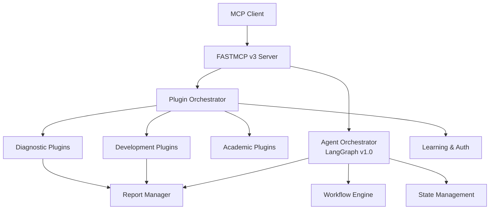

### Component Architecture Breakdown

#### 1. FASTMCP v3 Core Infrastructure

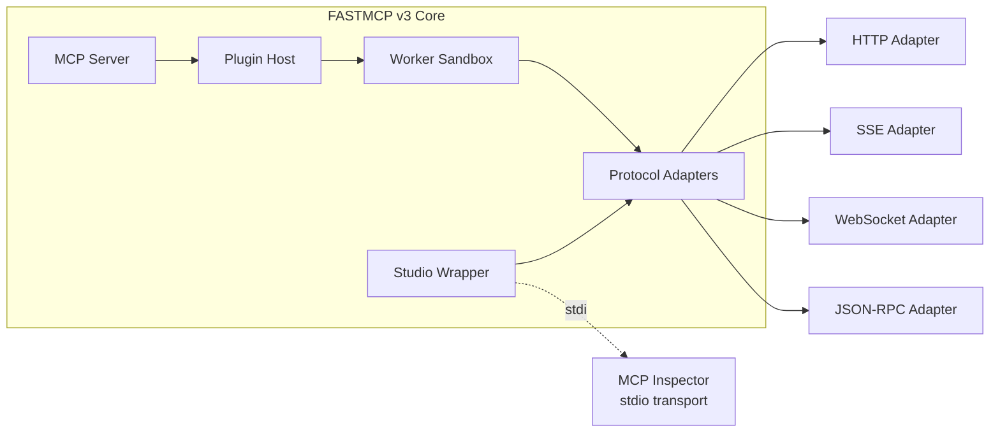

**Purpose**: Provides the foundational MCP server infrastructure with plugin hosting, sandboxing, and protocol support.

**Studio Wrapper**: A stdio transport bridge that allows MCP Inspector (which expects stdio transport) to communicate with HTTP-based MCP servers. It translates between:

- MCP Inspector stdio ↔ JSON-RPC 2.0 ↔ HTTP requests to MCP server
- Enables tools like MCP Inspector to diagnose CortexDx MCP itself
- Supports custom headers, timeouts, and verbose logging
- Used in the meta-diagnostic inspection workflow

#### 2. Diagnostic Plugin Ecosystem

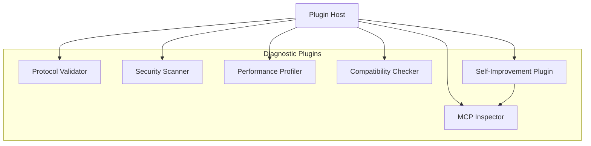

**Purpose**: Core diagnostic capabilities for analyzing MCP servers, including internal self-diagnosis.

#### 3. Academic Provider Integration

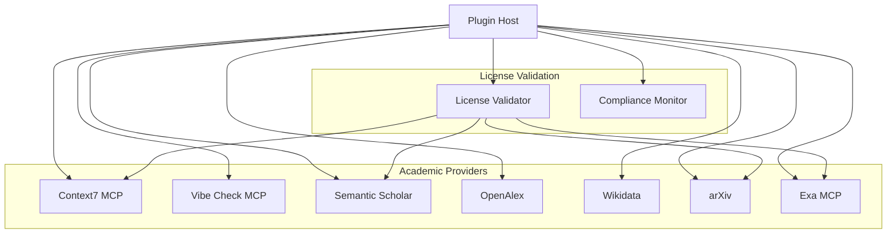

**Purpose**: Academic research integration with license compliance validation.

**Academic Providers**:

- **Context7**: Academic-grade validation of MCP implementations
- **Vibe Check**: Comprehensive error checking and improvement suggestions
- **Semantic Scholar**: Research paper validation and citation checking
- **OpenAlex**: Academic metadata and research trend analysis
- **Wikidata**: Entity validation and knowledge graph integration
- **arXiv**: Preprint analysis and technical validation
- **Exa**: Enhanced search and validation with content analysis and relevance scoring

#### 4. Development Assistance Plugins

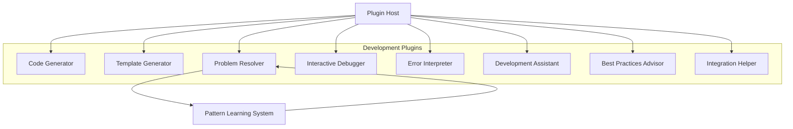

**Purpose**: AI-powered development assistance for building and debugging MCP implementations.

#### 5. LLM Integration Layer

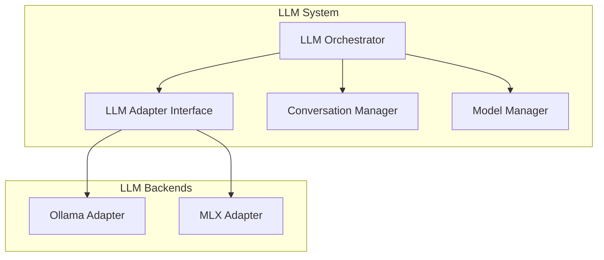

**Purpose**: Local LLM integration for intelligent assistance, supporting multiple backends.

**LLM Backends**:

- **Ollama**: Primary local LLM backend with model management and conversation support
- **MLX**: Apple Silicon optimized inference with quantization for fast response times

#### 6. OAuth & Authentication System

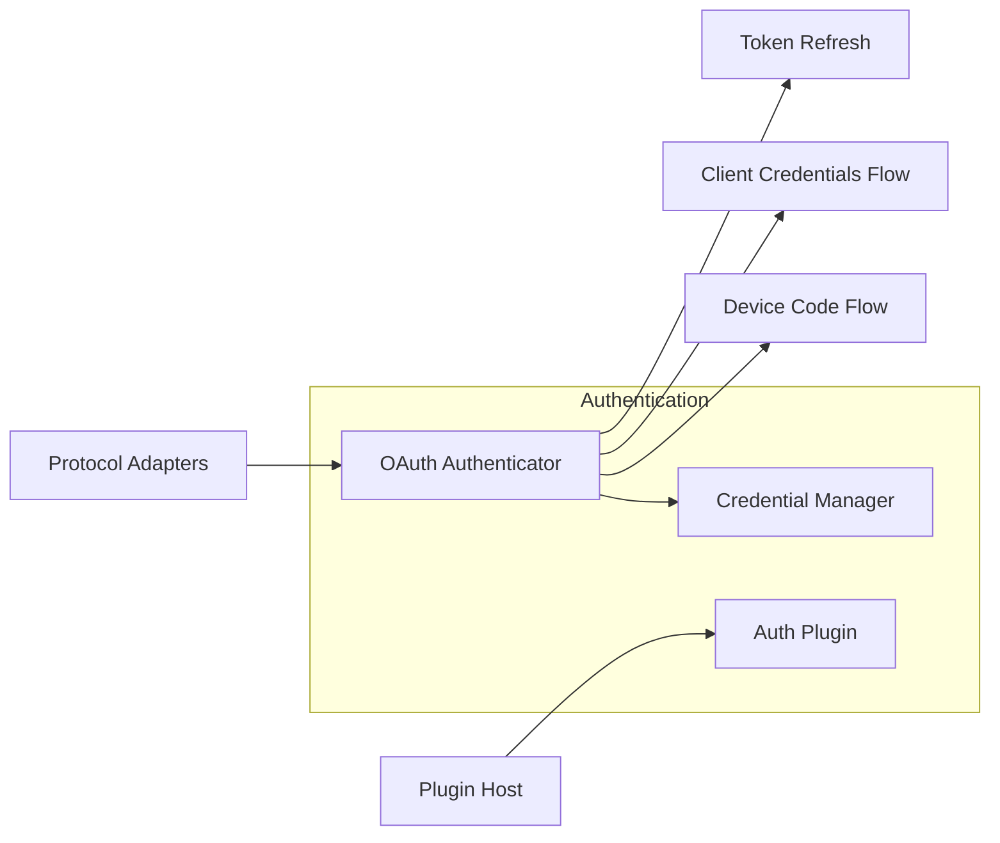

**Purpose**: OAuth2/Auth0 authentication for secured MCP servers with automatic credential management.

#### 7. Orchestration & Learning Layer

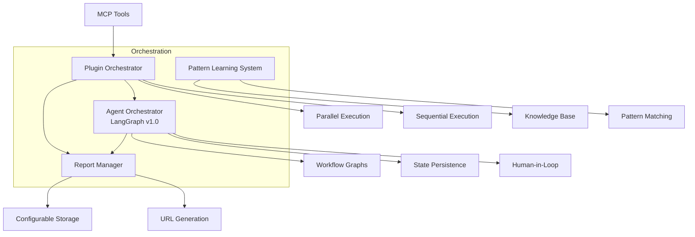

**Purpose**: Advanced orchestration with LangGraph, pattern learning, and report management.

### System Architecture Layers

1. **Existing brAInwav Infrastructure**: Leverages current plugin host, worker sandbox, and adapter systems
2. **MCP Server Layer**: Standard MCP server interface built on existing server.ts foundation
3. **Enhanced Plugin Layer**: Extends existing DiagnosticPlugin interface for new capabilities
4. **LLM Integration Layer**: New LLM adapter system following existing adapter patterns
5. **Academic Provider Layer**: Utilizes existing academic MCP providers with license validation
6. **Development Assistance Layer**: New plugins following existing plugin architecture
7. **Commercial Extension Layer**: Authentication and licensing extensions to existing systems
8. **OAuth & Authentication Layer**: OAuth2/Auth0 authentication for secured MCP servers with credential management
9. **Learning & Orchestration Layer**: Pattern learning, plugin orchestration, LangGraph-based agent workflows, and report management
10. **Self-Improvement Layer**: Internal diagnostics plugin for continuous self-monitoring and improvement

### Existing Infrastructure Reuse

The system builds upon established brAInwav patterns:

- **Plugin Host**: Extends existing plugin-host.ts with new plugin types
- **Worker Sandbox**: Reuses existing sandbox.ts for plugin isolation and budgets
- **Adapters**: Leverages existing HTTP, SSE, WebSocket, and JSON-RPC adapters
- **Academic Providers**: Utilizes existing academic/* providers with license validation
- **Types System**: Extends existing types.ts with new interfaces
- **Observability**: Builds on existing OTEL integration and brAInwav logging

## Plugin Interfaces and Contracts

### Existing DiagnosticPlugin Interface

All diagnostic plugins extend the existing `DiagnosticPlugin` interface:

```typescript
// Existing interface from types.ts
export interface DiagnosticPlugin {
  id: string;
  title: string;
  order?: number;
  run: (ctx: DiagnosticContext) => Promise<Finding[]>;
}

// Existing DiagnosticContext from types.ts
export interface DiagnosticContext {
  endpoint: string;
  headers?: Record<string, string>;
  logger: (...args: unknown[]) => void;
  request: <T>(input: RequestInfo, init?: RequestInit) => Promise<T>;
  jsonrpc: <T>(method: string, params?: unknown) => Promise<T>;
  sseProbe: (url: string, opts?: unknown) => Promise<SseResult>;
  governance?: GovernancePack;
  llm?: LlmAdapter | null;
  evidence: (ev: EvidencePointer) => void;
  deterministic?: boolean;
}
```

### Enhanced LLM Adapter Interface

Extends existing `LlmAdapter` interface from types.ts to support conversational AI and local model management:

```typescript
// Existing interface from types.ts
export interface LlmAdapter {
  complete: (prompt: string, maxTokens?: number) => Promise<string>;
}

// Enhanced interface for multiple backends with conversation support
export interface EnhancedLlmAdapter extends LlmAdapter {
  backend: 'ollama' | 'mlx';
  loadModel: (modelId: string) => Promise<void>;
  unloadModel: (modelId: string) => Promise<void>;
  getSupportedModels: () => Promise<string[]>;
  getModelInfo: (modelId: string) => Promise<ModelInfo>;
  
  // Conversational capabilities for development assistance
  startConversation: (context: ConversationContext) => Promise<ConversationId>;
  continueConversation: (id: ConversationId, message: string) => Promise<string>;
  endConversation: (id: ConversationId) => Promise<void>;
  
  // Specialized completion methods for different tasks
  analyzeCode: (code: string, context: string) => Promise<CodeAnalysis>;
  generateSolution: (problem: Problem, constraints: Constraints) => Promise<Solution>;
  explainError: (error: Error, context: Context) => Promise<Explanation>;
}

export interface ModelInfo {
  id: string;
  name: string;
  size: string;
  capabilities: string[];
  loaded: boolean;
  optimizedFor: ('code' | 'conversation' | 'debugging' | 'documentation')[];
}

export interface ConversationContext {
  userId?: string;
  sessionType: 'development' | 'debugging' | 'learning';
  mcpContext?: MCPContext;
  codeContext?: string;
  problemContext?: Problem;
}
```

### Development Assistance Plugin Extensions

New plugin types that extend `DiagnosticPlugin` to support conversational development assistance:

```typescript
export interface CodeGeneratorPlugin extends DiagnosticPlugin {
  generateCode: (spec: CodeSpec, ctx: DiagnosticContext) => Promise<GeneratedCode>;
  generateFromNaturalLanguage: (description: string, ctx: DiagnosticContext) => Promise<GeneratedCode>;
  generateAPIConnector: (apiSpec: APISpec, ctx: DiagnosticContext) => Promise<MCPConnector>;
  getTemplates: () => Promise<TemplateInfo[]>;
  customizeTemplate: (templateId: string, customizations: TemplateCustomization) => Promise<GeneratedCode>;
}

export interface InteractivePlugin extends DiagnosticPlugin {
  startSession: (problem: string, ctx: DiagnosticContext) => Promise<SessionId>;
  processInput: (sessionId: SessionId, input: string, ctx: DiagnosticContext) => Promise<Response>;
  endSession: (sessionId: SessionId) => Promise<void>;
  
  // Enhanced for step-by-step guidance
  askDiagnosticQuestion: (sessionId: SessionId, context: ProblemContext) => Promise<Question>;
  suggestNextStep: (sessionId: SessionId, currentState: SessionState) => Promise<NextStep>;
  validateSolution: (sessionId: SessionId, solution: Solution) => Promise<ValidationResult>;
}

export interface DevelopmentAssistantPlugin extends DiagnosticPlugin {
  provideGuidance: (userLevel: 'beginner' | 'intermediate' | 'expert', task: DevelopmentTask) => Promise<Guidance>;
  generateTutorial: (topic: string, userContext: UserContext) => Promise<Tutorial>;
  explainConcept: (concept: string, context: ConceptContext) => Promise<Explanation>;
  suggestBestPractices: (implementation: MCPImplementation) => Promise<BestPractice[]>;
}

export interface ProblemResolverPlugin extends DiagnosticPlugin {
  analyzeError: (error: Error, context: ErrorContext) => Promise<ErrorAnalysis>;
  generateFix: (problem: Problem, strategy: FixStrategy) => Promise<Fix>;
  applyFix: (fix: Fix, target: MCPImplementation) => Promise<FixResult>;
  validateFix: (fix: Fix, originalProblem: Problem) => Promise<ValidationResult>;
  suggestMultipleSolutions: (problem: Problem) => Promise<RankedSolution[]>;
}
```

### Academic Provider Integration

Academic providers extend existing patterns in `src/providers/academic/`:

```typescript
// Following existing academic provider patterns
export interface AcademicProvider {
  validateLicense: (content: ResearchContent) => Promise<LicenseValidation>;
  checkCompliance: (implementation: string) => Promise<ComplianceResult>;
  suggestImprovements: (findings: Finding[]) => Promise<Finding[]>;
}

// Integration with existing DiagnosticPlugin
export interface AcademicValidationPlugin extends DiagnosticPlugin {
  provider: AcademicProvider;
  licenseValidator: LicenseValidator;
}
```

### Enhanced Authentication Extensions

Extends existing `src/plugins/auth.ts` to support OAuth/Auth0 authentication for secured MCP servers:

```typescript
// Enhanced authentication following existing auth plugin patterns
export interface EnhancedAuthPlugin extends DiagnosticPlugin {
  validateAuth0Token: (token: string) => Promise<AuthResult>;
  checkRoleAccess: (role: string, feature: string) => Promise<boolean>;
  trackAuthUsage: (userId: string, action: string) => Promise<void>;
}

// OAuth/Auth0 Authenticator for secured MCP server diagnostics (Req 14)
export interface OAuth Authenticator {
  // Initiate OAuth2 flow when authentication is required
  initiateOAuth2Flow: (serverEndpoint: string, authConfig: AuthConfig) => Promise<OAuth2Session>;
  
  // Device code flow for CLI-based authentication (no browser redirect)
  deviceCodeFlow: (clientId: string, scope: string[]) => Promise<DeviceCodeResult>;
  pollDeviceCode: (deviceCode: string, interval: number) => Promise<TokenResult>;
  
  // Client credentials flow for automated scenarios
  clientCredentialsFlow: (clientId: string, clientSecret: string, scope: string[]) => Promise<TokenResult>;
  
  // Token management
  refreshToken: (refreshToken: string) => Promise<TokenResult>;
  validateToken: (accessToken: string) => Promise<TokenValidation>;
}

// Credential Manager for secure token storage (Req 14.4)
export interface CredentialManager {
  // Secure storage with encryption
  storeCredentials: (serverEndpoint: string, credentials: Credentials) => Promise<void>;
  retrieveCredentials: (serverEndpoint: string) => Promise<Credentials | null>;
  deleteCredentials: (serverEndpoint: string) => Promise<void>;
  
  // Automatic token refresh
  getValidToken: (serverEndpoint: string) => Promise<string>; // Auto-refreshes if expired
  scheduleTokenRefresh: (serverEndpoint: string, expiresIn: number) => void;
  
  // Credential lifecycle
  listStoredEndpoints: () => Promise<string[]>;
  clearAllCredentials: () => Promise<void>;
}

export interface AuthConfig {
  authType: 'oauth2' | 'bearer' | 'api-key';
  authorizationEndpoint?: string;
  tokenEndpoint?: string;
  clientId?: string;
  clientSecret?: string;
  scope?: string[];
  audience?: string;
}

export interface DeviceCodeResult {
  deviceCode: string;
  userCode: string;
  verificationUri: string;
  verificationUriComplete?: string;
  expiresIn: number;
  interval: number;
}

export interface TokenResult {
  accessToken: string;
  refreshToken?: string;
  expiresIn: number;
  tokenType: string;
  scope?: string[];
}

export interface Credentials {
  accessToken: string;
  refreshToken?: string;
  expiresAt: Date;
  tokenType: string;
  scope?: string[];
}
```

**OAuth Authentication Flow Integration**:

1. **Detection**: When MCP Inspector encounters 401/403 responses, automatically detect authentication requirements
2. **Flow Selection**: Choose appropriate OAuth flow based on context (CLI → device code, automated → client credentials)
3. **User Interaction**: For device code flow, display user code and verification URL in CLI
4. **Token Storage**: Securely store tokens with encryption in local credential store
5. **Auto-Refresh**: Monitor token expiration and automatically refresh before diagnostic operations
6. **Seamless Diagnostics**: Once authenticated, all diagnostic operations proceed without user intervention

**Design Rationale**: The OAuth authentication system enables CortexDx MCP to diagnose production MCP servers that require authentication without forcing users to manually extract and provide API keys. The device code flow is particularly important for CLI usage, as it doesn't require browser redirects or complex OAuth callback handling.

### Commercial Licensing Extensions

New plugins following existing governance patterns:

```typescript
// Following existing governance.ts plugin patterns
export interface CommercialLicensingPlugin extends DiagnosticPlugin {
  validateCommercialLicense: (key: string) => Promise<LicenseValidation>;
  checkFeatureAccess: (feature: string, license: License) => Promise<boolean>;
  trackUsage: (feature: string, metrics: UsageMetrics) => Promise<void>;
  generateComplianceReport: (period: TimePeriod) => Promise<Finding[]>;
}
```

### License Validation Plugin Interface

```typescript
interface ILicenseValidatorPlugin extends IPlugin {
  validateAcademicLicense(research: ResearchContent): Promise<LicenseValidation>;
  checkImplementationCompliance(code: string, source: ResearchSource): Promise<ComplianceResult>;
  getApprovedLicenses(): Promise<ApprovedLicense[]>;
  flagProprietaryContent(content: AcademicContent): Promise<ProprietaryFlag[]>;
}

interface ComplianceResult {
  compliant: boolean;
  licenseType: string;
  restrictions: string[];
  approvalRequired: boolean;
  implementationAllowed: boolean;
}
```

### Academic MCP Plugin Integrations

**Context7 MCP Plugin**:

- **Purpose**: Provides academic-grade validation of MCP implementations and features
- **Key Features**: Architecture validation, code quality assessment, best practices checking

**Vibe_Check MCP Plugin**:

- **Purpose**: Performs comprehensive error checking and improvement suggestions
- **Key Features**: Anti-pattern detection, refactoring suggestions, code health analysis

**Semantic Scholar MCP Plugin**:

- **Purpose**: Validates implementations against academic research and best practices
- **Key Features**: Research paper validation, citation checking, methodology verification

**OpenAlex MCP Plugin**:

- **Purpose**: Provides access to academic metadata for validation and research
- **Key Features**: Academic concept validation, research trend analysis, citation networks

**Wikidata MCP Plugin**:

- **Purpose**: Validates data structures and relationships using Wikidata knowledge base
- **Key Features**: Entity validation, relationship verification, knowledge graph integration

**arXiv MCP Plugin**:

- **Purpose**: Validates technical implementations against latest research papers
- **Key Features**: Preprint analysis, technical validation, research trend integration

**Exa MCP Plugin**:

- **Purpose**: Provides enhanced search and validation capabilities
- **Key Features**: Advanced search validation, content analysis, relevance scoring

### License Validation and Compliance System

**License Validator Plugin**:

- **Purpose**: Validates academic research licenses before implementation suggestions
- **Key Features**:
  - Real-time license checking with <3s response time
  - Database of approved open-source and permissive licenses
  - Proprietary content flagging and approval workflow
  - Integration with all academic MCP plugins

**Compliance Monitor Plugin**:

- **Purpose**: Tracks and reports license compliance for all academic integrations
- **Key Features**:
  - Continuous compliance monitoring
  - Automated reporting and audit trails
  - Legal framework integration
  - Risk assessment and mitigation recommendations

## Components and Interfaces

### Local LLM Agent

**Purpose**: Provides intelligent, conversational assistance for MCP development and debugging, supporting both developers and non-developers through natural language interactions.

**Key Interfaces**:

- `analyzeCode(code: string, context: string): Promise<Analysis>` - Response time: <2 seconds (Req 1.1, 5.2)
- `generateSolution(problem: Problem, constraints: Constraints): Promise<Solution>` - Response time: <5 seconds (Req 3.3, 4.2)
- `explainError(error: Error, context: Context): Promise<Explanation>` - Response time: <5 seconds (Req 9.3, 6.2)
- `suggestImprovements(implementation: MCPImplementation): Promise<Suggestion[]>` - Response time: <20 seconds (Req 5.2)
- `interpretNaturalLanguage(description: string, intent: Intent): Promise<ActionPlan>` - Response time: <3 seconds (Req 2.1)
- `provideStepByStepGuidance(task: DevelopmentTask, userLevel: UserLevel): Promise<GuidanceSession>` - Response time: <2 seconds (Req 1.1)
- `maintainConversationContext(sessionId: string, interaction: Interaction): Promise<void>` - Persistent across sessions (Req 12.5)

**Enhanced Capabilities**:

- **Natural Language Processing**: Understands development requests in plain English from non-technical users
- **Conversational Development**: Maintains context across multi-turn conversations for complex development tasks
- **Adaptive Explanations**: Adjusts technical depth based on user expertise level (beginner/intermediate/expert)
- **Interactive Tutorials**: Provides step-by-step guidance with real-time feedback and validation
- **Code Generation from Descriptions**: Creates MCP servers and connectors from natural language specifications
- **Contextual Problem Solving**: Analyzes error logs, configurations, and code together for comprehensive diagnosis
- **Learning and Adaptation**: Improves suggestions based on successful resolution patterns and user feedback

**Model Selection Strategy**:

- **Conversational Tasks**: General-purpose models (Llama 3 Instruct, Mistral 7B Instruct) for natural dialogue
- **Code Analysis**: Code-specialized models (CodeLlama, StarCoder) for technical analysis and generation
- **Debugging**: Reasoning-focused models (Llama 3 Instruct) for complex problem diagnosis
- **Documentation**: Writing-optimized models for clear, user-friendly explanations

### MCP Inspector

**Purpose**: Analyzes MCP servers and connectors for compliance, performance, and security issues.

**Key Interfaces**:

- `inspectServer(endpoint: string): Promise<InspectionReport>` - Response time: <30 seconds (Req 3.1)
- `validateProtocol(messages: MCPMessage[]): Promise<ValidationResult>` - Accuracy: 99% (Req 3.2)
- `analyzePerformance(server: MCPServer): Promise<PerformanceReport>` - Precision: millisecond-level (Req 5.1)
- `scanSecurity(implementation: MCPCode): Promise<SecurityReport>` - Detection accuracy: 95% (Req 6.1)
- `checkCompatibility(server: MCPServer, clients: MCPClient[]): Promise<CompatibilityReport>` - Response time: <60 seconds (Req 3.4)

**Analysis Types**:

- Protocol compliance validation (Req 3.1, 3.2)
- Security vulnerability scanning (Req 6.1, 6.4)
- Performance bottleneck identification (Req 5.1, 5.2)
- Configuration optimization opportunities (Req 5.3, 7.2)
- Compatibility issue detection (Req 11.1, 11.3)

### Problem Resolver

**Purpose**: Automatically fixes identified issues and implements suggested improvements.

**Key Interfaces**:

- `resolveProblem(problem: Problem, strategy: ResolutionStrategy): Promise<Resolution>` - Response time: <5 seconds (Req 3.3)
- `applyFix(fix: Fix, target: MCPImplementation): Promise<Result>` - Automated without user intervention (Req 4.4, 5.5)
- `generatePatch(issue: Issue, solution: Solution): Promise<Patch>` - Response time: <30 seconds (Req 6.3)
- `validateFix(fix: Fix, originalProblem: Problem): Promise<ValidationResult>` - Automated testing (Req 9.5)
- `suggestMultipleSolutions(problem: Problem): Promise<RankedSolution[]>` - Ranked by success likelihood (Req 9.4)

**Resolution Strategies**:

- Automated code patching (Req 4.4, 6.3)
- Configuration adjustments (Req 4.4, 5.3)
- Dependency updates (Req 11.5)
- Architecture refactoring (Req 5.2)
- Performance optimizations (Req 5.5)

### Code Generator

**Purpose**: Creates MCP servers, connectors, and related code from both technical specifications and natural language descriptions, enabling non-developers to create MCP implementations.

**Key Interfaces**:

- `generateServer(spec: ServerSpec): Promise<MCPServerCode>` - Response time: <10 seconds (Req 1.2)
- `generateFromNaturalLanguage(description: string, userContext: UserContext): Promise<MCPImplementation>` - Response time: <15 seconds (Req 2.2)
- `generateConnector(apiSpec: APISpec, mcpSpec: MCPSpec): Promise<ConnectorCode>` - Response time: <60 seconds (Req 8.1)
- `generateTools(toolSpecs: ToolSpec[]): Promise<ToolDefinitions>` - Response time: <5 seconds (Req 1.4, 8.2)
- `generateTests(implementation: MCPImplementation): Promise<TestSuite>` - Coverage: 80-90% (Req 2.5, 7.4, 8.4)
- `generateCustomTemplate(requirements: TemplateRequirements, orgStandards: OrgStandards): Promise<CustomTemplate>` - Response time: <8 seconds (Req 10.1)
- `refineGeneration(code: GeneratedCode, feedback: UserFeedback): Promise<RefinedCode>` - Response time: <12 seconds (Req 2.3)
- `generateDocumentation(implementation: MCPImplementation): Promise<Documentation>` - Response time: <15 seconds (Req 1.5, 7.5)

**Enhanced Generation Capabilities**:

- **Natural Language to Code**: Converts plain English descriptions into working MCP implementations
- **Conversational Refinement**: Iteratively improves generated code through user feedback and clarification
- **Organization-Specific Templates**: Creates standardized templates following team conventions and coding standards
- **API Integration Automation**: Automatically generates OAuth2 and API key authentication wrappers
- **Comprehensive Documentation**: Creates user guides, API documentation, and deployment instructions
- **Testing Framework Integration**: Generates comprehensive test suites with interoperability testing
- **Configuration Optimization**: Automatically optimizes generated configurations for performance and security

**Design Rationale**: The enhanced code generator addresses the need for non-developers to create MCP implementations through natural language, while maintaining the technical depth required for complex integrations. The conversational refinement capability ensures generated code meets specific requirements through iterative improvement.

### Interactive Debugger

**Purpose**: Provides conversational, step-by-step debugging assistance that can understand context from error messages, logs, and configurations to guide users through complex problem resolution.

**Key Interfaces**:

- `startDebuggingSession(problem: string, context?: ProblemContext): Promise<DebuggingSession>` - Response time: <10 seconds (Req 4.1, 9.1)
- `acceptMultipleInputs(session: DebuggingSession, inputs: MultipleInputs): Promise<ContextualAnalysis>` - Supports JSON, text, YAML formats (Req 9.1)
- `askDiagnosticQuestion(session: DebuggingSession, currentContext: SessionContext): Promise<TargetedQuestion>` - Response time: <5 seconds (Req 9.2)
- `suggestNextStep(session: DebuggingSession): Promise<DebuggingStep>` - Provides numbered, actionable instructions (Req 9.3)
- `validateSolution(session: DebuggingSession, solution: Solution): Promise<ValidationResult>` - Includes automated testing (Req 9.5)
- `provideSolutionAlternatives(session: DebuggingSession, problem: Problem): Promise<RankedSolution[]>` - Multiple approaches ranked by success likelihood (Req 9.4)
- `maintainSessionContext(session: DebuggingSession, interaction: Interaction): Promise<void>` - Persistent context across interactions (Req 12.5)
- `analyzeConnectionFailure(session: DebuggingSession, diagnostics: NetworkDiagnostics): Promise<FailureAnalysis>` - Response time: <15 seconds, 85% accuracy (Req 4.2, 4.3)

**Enhanced Debugging Flow**:

1. **Multi-Input Analysis**: Accepts error messages, logs, configuration files, and code simultaneously
2. **Contextual Understanding**: Analyzes relationships between different inputs to understand the complete problem
3. **Targeted Questioning**: Asks specific diagnostic questions based on initial analysis rather than generic troubleshooting
4. **Hypothesis Generation**: Creates multiple potential causes ranked by probability
5. **Solution Ranking**: Provides multiple solution approaches with success likelihood and implementation complexity
6. **Automated Verification**: Tests proposed solutions and confirms issue resolution
7. **Learning Integration**: Improves future debugging based on successful resolution patterns

**Design Rationale**: The enhanced interactive debugger addresses the need for intelligent, context-aware troubleshooting that can handle complex MCP issues by understanding the relationships between errors, configurations, and system state. The multi-input capability allows users to provide comprehensive context upfront, leading to more accurate and faster problem resolution.

### Academic Validation Tools with License Compliance

**Context7 Plugin**:

- **Purpose**: Provides academic-grade validation of MCP implementations and features with integrated license compliance checking
- **Key Interfaces**:
  - `validateArchitecture(design: ArchitectureSpec): Promise<AcademicValidation>` - Includes license compliance check (Req 10.2, 13.1)
  - `reviewCodeQuality(code: string): Promise<QualityAssessment>` - Validates against academic standards with IP compliance (Req 10.2)
  - `checkBestPractices(implementation: MCPImplementation): Promise<BestPracticesReport>` - Ensures legal compliance of suggested practices (Req 6.2, 10.2)
  - `validateLicenseCompliance(research: ResearchContent): Promise<LicenseValidation>` - <3s response time for license checking (Req 13.1)

**Vibe Check Plugin**:

- **Purpose**: Performs comprehensive error checking and improvement suggestions with legal compliance validation
- **Key Interfaces**:
  - `performVibeCheck(target: MCPTarget): Promise<VibeCheckResult>` - Includes proprietary content flagging (Req 13.3)
  - `identifyAntiPatterns(code: string): Promise<AntiPatternReport>` - Flags patterns that may violate licenses (Req 10.2)
  - `suggestRefactoring(analysis: CodeAnalysis): Promise<RefactoringPlan>` - Only suggests legally compliant refactoring approaches (Req 13.2)
  - `flagProprietaryContent(content: AcademicContent): Promise<ProprietaryFlag[]>` - Identifies content requiring approval (Req 13.3)

**Semantic Scholar Plugin**:

- **Purpose**: Validates implementations against academic research with license compliance
- **Key Interfaces**:
  - `validateResearch(implementation: MCPImplementation): Promise<ResearchValidation>` - Includes citation and license checking (Req 13.1)
  - `checkMethodology(approach: TechnicalApproach): Promise<MethodologyValidation>` - Validates against published research (Req 11.4)

**Additional Academic Providers**:

- **OpenAlex**: Research trend analysis with license compatibility assessment (Req 13.2)
- **Wikidata**: Entity and relationship verification for knowledge graph integration (Req 11.4)
- **arXiv**: Preprint analysis with intellectual property compliance checking (Req 13.1)
- **Exa**: Advanced search validation with content analysis and relevance scoring (Req 9.2)

**Enhanced Academic Integration Features**:

- **Real-time License Validation**: All academic suggestions are validated against approved licenses before presentation
- **Proprietary Content Detection**: Automatically identifies and flags research that requires licensing approval
- **Compliance Tracking**: Maintains audit trail of all academic research usage and license compliance
- **Legal Framework Integration**: Integrates with organizational legal policies and approval workflows

**Design Rationale**: The enhanced academic validation system ensures that all research-based suggestions comply with intellectual property and licensing requirements, addressing legal compliance concerns while maintaining the value of academic research integration. The real-time validation prevents legal issues by checking licenses before implementation suggestions are made.

### Authentication and Licensing System

**Auth0 Integration Plugin**:

- **Purpose**: Provides enterprise-grade authentication for commercial deployment
- **Key Features**:
  - OAuth 2.0 and OpenID Connect support (Req 7.1)
  - Multi-factor authentication (Req 6.4)
  - Single sign-on (SSO) integration (Req 7.1)
  - Role-based access control (RBAC) (Req 6.4, 10.5)
  - API key management for programmatic access (Req 8.4)

**Licensing Manager Plugin**:

- **Purpose**: Manages commercial licensing and feature access control
- **Key Features**:
  - License key validation and activation (Req 10.5)
  - Feature-based licensing (diagnostic tools, LLM backends, etc.) (Req 12.1)
  - Usage tracking and reporting (Req 7.5)
  - Subscription management (Req 10.5)
  - Offline license validation (Req 12.2)
  - License compliance monitoring (Req 13.4)
  - Academic research license validation (Req 13.1, 13.2)
  - Intellectual property compliance tracking (Req 13.5)

## Data Models

### Problem Definition

```typescript
interface Problem {
  id: string;
  type: ProblemType;
  severity: 'low' | 'medium' | 'high' | 'critical';
  description: string;
  userFriendlyDescription: string; // Plain English explanation for non-developers
  context: ProblemContext;
  evidence: Evidence[];
  affectedComponents: string[];
  suggestedSolutions: RankedSolution[];
  conversationHistory?: ConversationEntry[];
  userLevel: 'beginner' | 'intermediate' | 'expert';
}

interface ProblemContext {
  mcpVersion: string;
  serverType: string;
  environment: string;
  configuration: Record<string, any>;
  errorLogs: string[];
  performanceMetrics?: PerformanceMetrics;
  userInputs?: MultipleInputs; // Support for JSON, text, YAML inputs
  sessionContext?: SessionContext;
  previousAttempts?: ResolutionAttempt[];
}

interface MultipleInputs {
  errorMessages?: string[];
  logFiles?: LogFile[];
  configurationFiles?: ConfigFile[];
  codeSnippets?: CodeSnippet[];
  format: 'json' | 'text' | 'yaml' | 'mixed';
}

interface RankedSolution {
  solution: Solution;
  confidence: number;
  successLikelihood: number;
  implementationComplexity: 'low' | 'medium' | 'high';
  estimatedTime: string;
  prerequisites: string[];
}
```

### Solution Framework

```typescript
interface Solution {
  id: string;
  type: SolutionType;
  confidence: number;
  description: string;
  userFriendlyDescription: string; // Plain English explanation
  steps: SolutionStep[];
  codeChanges: CodeChange[];
  configChanges: ConfigChange[];
  testingStrategy: TestingStrategy;
  rollbackPlan: RollbackPlan;
  automatedFix?: AutomatedFix; // For problems that can be fixed automatically
  licenseCompliance?: LicenseCompliance; // For academic research-based solutions
}

interface SolutionStep {
  order: number;
  description: string;
  userFriendlyDescription: string; // Numbered, actionable instructions
  action: Action;
  validation: ValidationCriteria;
  dependencies: string[];
  estimatedDuration: string;
  canAutomate: boolean;
}

interface AutomatedFix {
  canApplyAutomatically: boolean;
  requiresUserConfirmation: boolean;
  riskLevel: 'low' | 'medium' | 'high';
  backupRequired: boolean;
  validationTests: ValidationTest[];
}

interface LicenseCompliance {
  requiresLicenseCheck: boolean;
  approvedLicenses: string[];
  proprietaryContent: boolean;
  approvalRequired: boolean;
  complianceStatus: 'compliant' | 'requires_approval' | 'non_compliant';
}
```

### MCP Analysis Models

```typescript
interface MCPAnalysis {
  serverId: string;
  timestamp: Date;
  protocolCompliance: ComplianceReport;
  securityAssessment: SecurityReport;
  performanceProfile: PerformanceReport;
  compatibilityAssessment: CompatibilityReport;
  recommendations: Recommendation[];
  issues: Issue[];
  conversationalSummary: string; // User-friendly summary of findings
  interactiveActions: InteractiveAction[]; // Actions user can take through conversation
}

interface ComplianceReport {
  version: string;
  compliant: boolean;
  violations: ProtocolViolation[];
  warnings: ProtocolWarning[];
  score: number;
  migrationPath?: MigrationPath; // For version compatibility issues
}

interface CompatibilityReport {
  testedClients: string[];
  compatibilityMatrix: CompatibilityMatrix;
  interoperabilityIssues: InteroperabilityIssue[];
  migrationRecommendations: MigrationRecommendation[];
  testDuration: number; // Should be ≤120 seconds
}

interface InteractiveAction {
  id: string;
  description: string;
  type: 'fix' | 'explain' | 'generate' | 'test' | 'optimize';
  canAutomate: boolean;
  estimatedTime: string;
  conversationPrompt: string; // How to initiate this action through conversation
}
```

## Error Handling

### Error Categories

1. **Protocol Errors**: MCP specification violations
2. **Configuration Errors**: Invalid or suboptimal configurations
3. **Security Errors**: Vulnerabilities and security misconfigurations
4. **Performance Errors**: Bottlenecks and inefficiencies
5. **Integration Errors**: Compatibility and interoperability issues

### Error Resolution Pipeline


### Intelligent Error Interpretation

The Local LLM Agent provides context-aware error interpretation:

- Translates technical errors into user-friendly explanations
- Suggests probable causes based on context analysis
- Provides step-by-step resolution guidance
- Learns from successful resolutions to improve future recommendations

## Testing Strategy

### Automated Testing Framework

1. **Unit Tests**: Individual component functionality (Req 7.4)
2. **Integration Tests**: Component interaction validation (Req 7.4)
3. **MCP Protocol Tests**: Compliance and interoperability testing (Req 11.2)
4. **Performance Tests**: Load and stress testing (Req 5.4)
5. **Security Tests**: Vulnerability and penetration testing (Req 6.1)
6. **Compatibility Tests**: Multi-client interoperability within 120 seconds (Req 11.1)

### LLM Testing Approach

1. **Response Quality Tests**: Validate LLM output accuracy and helpfulness (Req 1.1, 4.2)
2. **Context Understanding Tests**: Verify proper context interpretation (Req 9.2)
3. **Solution Effectiveness Tests**: Measure success rate of suggested solutions with 85% accuracy target (Req 4.2)
4. **Conversation Flow Tests**: Validate interactive debugging sessions (Req 9.1, 9.5)
5. **Performance Tests**: Validate response time requirements (<2s, <5s, <10s, etc.) (Req 1.1, 5.1)

### Test Data Generation

- Synthetic MCP server implementations with known issues (Req 3.1, 11.2)
- Real-world error scenarios and edge cases (Req 4.2, 9.1)
- Performance benchmarks and stress test scenarios (Req 5.1, 5.4)
- Security vulnerability test cases (Req 6.1)
- Interoperability test suites covering all MCP protocol features (Req 11.2)
- Test generation with 80-90% code coverage (Req 8.4)

## Local LLM Integration

### Supported Backends

1. **Ollama**: Primary local LLM backend with model management and conversation support (Req 12.3)
2. **MLX**: Apple Silicon optimized inference with quantization for <2s response times (Req 12.3)
3. **Custom Backends**: Extensible architecture for additional backends (Req 12.4)

### Enhanced Model Selection Strategy

- **Conversational Development**: General-purpose models (Llama 3 Instruct, Mistral 7B Instruct) for natural dialogue with non-developers
- **Code Analysis and Generation**: Code-specialized models (CodeLlama, StarCoder) for technical analysis and automated code generation
- **Interactive Debugging**: Reasoning-focused models (Llama 3 Instruct) for complex problem diagnosis and step-by-step guidance
- **Documentation and Explanation**: Writing-optimized models for clear, user-friendly explanations adapted to user expertise level
- **Natural Language Processing**: Models optimized for understanding development requests in plain English

### Advanced Context Management

- **Persistent Conversation History**: Maintains context across sessions for ongoing development projects
- **Multi-Modal Context**: Preserves relationships between code, configurations, errors, and user interactions
- **Adaptive Learning**: Improves suggestions based on successful resolution patterns and user feedback
- **Session-Aware Context**: Maintains different context types for development, debugging, and learning sessions
- **Cross-Session Knowledge**: Builds knowledge base from successful interactions to improve future assistance

### Performance Optimization

- **Model Quantization**: Automatic quantization for faster inference targeting <2s response times
- **Context Window Optimization**: Efficient memory usage for long conversations and large codebases
- **Streaming Responses**: Real-time feedback for better user experience during long operations
- **Model Caching**: Warm-up strategies to minimize cold start delays
- **Automatic Model Selection**: Task-based model selection optimized for performance and accuracy

**Design Rationale**: The enhanced LLM integration supports the conversational nature of the system, enabling natural language interactions for both developers and non-developers while maintaining high performance through optimized model selection and caching strategies.

## Security Considerations

### Local-First Security

- All processing occurs locally without external API calls (Req 12.1)
- No sensitive code or data transmitted to external services (Req 12.1)
- Local model storage and execution (Req 12.1, 12.4)
- Encrypted conversation history storage (Req 12.5)
- Offline functionality for core features (Req 12.2)

### MCP Security Analysis

- Authentication and authorization validation according to MCP specification (Req 6.4)
- Input sanitization checking based on OWASP guidelines (Req 6.1, 6.2)
- Privilege escalation detection and prevention (Req 6.1)
- Secure communication verification for all transport protocols (Req 6.4)
- Security vulnerability detection with 95% accuracy (Req 6.1)
- Secure code patch generation within 30 seconds (Req 6.3)

### Protocol Compliance

- Full compliance with MCP protocol specification version 2024-11-05 (Req 8.3)
- Support for OAuth2 and API key authentication methods (Req 8.4)
- JSON-RPC 2.0 message format validation (Req 3.2)
- WebSocket and HTTP transport protocol support (Req 4.3)
- Backward compatibility testing for older MCP versions (Req 11.1, 11.3)
- Migration path suggestions for protocol upgrades (Req 11.4, 11.5)

## Commercial Deployment Architecture

### Licensing Tiers

**Community Edition (Free)**:

- Basic diagnostic tools (Req 3.1, 3.2)
- Limited LLM backend support (Req 12.3)
- Core MCP validation (Req 3.2, 8.3)
- Open source plugins only

**Professional Edition**:

- Advanced diagnostic plugins (Req 5.1, 6.1)
- All LLM backend support (Req 12.3, 12.4)
- Academic validation tools (Context7, Vibe Check, Semantic Scholar) (Req 13.1, 13.2)
- Priority support
- Commercial plugin access (Req 10.5)

**Enterprise Edition**:

- Full feature access (Req 7.1)
- Auth0 integration (Req 6.4, 7.1)
- Custom plugin development (Req 10.1)
- On-premises deployment (Req 7.1, 7.2)
- SLA guarantees
- Advanced usage analytics (Req 7.5)

### Authentication Flow

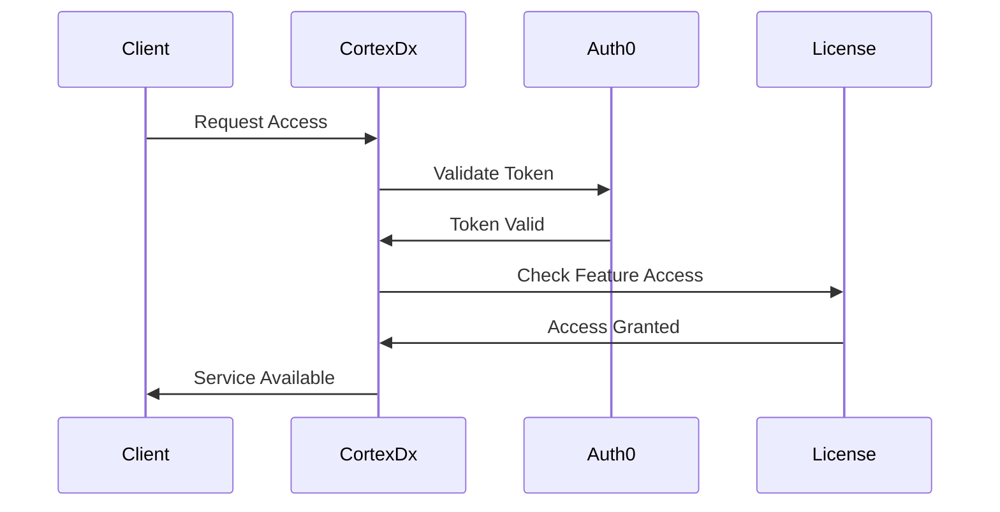

### Usage Tracking

- Feature usage metrics collection
- API call tracking and rate limiting
- License compliance monitoring
- Automated billing integration
- Usage analytics and reporting

## Performance Optimization

### LLM Performance

- **Sub-2-Second Response Times**: Model quantization and optimization targeting <2s for most operations
- **Context Window Optimization**: Efficient memory usage for long conversations and large codebases
- **Streaming Responses**: Real-time feedback for better UX during code generation and analysis
- **Model Caching and Warm-up**: Strategies to minimize cold start delays and maintain responsive interactions
- **Automatic Model Selection**: Task-based selection optimized for performance requirements and accuracy
- **Conversation Context Optimization**: Efficient storage and retrieval of multi-turn conversation history

### Enhanced Diagnostic Performance

- **Parallel Analysis Execution**: Multiple diagnostic tools running concurrently for faster results
- **Real-time Monitoring**: Performance metrics collection with 1-second update intervals for live feedback
- **Millisecond-Precision Timing**: Accurate performance profiling for bottleneck identification
- **Incremental Analysis**: Updates with minimal recomputation for iterative development workflows
- **Background Processing**: Non-critical tasks processed asynchronously to maintain responsiveness
- **Caching Strategy**: Intelligent caching of analysis results to avoid redundant processing

### Conversational Performance

- **Natural Language Processing**: <3s response time for interpreting development requests
- **Step-by-Step Guidance**: <2s response time for providing development assistance
- **Interactive Debugging**: <10s response time for starting debugging sessions with context analysis
- **Code Generation**: <15s response time for generating implementations from natural language
- **Multi-Input Analysis**: <5s response time for analyzing multiple inputs (logs, configs, code) simultaneously

### Real-time Monitoring and Adaptation

- **Performance Metrics Collection**: 1-second update intervals with detailed timing breakdowns
- **Automated Performance Alerting**: Degradation detection with adaptive thresholds
- **Resource Usage Optimization**: Dynamic resource allocation for local LLM inference
- **Adaptive Timeout Handling**: System capability-based timeout adjustments
- **User Experience Monitoring**: Response time tracking for different interaction types

**Design Rationale**: The performance optimization strategy ensures that conversational interactions remain responsive and natural, while complex operations like code generation and comprehensive analysis complete within acceptable timeframes. The real-time monitoring enables continuous optimization of the user experience.

## Security Framework Integration (OWASP ASVS + MITRE ATLAS)

### Architecture

The Security Framework Integration provides comprehensive security assessment combining traditional application security (OWASP ASVS) with AI/ML-specific threat detection (MITRE ATLAS) (Req 20).

```typescript
// ASVS Compliance Engine
export interface ASVSComplianceEngine {
  // ASVS assessment
  assessASVS: (target: MCPImplementation, level: ASVSLevel) => Promise<ASVSReport>;
  validateRequirement: (requirementId: string, target: MCPImplementation) => Promise<ValidationResult>;
  
  // Tiered verification
  getRequirementsForLevel: (level: ASVSLevel) => Promise<ASVSRequirement[]>;
  generateComplianceReport: (assessment: ASVSAssessment) => Promise<ComplianceReport>;
  
  // Requirement mapping
  mapFindingsToASVS: (findings: Finding[]) => Promise<ASVSMapping[]>;
}

export type ASVSLevel = 'L1' | 'L2' | 'L3';

export interface ASVSRequirement {
  id: string; // e.g., "V2.1.1"
  category: string; // e.g., "Authentication"
  level: ASVSLevel;
  description: string;
  verificationMethod: 'automated' | 'manual' | 'hybrid';
  tools: string[]; // Which tools can verify this requirement
}

export interface ASVSReport {
  level: ASVSLevel;
  totalRequirements: number;
  passedRequirements: number;
  failedRequirements: number;
  notApplicable: number;
  compliancePercentage: number;
  findings: ASVSFinding[];
  recommendations: string[];
}

// MITRE ATLAS Threat Detector
export interface ATLASThreatDetector {
  // Threat detection
  detectThreats: (target: MCPImplementation) => Promise<ATLASReport>;
  checkTechnique: (techniqueId: string, target: MCPImplementation) => Promise<ThreatDetection>;
  
  // AI/ML-specific checks
  detectPromptInjection: (input: string) => Promise<PromptInjectionResult>;
  detectModelPoisoning: (patterns: Pattern[]) => Promise<PoisoningDetection>;
  detectDataExfiltration: (llmResponses: string[]) => Promise<ExfiltrationDetection>;
  
  // Safeguards
  sanitizePrompt: (input: string) => Promise<string>;
  validateModelIntegrity: (modelPath: string) => Promise<IntegrityResult>;
}

export interface ATLASTechnique {
  id: string; // e.g., "AML.T0051"
  name: string; // e.g., "LLM Prompt Injection"
  tactic: string; // e.g., "Initial Access"
  description: string;
  mitigations: string[];
  detectionMethods: string[];
}

export interface ATLASReport {
  threatsDetected: number;
  highSeverityThreats: number;
  techniques: ATLASTechnique[];
  findings: ATLASFinding[];
  mitigations: Mitigation[];
}

// Combined Security Assessment
export interface SecurityFrameworkAssessment {
  asvs: ASVSReport;
  atlas: ATLASReport;
  combinedScore: number;
  criticalFindings: Finding[];
  recommendations: PrioritizedRecommendation[];
}
```

### OWASP ASVS Integration

**Verification Levels by Licensing Tier** (Req 20.1):

- **Community Edition**: ASVS Level 1 (Opportunistic)
  - Basic security checks
  - ~50 requirements
  - Automated verification only
  
- **Professional Edition**: ASVS Level 2 (Standard)
  - Standard security verification
  - ~150 requirements
  - Automated + some manual verification
  
- **Enterprise Edition**: ASVS Level 3 (Advanced)
  - Advanced security + compliance
  - ~250+ requirements
  - Full automated + manual verification

**ASVS Categories Mapped to CortexDx MCP**:

1. **V1 - Architecture**: Design patterns, security architecture
2. **V2 - Authentication**: OAuth/Auth0 integration, credential management
3. **V3 - Session Management**: Token lifecycle, session security
4. **V4 - Access Control**: RBAC, authorization checks
5. **V5 - Validation**: Input validation, output encoding
6. **V7 - Cryptography**: Encryption at rest, secure storage
7. **V9 - Communication**: TLS, secure transport protocols
8. **V10 - Malicious Code**: Code injection, XSS prevention
9. **V13 - API**: REST/WebSocket security, rate limiting
10. **V14 - Configuration**: Secure defaults, hardening

### MITRE ATLAS Integration

**High-Priority ATLAS Techniques for CortexDx MCP** (Req 20.2):

**1. AML.T0051 - LLM Prompt Injection** (Req 20.3):

```typescript
// Prompt injection safeguards
export interface PromptInjectionSafeguard {
  // Input validation
  validatePrompt: (input: string) => Promise<ValidationResult>;
  detectInjectionPatterns: (input: string) => Promise<InjectionPattern[]>;
  
  // Sanitization
  sanitizeInput: (input: string) => Promise<string>;
  removeSystemPrompts: (input: string) => Promise<string>;
  
  // Context isolation
  isolateUserInput: (input: string, systemContext: string) => Promise<IsolatedPrompt>;
}
```

**2. AML.T0020 - Poison Training Data** (Req 20.4):

```typescript
// Data poisoning detection for Pattern Learning System
export interface DataPoisoningDetector {
  // Anomaly detection
  detectAnomalousPatterns: (pattern: Pattern) => Promise<AnomalyScore>;
  validatePatternIntegrity: (pattern: Pattern) => Promise<IntegrityResult>;
  
  // Statistical analysis
  compareWithBaseline: (pattern: Pattern, baseline: Pattern[]) => Promise<DeviationScore>;
  detectOutliers: (patterns: Pattern[]) => Promise<Pattern[]>;
}
```

**3. AML.T0024 - Exfiltration via ML Inference API**:

```typescript
// Data exfiltration detection
export interface ExfiltrationDetector {
  // Response monitoring
  monitorLLMResponses: (responses: string[]) => Promise<ExfiltrationRisk>;
  detectSensitiveDataLeakage: (response: string) => Promise<LeakageDetection>;
  
  // Rate limiting
  enforceInferenceRateLimits: (userId: string) => Promise<RateLimitResult>;
}
```

**4. AML.T0040 - ML Model Inference API Access**:

- Integrated with OAuth Authenticator
- API key validation
- Access control for LLM endpoints

**5. AML.T0000 - ML Model Access**:

- Model file integrity verification
- Checksum validation for Ollama/MLX models
- Unauthorized model access detection

### Tool Integration Architecture

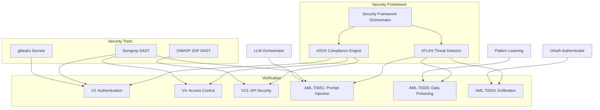

**Design Rationale**: Combining OWASP ASVS and MITRE ATLAS provides comprehensive security coverage for both traditional application vulnerabilities and emerging AI/ML threats. This dual-framework approach positions CortexDx MCP as a security-first diagnostic tool that addresses the unique challenges of AI-powered systems.

## Enhanced Security Tool Integration

### Architecture

Integration of industry-standard security tools (Semgrep, gitleaks, OWASP ZAP) into the Security Scanner plugin (Req 21).

```typescript
// Security Tool Integration
export interface SecurityToolIntegration {
  // Tool execution
  runSemgrep: (target: string, rules: string[]) => Promise<SemgrepResults>;
  runGitleaks: (target: string, config: GitleaksConfig) => Promise<GitleaksResults>;
  runZAP: (endpoint: string, scanType: 'baseline' | 'full') => Promise<ZAPResults>;
  
  // Result aggregation
  aggregateFindings: (results: ToolResults[]) => Promise<UnifiedSecurityReport>;
  deduplicateFindings: (findings: Finding[]) => Promise<Finding[]>;
  prioritizeFindings: (findings: Finding[]) => Promise<PrioritizedFinding[]>;
}

// Semgrep Integration (Req 21.1)
export interface SemgrepIntegration {
  // Rule management
  loadMCPRules: () => Promise<SemgrepRule[]>;
  createCustomRule: (pattern: string, message: string) => Promise<SemgrepRule>;
  
  // Scanning
  scanCode: (path: string, rules: SemgrepRule[]) => Promise<SemgrepResults>;
  scanDependencies: (manifest: string) => Promise<DependencyFindings>;
  
  // MCP-specific rules
  detectInsecureTransport: (code: string) => Promise<Finding[]>;
  detectWeakAuthentication: (code: string) => Promise<Finding[]>;
  detectPromptInjectionVulnerabilities: (code: string) => Promise<Finding[]>;
}

// gitleaks Integration (Req 21.2)
export interface GitleaksIntegration {
  // Secrets scanning
  scanRepository: (repoPath: string) => Promise<SecretFindings>;
  scanFiles: (files: string[]) => Promise<SecretFindings>;
  scanConfiguration: (configFiles: string[]) => Promise<SecretFindings>;
  
  // Secret types
  detectAPIKeys: (content: string) => Promise<Secret[]>;
  detectTokens: (content: string) => Promise<Secret[]>;
  detectCredentials: (content: string) => Promise<Secret[]>;
}

// OWASP ZAP Integration (Req 21.3)
export interface ZAPIntegration {
  // Dynamic scanning
  baselineScan: (endpoint: string) => Promise<ZAPResults>;
  fullScan: (endpoint: string, config: ZAPConfig) => Promise<ZAPResults>;
  apiScan: (openApiSpec: string, endpoint: string) => Promise<ZAPResults>;
  
  // Transport-specific scanning
  scanHTTP: (endpoint: string) => Promise<Finding[]>;
  scanSSE: (endpoint: string) => Promise<Finding[]>;
  scanWebSocket: (endpoint: string) => Promise<Finding[]>;
  
  // Vulnerability detection
  detectXSS: (endpoint: string) => Promise<Finding[]>;
  detectSQLInjection: (endpoint: string) => Promise<Finding[]>;
  detectCSRF: (endpoint: string) => Promise<Finding[]>;
}
```

### MCP-Specific Semgrep Rules

Custom Semgrep rules for MCP security patterns:

```yaml
# Example: Detect insecure MCP transport
rules:
  - id: mcp-insecure-transport
    pattern: |
      http://$URL
    message: "MCP server using insecure HTTP transport. Use HTTPS."
    severity: WARNING
    languages: [typescript, javascript]
    
  - id: mcp-weak-auth
    pattern: |
      headers: { Authorization: "$TOKEN" }
    message: "Hardcoded authorization token detected."
    severity: ERROR
    languages: [typescript, javascript]
    
  - id: mcp-prompt-injection-risk
    pattern: |
      llm.complete($USER_INPUT)
    message: "Unsanitized user input passed to LLM. Risk of prompt injection."
    severity: WARNING
    languages: [typescript, javascript]
```

**Design Rationale**: Integrating proven security tools (Semgrep, gitleaks, ZAP) leverages existing security expertise while adding MCP-specific detection rules. This approach provides immediate value through established tools while customizing for MCP's unique security requirements.

## Dependency & Supply-Chain Scanner

### Architecture

Comprehensive dependency analysis with SBOM generation and vulnerability monitoring (Req 22).

```typescript
// Dependency Scanner
export interface DependencyScanner {
  // SBOM generation (Req 22.1)
  generateSBOM: (manifest: string, format: 'cyclonedx' | 'spdx') => Promise<SBOM>;
  analyzeDependencies: (manifest: string) => Promise<DependencyAnalysis>;
  
  // Vulnerability scanning (Req 22.2, 22.3)
  scanVulnerabilities: (sbom: SBOM) => Promise<VulnerabilityReport>;
  integrateDependencyTrack: (sbom: SBOM, projectId: string) => Promise<TrackingResult>;
  queryCVEDatabase: (dependency: Dependency) => Promise<CVE[]>;
  
  // License compatibility (Req 22.4)
  checkLicenseCompatibility: (dependencies: Dependency[]) => Promise<CompatibilityReport>;
  runFlict: (dependencies: Dependency[]) => Promise<FlictResults>;
  
  // Recommendations (Req 22.5)
  recommendUpdates: (vulnerabilities: CVE[]) => Promise<UpdateRecommendation[]>;
  assessSecurityImpact: (update: Update) => Promise<ImpactAnalysis>;
}

// CycloneDX SBOM
export interface SBOM {
  bomFormat: 'CycloneDX';
  specVersion: string;
  version: number;
  metadata: SBOMMetadata;
  components: Component[];
  dependencies: DependencyRelationship[];
}

export interface Component {
  type: 'library' | 'framework' | 'application';
  name: string;
  version: string;
  purl: string; // Package URL
  licenses: License[];
  hashes: Hash[];
  externalReferences: ExternalReference[];
}

// OWASP Dependency Track Integration
export interface DependencyTrackIntegration {
  // Project management
  createProject: (name: string, version: string) => Promise<Project>;
  uploadSBOM: (projectId: string, sbom: SBOM) => Promise<UploadResult>;
  
  // Vulnerability monitoring
  getVulnerabilities: (projectId: string) => Promise<Vulnerability[]>;
  getMetrics: (projectId: string) => Promise<ProjectMetrics>;
  
  // Alerts
  subscribeToAlerts: (projectId: string, webhook: string) => Promise<Subscription>;
}

// License Compatibility (flict)
export interface FlictIntegration {
  // Compatibility checking
  checkCompatibility: (licenses: License[]) => Promise<CompatibilityMatrix>;
  suggestOutboundLicense: (licenses: License[]) => Promise<License[]>;
  
  // Conflict resolution
  detectConflicts: (licenses: License[]) => Promise<LicenseConflict[]>;
  resolveConflicts: (conflicts: LicenseConflict[]) => Promise<Resolution[]>;
}
```

### Dependency Scanning Workflow

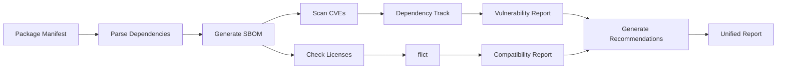

**Design Rationale**: Supply-chain security is critical for modern applications. By generating SBOMs and continuously monitoring vulnerabilities, CortexDx MCP helps users maintain secure dependencies. The flict integration ensures legal compliance alongside security.

## Pattern Learning System

### Architecture

The Pattern Learning System enables CortexDx MCP to learn from successfully applied fixes and automatically resolve recurring problems without re-diagnosing the same issues (Req 16).

```typescript
// Pattern Learning System for accumulated diagnostic knowledge
export interface PatternLearningSystem {
  // Pattern storage (privacy-preserving)
  storePattern: (problem: ProblemSignature, solution: SolutionPattern) => Promise<void>;
  matchPattern: (problem: Problem) => Promise<PatternMatch[]>; // 90% accuracy, <3s
  
  // Pattern management
  getPatternById: (patternId: string) => Promise<StoredPattern | null>;
  listPatterns: (filters: PatternFilters) => Promise<StoredPattern[]>;
  deletePattern: (patternId: string) => Promise<void>;
  
  // Analytics
  getPatternStatistics: () => Promise<PatternStatistics>;
  getSuccessRate: (patternId: string) => Promise<number>;
}

export interface ProblemSignature {
  // Anonymized problem characteristics
  errorType: string;
  errorPattern: string; // Regex pattern with sensitive data removed
  severity: 'low' | 'medium' | 'high' | 'critical';
  affectedComponents: string[];
  contextSignature: string; // Hash of relevant context without sensitive data
  mcpVersion?: string;
  protocolFeatures?: string[];
}

export interface SolutionPattern {
  // Solution template without sensitive data
  solutionType: string;
  steps: SolutionStepTemplate[];
  codeChanges?: CodeChangeTemplate[];
  configChanges?: ConfigChangeTemplate[];
  validationCriteria: ValidationTemplate[];
  successRate: number;
  applicationsCount: number;
  lastApplied: Date;
}

export interface PatternMatch {
  patternId: string;
  confidence: number; // 0-1 scale
  signature: ProblemSignature;
  solution: SolutionPattern;
  reasoning: string;
}

export interface StoredPattern {
  id: string;
  signature: ProblemSignature;
  solution: SolutionPattern;
  createdAt: Date;
  updatedAt: Date;
  applicationsCount: number;
  successCount: number;
  failureCount: number;
  tags: string[];
}
```

### Privacy-Preserving Anonymization

**Data Removal** (Req 16.4):

- Endpoint URLs → Generic placeholders (`https://example.com/mcp`)
- API keys and tokens → Removed entirely
- User-specific identifiers → Hashed or removed
- Credentials → Never stored
- Custom domain names → Replaced with generic patterns

**Pattern Matching Strategy**:

1. **Structural Matching**: Compare error types, affected components, and context structure
2. **Semantic Matching**: Use LLM to understand problem similarity beyond exact matches
3. **Confidence Scoring**: Calculate match confidence based on multiple factors
4. **Threshold Filtering**: Only suggest patterns with >70% confidence

**Storage Architecture**:

- Local SQLite database for pattern storage
- Encrypted at rest using system keychain
- Periodic cleanup of low-success patterns
- Export/import for team sharing (with privacy validation)

**Design Rationale**: The pattern learning system addresses the need to avoid re-diagnosing the same issues repeatedly. By storing anonymized problem-solution patterns, CortexDx MCP can instantly recognize and resolve recurring problems while maintaining user privacy and security.

## Plugin Orchestration and MCP Tool Exposure

### Architecture

The Plugin Orchestrator enables diagnostic plugins to be exposed as MCP tools and executed in parallel or sequence (Req 17).

```typescript
// Plugin Orchestrator for parallel and sequential execution
export interface PluginOrchestrator {
  // Plugin execution
  executePlugin: (pluginId: string, context: DiagnosticContext) => Promise<Finding[]>;
  executeParallel: (pluginIds: string[], context: DiagnosticContext) => Promise<PluginResults>;
  executeSequential: (workflow: PluginWorkflow, context: DiagnosticContext) => Promise<WorkflowResults>;
  
  // Workflow management
  createWorkflow: (definition: WorkflowDefinition) => Promise<PluginWorkflow>;
  validateWorkflow: (workflow: PluginWorkflow) => Promise<ValidationResult>;
  
  // Plugin registry
  listPlugins: () => Promise<PluginInfo[]>;
  getPluginSchema: (pluginId: string) => Promise<PluginSchema>;
}

export interface PluginWorkflow {
  id: string;
  name: string;
  description: string;
  stages: WorkflowStage[];
  dependencies: WorkflowDependency[];
}

export interface WorkflowStage {
  id: string;
  pluginId: string;
  order: number;
  parallel: boolean; // Execute with other stages at same order
  inputMapping?: Record<string, string>; // Map outputs from previous stages
  condition?: StageCondition; // Conditional execution
}

export interface WorkflowDependency {
  fromStage: string;
  toStage: string;
  dataFlow: string[]; // Which data flows between stages
}

export interface PluginResults {
  results: Map<string, Finding[]>;
  executionTime: number;
  errors: Map<string, Error>;
}

export interface WorkflowResults {
  stageResults: Map<string, Finding[]>;
  totalExecutionTime: number;
  stageTimings: Map<string, number>;
  skippedStages: string[]; // Stages skipped due to conditions
}
```

### MCP Tool Schema

Each diagnostic plugin is exposed as an MCP tool with standardized schema:

```typescript
// MCP tool definition for a diagnostic plugin
export interface DiagnosticToolSchema {
  name: string; // e.g., "cortexdx_diagnose_protocol"
  description: string;
  inputSchema: {
    type: "object";
    properties: {
      endpoint: { type: "string"; description: "MCP server endpoint" };
      options?: { type: "object"; /* plugin-specific options */ };
    };
    required: string[];
  };
  outputSchema: {
    type: "object";
    properties: {
      findings: { type: "array"; items: { /* Finding schema */ } };
      reportUrl?: { type: "string"; description: "URL to full report" };
    };
  };
}
```

**Parallel Execution Strategy** (Req 17.2):

- Independent plugins execute concurrently using Promise.all()
- Shared context with thread-safe access
- Timeout management per plugin (30s total)
- Graceful degradation if some plugins fail

**Sequential Execution Strategy** (Req 17.3):

- Stages execute in dependency order
- Output from previous stages passed as input to next stages
- State accumulation across stages
- Early termination on critical failures

**Design Rationale**: Exposing plugins as MCP tools enables CortexDx MCP to be composed with other MCP clients and agents. The orchestration capabilities allow users to build custom diagnostic workflows tailored to their specific needs, while parallel execution ensures fast results.

## LangGraph v1.0 Integration

### Architecture

The Agent Orchestrator uses LangGraph v1.0 for modular agent orchestration with persistent memory and complex workflow management (Req 18).

```typescript
// LangGraph-based Agent Orchestrator
export interface AgentOrchestrator {
  // Workflow definition
  defineWorkflow: (definition: GraphWorkflowDefinition) => Promise<DiagnosticGraph>;
  compileWorkflow: (graph: DiagnosticGraph) => Promise<CompiledWorkflow>;
  
  // Execution
  executeWorkflow: (workflow: CompiledWorkflow, input: WorkflowInput) => Promise<WorkflowOutput>;
  streamWorkflow: (workflow: CompiledWorkflow, input: WorkflowInput) => AsyncIterator<WorkflowEvent>;
  
  // State management
  getWorkflowState: (executionId: string) => Promise<WorkflowState>;
  updateWorkflowState: (executionId: string, updates: Partial<WorkflowState>) => Promise<void>;
  
  // Human-in-the-loop
  pauseForHumanInput: (executionId: string, prompt: string) => Promise<void>;
  provideHumanInput: (executionId: string, input: HumanInput) => Promise<void>;
  
  // Visualization
  visualizeWorkflow: (workflow: DiagnosticGraph) => Promise<WorkflowVisualization>;
  getExecutionTrace: (executionId: string) => Promise<ExecutionTrace>;
}

export interface GraphWorkflowDefinition {
  nodes: GraphNode[];
  edges: GraphEdge[];
  entryPoint: string;
  checkpoints: CheckpointConfig;
}

export interface GraphNode {
  id: string;
  type: 'diagnostic' | 'llm' | 'decision' | 'human' | 'action';
  handler: NodeHandler;
  retryPolicy?: RetryPolicy;
}

export interface GraphEdge {
  from: string;
  to: string;
  condition?: EdgeCondition; // Conditional branching
  label?: string;
}

export interface WorkflowState {
  executionId: string;
  currentNode: string;
  data: Record<string, any>; // Persistent state
  findings: Finding[];
  history: StateTransition[];
  pausedForHuman?: boolean;
  humanPrompt?: string;
}

export interface HumanInput {
  decision: string;
  data?: Record<string, any>;
  timestamp: Date;
}
```

### LangGraph Integration Points

**State Persistence** (Req 18.2):

- LangGraph's built-in checkpointing for state persistence
- SQLite backend for checkpoint storage
- State recovery after interruptions
- Cross-session state continuity

**Conditional Branching** (Req 18.3):

- Edge conditions based on diagnostic results
- Dynamic routing based on severity levels
- Fallback paths for error scenarios
- Loop detection and prevention

**Human-in-the-Loop** (Req 18.4):

- Pause workflow at decision points
- Present options to user with context
- Resume workflow with user input
- Timeout handling for abandoned workflows

**Workflow Visualization** (Req 18.5):

- Mermaid diagram generation from graph structure
- Real-time execution highlighting
- State transition history
- Performance metrics per node

### Example Diagnostic Workflow

```typescript
// Example: Multi-stage diagnostic workflow with LangGraph
const diagnosticWorkflow = {
  nodes: [
    { id: 'detect_auth', type: 'diagnostic', handler: detectAuthRequirements },
    { id: 'authenticate', type: 'action', handler: performOAuth },
    { id: 'run_inspector', type: 'diagnostic', handler: runMCPInspector },
    { id: 'analyze_findings', type: 'llm', handler: analyzeFindingsWithLLM },
    { id: 'check_patterns', type: 'diagnostic', handler: matchKnownPatterns },
    { id: 'human_decision', type: 'human', handler: askUserForApproval },
    { id: 'apply_fix', type: 'action', handler: applyAutomatedFix },
    { id: 'validate', type: 'diagnostic', handler: validateFix },
  ],
  edges: [
    { from: 'detect_auth', to: 'authenticate', condition: 'authRequired' },
    { from: 'detect_auth', to: 'run_inspector', condition: '!authRequired' },
    { from: 'authenticate', to: 'run_inspector' },
    { from: 'run_inspector', to: 'analyze_findings' },
    { from: 'analyze_findings', to: 'check_patterns' },
    { from: 'check_patterns', to: 'apply_fix', condition: 'patternFound && autoFix' },
    { from: 'check_patterns', to: 'human_decision', condition: '!autoFix' },
    { from: 'human_decision', to: 'apply_fix', condition: 'approved' },
    { from: 'apply_fix', to: 'validate' },
  ],
  entryPoint: 'detect_auth',
  checkpoints: { enabled: true, interval: 'per_node' },
};
```

**Design Rationale**: LangGraph v1.0 provides a robust foundation for building complex diagnostic workflows with state management, conditional branching, and human-in-the-loop capabilities. This enables sophisticated multi-step problem resolution that can adapt based on intermediate results and user input.

## Performance Profiling Tool Integration

### Architecture

Integration of specialized profiling tools for Node.js and Python MCP servers (Req 23).

```typescript
// Performance Profiler with Tool Integration
export interface PerformanceProfilerIntegration {
  // Tool selection
  selectProfiler: (serverType: 'nodejs' | 'python' | 'other') => Promise<ProfilerTool>;
  
  // Profiling execution
  profileNodeJS: (target: string, duration: number) => Promise<ClinicResults>;
  profilePython: (target: string, duration: number) => Promise<PySpyResults>;
  
  // Analysis
  generateFlameGraph: (profile: ProfileData) => Promise<FlameGraph>;
  identifyBottlenecks: (profile: ProfileData) => Promise<Bottleneck[]>;
  detectMemoryLeaks: (profile: ProfileData) => Promise<MemoryLeak[]>;
  
  // Recommendations
  generateOptimizations: (bottlenecks: Bottleneck[]) => Promise<Optimization[]>;
}

// Clinic.js Integration (Req 23.1)
export interface ClinicIntegration {
  // Clinic Doctor - Event loop diagnosis
  runDoctor: (target: string) => Promise<DoctorResults>;
  detectEventLoopBlocking: (results: DoctorResults) => Promise<BlockingOperation[]>;
  
  // Clinic Flame - CPU profiling
  runFlame: (target: string) => Promise<FlameResults>;
  generateCPUFlameGraph: (results: FlameResults) => Promise<FlameGraph>;
  identifyCPUHotspots: (results: FlameResults) => Promise<Hotspot[]>;
  
  // Clinic Bubbleprof - Async operations
  runBubbleprof: (target: string) => Promise<BubbleprofResults>;
  analyzeAsyncOperations: (results: BubbleprofResults) => Promise<AsyncAnalysis>;
  detectAsyncBottlenecks: (results: BubbleprofResults) => Promise<AsyncBottleneck[]>;
}

export interface DoctorResults {
  eventLoopDelay: number[];
  cpuUsage: number[];
  memoryUsage: number[];
  activeHandles: number[];
  recommendations: string[];
}

export interface FlameResults {
  samples: Sample[];
  stacks: Stack[];
  totalTime: number;
  flameGraphData: FlameGraphData;
}

// py-spy Integration (Req 23.2)
export interface PySpyIntegration {
  // Sampling profiling
  profile: (pid: number, duration: number) => Promise<PySpyResults>;
  profileSubprocess: (command: string, duration: number) => Promise<PySpyResults>;
  
  // Output formats
  generateFlameGraph: (results: PySpyResults) => Promise<FlameGraph>;
  generateSpeedscope: (results: PySpyResults) => Promise<SpeedscopeData>;
  
  // Analysis
  identifySlowFunctions: (results: PySpyResults) => Promise<SlowFunction[]>;
  analyzeGILContention: (results: PySpyResults) => Promise<GILAnalysis>;
}

export interface PySpyResults {
  samples: PythonSample[];
  functions: FunctionStats[];
  totalSamples: number;
  duration: number;
  flameGraphData: FlameGraphData;
}

// Flame Graph Generation (Req 23.3)
export interface FlameGraph {
  format: 'svg' | 'html' | 'json';
  data: FlameGraphData;
  interactive: boolean;
  metadata: {
    totalSamples: number;
    duration: number;
    timestamp: Date;
  };
}

// Performance Bottleneck Detection (Req 23.4)
export interface Bottleneck {
  type: 'cpu' | 'memory' | 'event-loop' | 'async' | 'io';
  severity: 'low' | 'medium' | 'high' | 'critical';
  location: string; // Function/file location
  impact: number; // Percentage of total time
  description: string;
  evidence: ProfileEvidence[];
}

// Optimization Recommendations (Req 23.5)
export interface Optimization {
  bottleneck: Bottleneck;
  recommendation: string;
  estimatedImpact: string;
  codeExample?: string;
  references: string[];
}
```

### Profiling Workflow

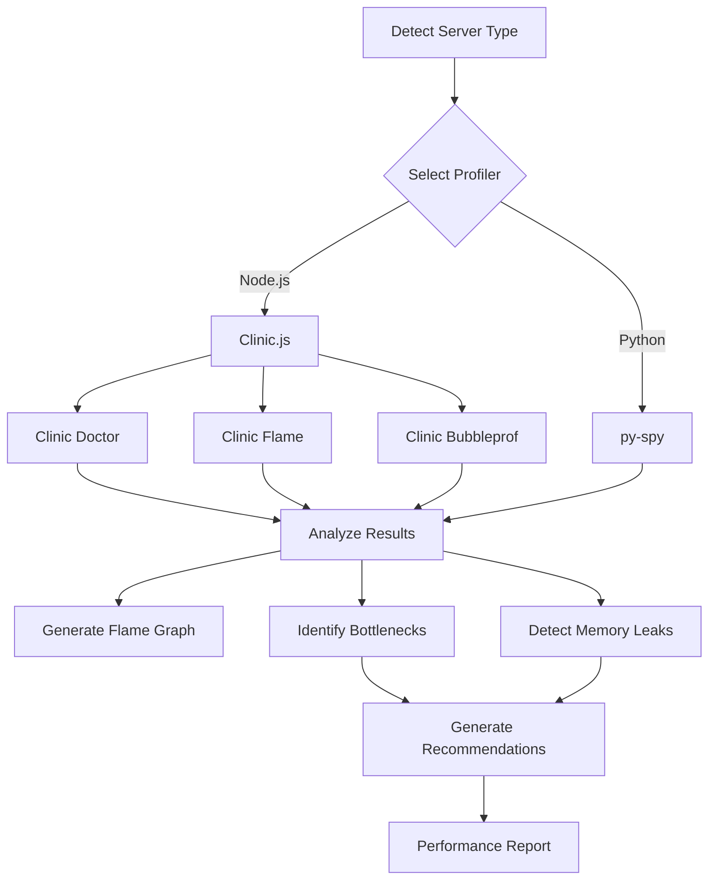

**Design Rationale**: Clinic.js and py-spy are best-in-class profiling tools for their respective ecosystems. Integrating them provides deep performance insights without requiring code instrumentation, making it easy for users to diagnose performance issues in MCP servers.

## Protocol Validation Tool Integration

### Architecture

Integration of Protovalidate for semantic validation of Protocol Buffer messages (Req 24).

```typescript
// Protocol Validator with Protovalidate
export interface ProtocolValidatorIntegration {
  // Protovalidate integration (Req 24.1)
  validateProtobuf: (message: any, schema: ProtoSchema) => Promise<ValidationResult>;
  validateWithCEL: (message: any, rules: CELRule[]) => Promise<ValidationResult>;
  
  // MCP protocol validation (Req 24.2)
  validateJSONRPC: (message: JSONRPCMessage) => Promise<ValidationResult>;
  validateGRPC: (message: GRPCMessage) => Promise<ValidationResult>;
  validateMCPHandshake: (initializeMessage: any) => Promise<ValidationResult>;
  
  // Custom rules (Req 24.3)
  createCELRule: (expression: string, message: string) => Promise<CELRule>;
  loadCustomRules: (rulesFile: string) => Promise<CELRule[]>;
  
  // Error reporting (Req 24.4)
  getFieldViolations: (result: ValidationResult) => Promise<FieldViolation[]>;
  generateDetailedErrors: (violations: FieldViolation[]) => Promise<DetailedError[]>;
}

// Protovalidate Integration
export interface ProtovalidateIntegration {
  // Validation
  validate: (message: ProtoMessage, constraints: Constraints) => Promise<ValidationResult>;
  validateField: (field: any, constraint: FieldConstraint) => Promise<FieldValidationResult>;
  
  // CEL expressions
  evaluateCEL: (expression: string, context: any) => Promise<boolean>;
  compileCEL: (expression: string) => Promise<CompiledCEL>;
  
  // Standard constraints
  validateString: (value: string, constraints: StringConstraints) => Promise<ValidationResult>;
  validateNumber: (value: number, constraints: NumberConstraints) => Promise<ValidationResult>;
  validateRepeated: (values: any[], constraints: RepeatedConstraints) => Promise<ValidationResult>;
}

export interface StringConstraints {
  minLength?: number;
  maxLength?: number;
  pattern?: string; // Regex pattern
  prefix?: string;
  suffix?: string;
  contains?: string;
  notContains?: string;
  in?: string[]; // Enum values
  notIn?: string[];
  email?: boolean;
  hostname?: boolean;
  ip?: boolean;
  uri?: boolean;
  uuid?: boolean;
}

export interface NumberConstraints {
  const?: number;
  lt?: number; // Less than
  lte?: number; // Less than or equal
  gt?: number; // Greater than
  gte?: number; // Greater than or equal
  in?: number[];
  notIn?: number[];
  finite?: boolean;
}

// MCP-Specific Validation Rules
export interface MCPValidationRules {
  // Initialize message validation
  validateInitialize: (msg: InitializeMessage) => Promise<ValidationResult>;
  validateProtocolVersion: (version: string) => Promise<ValidationResult>;
  validateCapabilities: (capabilities: Capabilities) => Promise<ValidationResult>;
  
  // Tool definition validation
  validateToolDefinition: (tool: ToolDefinition) => Promise<ValidationResult>;
  validateInputSchema: (schema: JSONSchema) => Promise<ValidationResult>;
  
  // Resource validation
  validateResourceURI: (uri: string) => Promise<ValidationResult>;
  validateMimeType: (mimeType: string) => Promise<ValidationResult>;
}

// Field-Level Validation (Req 24.4)
export interface FieldViolation {
  fieldPath: string; // e.g., "initialize.protocolVersion"
  constraintId: string;
  message: string;
  value: any;
  expectedConstraint: string;
}

export interface DetailedError {
  field: string;
  violation: FieldViolation;
  suggestion: string;
  documentation: string;
}
```

### CEL Validation Examples

```typescript
// Example CEL rules for MCP protocol validation
const mcpCELRules = [
  {
    field: 'protocolVersion',
    rule: 'this.matches("^\\d+\\.\\d+\\.\\d+$")',
    message: 'Protocol version must be in semver format (e.g., "2024.11.05")'
  },
  {
    field: 'capabilities.tools',
    rule: 'size(this) > 0',
    message: 'Server must expose at least one tool'
  },
  {
    field: 'tool.inputSchema',
    rule: 'has(this.type) && this.type == "object"',
    message: 'Tool input schema must be a JSON Schema object'
  },
  {
    field: 'resource.uri',
    rule: 'this.startsWith("file://") || this.startsWith("http://") || this.startsWith("https://")',
    message: 'Resource URI must use a valid scheme'
  }
];
```

**Design Rationale**: Protovalidate provides powerful semantic validation using CEL expressions, enabling complex validation rules beyond simple type checking. This ensures MCP protocol messages are not just syntactically correct but semantically valid, catching subtle protocol violations early.

## Report Management and URL-Based Sharing

### Architecture

The Report Manager handles configurable report storage and URL-based sharing to reduce token usage and improve organization (Req 19).

```typescript
// Report Manager for storage and URL-based sharing
export interface ReportManager {
  // Report storage
  storeReport: (report: DiagnosticReport, options: StorageOptions) => Promise<ReportMetadata>;
  retrieveReport: (reportId: string, format: ReportFormat) => Promise<string>;
  deleteReport: (reportId: string) => Promise<void>;
  
  // URL generation
  generateReportUrl: (reportId: string) => Promise<string>;
  getReportByUrl: (url: string, format: ReportFormat) => Promise<string>;
  
  // Organization
  listReports: (filters: ReportFilters) => Promise<ReportMetadata[]>;
  searchReports: (query: string) => Promise<ReportMetadata[]>;
  
  // Configuration
  setStorageLocation: (location: string) => Promise<void>;
  getStorageLocation: () => Promise<string>;
}

export interface StorageOptions {
  location?: string; // Override default storage location
  organizationStrategy: 'date' | 'session' | 'type' | 'custom';
  retentionDays?: number;
  compress?: boolean;
}

export interface ReportMetadata {
  id: string;
  url: string;
  sessionId: string;
  diagnosticType: string;
  createdAt: Date;
  size: number;
  format: ReportFormat[];
  path: string;
  tags: string[];
}

export type ReportFormat = 'json' | 'markdown' | 'html';

export interface ReportFilters {
  startDate?: Date;
  endDate?: Date;
  diagnosticType?: string;
  sessionId?: string;
  tags?: string[];
  minSeverity?: string;
}
```

### Storage Organization

**Directory Structure** (Req 19.3):

```
{storage_root}/
├── reports/
│   ├── 2025-01-08/
│   │   ├── session-abc123/
│   │   │   ├── protocol-compliance.json
│   │   │   ├── protocol-compliance.md
│   │   │   └── protocol-compliance.html
│   │   └── session-def456/
│   │       └── security-scan.json
│   ├── 2025-01-09/
│   └── index.db  # SQLite index for fast lookups
└── config/
    └── report-config.json
```

**Configuration** (Req 19.1):

```typescript
// Configuration via environment variables or config file
export interface ReportConfig {
  storageRoot: string; // Default: ./reports or $CORTEXDX_REPORT_DIR
  baseUrl: string; // For URL generation, e.g., http://localhost:5001/reports
  organizationStrategy: 'date' | 'session' | 'type';
  retentionDays: number; // Auto-delete old reports
  enableCompression: boolean;
  formats: ReportFormat[]; // Which formats to generate
}
```

**URL-Based Access** (Req 19.4):

```typescript
// HTTP endpoint for report access
GET /reports/{reportId}
Accept: application/json | text/markdown | text/html

Response:
- Content-Type based on Accept header
- Cache headers for performance
- Gzip compression if requested
```

**Token Usage Optimization** (Req 19.5):

```typescript
// MCP tool response with URL instead of full content
{
  "findings": [
    { "id": "...", "severity": "major", "title": "..." }
  ],
  "reportUrl": "http://localhost:5001/reports/abc123",
  "summary": "Found 5 issues: 1 critical, 2 major, 2 minor"
}

// Instead of embedding full report (thousands of tokens)
```

**Design Rationale**: URL-based report sharing dramatically reduces token usage in MCP tool responses while providing better organization and accessibility. Users can share report URLs with team members or other systems without copying large JSON payloads. The configurable storage location prevents reports from cluttering the workspace root.

## Code Standards and Infrastructure Compliance

### brAInwav CODESTYLE.md Compliance

All implementations must follow established brAInwav standards:

**Naming Conventions**:

- Files and directories: `kebab-case` (e.g., `license-validator.ts`, `mcp-compatibility.ts`)
- Functions and variables: `camelCase` (e.g., `validateLicense`, `checkCompliance`)
- Types and interfaces: `PascalCase` (e.g., `LicenseValidator`, `ComplianceResult`)
- Constants: `UPPER_SNAKE_CASE` (e.g., `MAX_VALIDATION_TIME_MS`)

**Code Structure**:

- Functions ≤ 40 lines; split into helpers when needed
- Named exports only (no `export default`)
- ESM modules with `"type": "module"`
- AbortSignal support for all async operations
- Proper error handling with context propagation

**Infrastructure Reuse**:

- Extend existing `DiagnosticPlugin` interface instead of creating new base classes
- Use existing adapter patterns in `src/adapters/` for new integrations
- Leverage existing worker sandbox system for plugin isolation
- Follow existing observability patterns with brAInwav branding
- Reuse existing `Finding`, `EvidencePointer`, and `FilePlan` types

**Quality Gates**:

- Branch coverage ≥ 65% (configurable via `BRANCH_MIN`)
- Mutation score ≥ 75% (configurable via `MUTATION_MIN`)
- All functions must include proper TypeScript types
- Security scanning with Semgrep and governance rules
- No `Math.random()`, hard-coded mocks, or TODO comments in production paths

## Natural Language Development Interface

### Conversational Development Workflow

The system provides a natural language interface that guides users through MCP development without requiring deep technical knowledge:

**User Interaction Flow**:

1. **Intent Recognition**: Understands development goals from natural language descriptions
2. **Requirement Clarification**: Asks targeted questions to gather necessary details
3. **Solution Planning**: Proposes implementation approach with user-friendly explanations
4. **Iterative Development**: Generates code with conversational refinement based on feedback
5. **Testing and Validation**: Automatically tests generated implementations with user-friendly results

**Key Design Decisions**:

- **Adaptive Communication**: Adjusts technical depth based on detected user expertise level
- **Contextual Memory**: Maintains conversation context across development sessions
- **Progressive Disclosure**: Reveals technical details gradually as users become more comfortable
- **Error Recovery**: Gracefully handles misunderstandings and provides clarification options

### Team Standardization and Templates

**Organization-Specific Customization**:

- **Template Management**: JSON-configurable templates for team-specific patterns and conventions (Req 10.1)
- **Coding Standards Enforcement**: Automated validation against organizational guidelines (Req 10.2, 10.3)
- **Best Practices Integration**: Team-defined rules integrated into AI suggestions and code generation (Req 10.2)
- **Documentation Standards**: Consistent documentation generation following team preferences (Req 10.4)

**Standardization Features**:

- **Convention Validation**: Ensures generated code follows naming conventions and architectural patterns (Req 10.3)
- **Template Customization**: Allows teams to define custom MCP server and connector templates (Req 10.1)
- **Quality Gates**: Automated checks for code quality, security, and compliance with team standards (Req 10.5)
- **Knowledge Sharing**: Captures and reuses successful patterns across team members (Req 10.2)
- **Compliance Checking**: Validates against organizational MCP standards defined in configuration files (Req 10.5)

## Extensibility Framework

### FASTMCP v3 Plugin System

The modular plugin architecture enables:

- **Diagnostic Plugins**: Pluggable analyzers for different MCP aspects (security, performance, compliance) (Req 3.1, 5.1, 6.1)
- **LLM Backend Plugins**: Swappable local LLM implementations (Ollama, MLX) (Req 12.3, 12.4)
- **Code Generator Plugins**: Modular code generation for different languages and frameworks (Req 1.2, 2.2, 8.1)
- **Transport Plugins**: Support for different MCP transport protocols (Req 4.3)
- **Authentication Plugins**: Pluggable authentication mechanisms (Req 6.4, 7.1)
- **Reporting Plugins**: Customizable output formats and destinations (Req 7.5)

### Plugin Development Kit

- **Plugin SDK**: TypeScript SDK for developing custom plugins (Req 10.1)
- **Plugin Templates**: Boilerplate code for common plugin types (Req 10.1)
- **Testing Framework**: Automated testing tools for plugin validation (Req 7.4, 11.2)
- **Documentation Generator**: Automatic API documentation for plugins (Req 7.5, 10.4)
- **Plugin Registry**: Centralized registry for plugin discovery and distribution

### Version Management

- **Semantic Versioning**: Automatic compatibility checking between plugin versions (Req 11.3)
- **Dependency Resolution**: Automatic resolution of plugin dependencies (Req 11.5)
- **Migration Tools**: Automated migration between plugin versions (Req 11.4, 11.5)
- **Rollback Support**: Safe rollback to previous plugin versions
- **Update Notifications**: Automatic notifications for available plugin updates

### API Extensions and Integration

- **REST API**: External integrations with version-specific endpoints
- **WebSocket API**: Real-time updates with plugin-specific channels
- **CLI Interface**: Command-line automation with plugin-aware commands (Req 1.1, 4.1)
- **IDE Plugin Support**: Integration APIs for popular development environments (Req 1.3)

### Deployment and Integration Support

**Containerization and Orchestration** (Req 7.1, 7.2):

- **Docker Support**: Pre-built Docker images for all licensing tiers
- **Kubernetes Deployment**: Helm charts and deployment configurations
- **CI/CD Integration**: Pipeline templates for automated deployment (Req 7.4)
- **Configuration Management**: Environment-specific configuration validation (Req 7.2)

**Production Readiness** (Req 7.3, 7.5):

- **Health Checks**: Comprehensive health check endpoints for monitoring
- **Metrics Collection**: Performance and usage metrics with 1-second intervals (Req 5.4)
- **Deployment Guides**: Step-by-step deployment documentation in Markdown (Req 7.5)
- **Operational Documentation**: Troubleshooting and maintenance guides (Req 7.5)

## License Validation and Compliance Architecture

### Academic Research License Validation

**Real-Time License Checking**:

- **Sub-3-Second Validation**: All academic research suggestions validated against approved licenses within 3 seconds
- **Approved License Database**: Maintains comprehensive database of open-source and permissive licenses
- **Proprietary Content Detection**: Automatically identifies research requiring licensing approval
- **Legal Framework Integration**: Integrates with organizational legal policies and approval workflows

**Compliance Monitoring System**:

- **Continuous Tracking**: Monitors all academic integration usage with audit trail maintenance
- **Automated Reporting**: Generates compliance reports for legal and management review
- **Risk Assessment**: Evaluates intellectual property risks and provides mitigation recommendations
- **Approval Workflow**: Manages approval process for proprietary research content

**Integration with Academic Providers**:

- **Context7 Integration**: License validation integrated into architecture and code quality assessments
- **Semantic Scholar Compliance**: Citation checking includes license compliance verification
- **arXiv Validation**: Preprint analysis includes intellectual property compliance checking
- **OpenAlex Integration**: Research trend analysis includes license compatibility assessment

**Design Rationale**: The license validation system ensures legal compliance while maintaining the value of academic research integration. By validating licenses before suggestions are made, the system prevents legal issues and provides confidence in the compliance of all research-based recommendations.

### Compliance Workflow

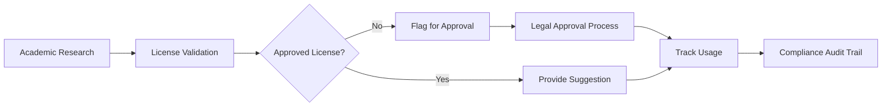
