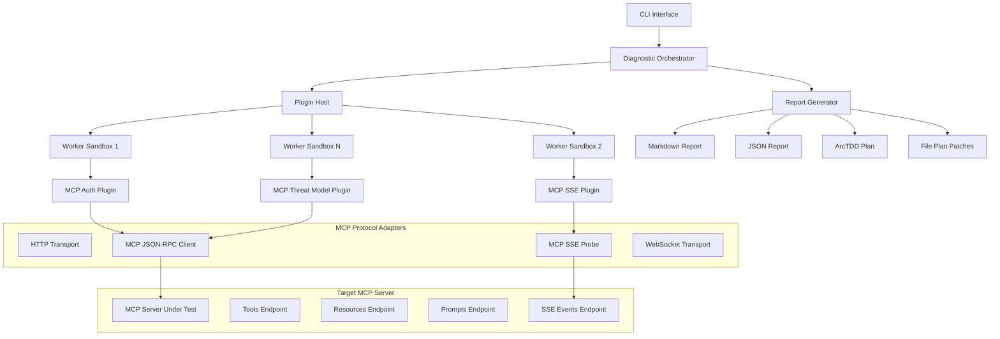

# Design Document

## Overview

Insula MCP implements a plugin-based diagnostic meta-inspector architecture specifically designed to proactively identify security, performance, and compliance issues in MCP (Model Context Protocol) servers before they reach production. The system safely executes comprehensive checks against MCP servers, focusing on protocol conformance, security vulnerabilities, operational readiness, and governance compliance. It uses worker thread sandboxing for isolation, provides multiple output formats with accessibility support, and integrates with CI/CD pipelines through structured exit codes and artifact generation.

The diagnostic system validates MCP protocol compliance and security including:

- JSON-RPC 2.0 transport layer conformance and MCP-specific extensions
- MCP tool, resource, and prompt discovery mechanisms with security analysis
- Server-Sent Events (SSE) streaming capabilities for MCP progress notifications
- Authentication and authorization implementations with vulnerability detection
- Tool permissioning analysis against least-privilege principles
- STRIDE-based threat modeling for MCP-specific attack vectors
- Academic research provider integration with FASTMCP v3.22 compliance
- Governance policy compliance and drift detection
- Performance baseline measurements and SLA validation
- Accessibility compliance (WCAG 2.2 AA) for inclusive tooling

## Architecture

### High-Level Architecture



### Plugin Architecture

The system follows a plugin-based architecture where each diagnostic capability is implemented as an isolated plugin:

- **Stateless Design**: Plugins receive a diagnostic context and return findings without maintaining state
- **Sandboxed Execution**: Each plugin runs in a Node.js worker thread with resource limits
- **Adapter Pattern**: Common network operations are abstracted through adapters
- **Evidence Collection**: Plugins collect evidence pointers that link findings to specific sources

## Components and Interfaces

### Core Components

#### 1. CLI Interface (`cli.ts`)

- **Purpose**: Command-line interface using Commander.js
- **Key Methods**:
  - `diagnose <endpoint>`: Main diagnostic command
  - `doctor`: Environment health checks
  - `compare <old> <new>`: Diff findings between runs
- **Configuration**: Supports extensive CLI flags for customization

#### 2. Diagnostic Orchestrator (`orchestrator.ts`)

- **Purpose**: Coordinates plugin execution and report generation
- **Responsibilities**:
  - Plugin selection based on suites and full mode
  - Result aggregation and severity assessment
  - Exit code determination for CI/CD integration
  - Output directory management

#### 3. Plugin Host (`plugin-host.ts`)

- **Purpose**: Manages plugin lifecycle and sandboxing
- **Key Features**:
  - Worker thread creation with resource limits
  - Fallback to in-process execution
  - Evidence relay from workers to host
  - Timeout and memory budget enforcement

#### 4. Diagnostic Context

- **Purpose**: Runtime environment provided to plugins with security and accessibility considerations
- **Design Rationale**: Centralized context ensures consistent plugin behavior while maintaining security boundaries
- **Interface**:

```typescript
interface DiagnosticContext {
  endpoint: string;
  headers?: Record<string, string>;
  logger: (...args: unknown[]) => void;
  request: <T>(input: RequestInfo, init?: RequestInit) => Promise<T>;
  jsonrpc: <T>(method: string, params?: unknown) => Promise<T>;
  sseProbe: (url: string, opts?: unknown) => Promise<SseResult>;
  governance?: GovernancePack;
  llm?: LlmAdapter | null;
  evidence: (ev: EvidencePointer) => void;
  deterministic?: boolean;
  // Accessibility support
  a11yMode?: boolean;
  // Security constraints
  timeoutMs?: number;
  memoryLimitMB?: number;
}
```

### Plugin System

#### Built-in Plugins

1. **DevTool Environment Plugin** (`devtool-env.ts`)
   - Checks for known CVEs in development tools and MCP Inspector versions
   - Validates development environment security posture
   - **Design Rationale**: Early detection of compromised development tools prevents supply chain attacks
   - Order: 10 (runs first)

2. **MCP Authentication Plugin** (`auth.ts`)
   - Tests unauthenticated access to discovery endpoints with BLOCKER severity for exposed tools
   - Validates multiple authentication schemes (Bearer tokens, Basic auth, custom headers)
   - Detects authentication bypass vulnerabilities and header case sensitivity issues
   - **Design Rationale**: Authentication failures represent critical security risks requiring immediate attention
   - Order: 90

3. **MCP Discovery Plugin** (`discovery.ts`)
   - Enumerates MCP tools, prompts, and resources via JSON-RPC discovery methods
   - Tests discovery endpoint response schemas and capability negotiation
   - Validates MCP protocol version handshake and metadata consistency
   - **Design Rationale**: Discovery validation ensures proper MCP protocol implementation and prevents capability confusion
   - Order: 100

4. **MCP Protocol Plugin** (`protocol.ts`)
   - Validates MCP JSON-RPC 2.0 conformance and initialization handshake
   - Tests method signatures, parameter schemas, and error handling
   - Verifies MCP-specific error codes and response formats
   - **Design Rationale**: Protocol conformance ensures interoperability and prevents client-server communication failures
   - Order: 110

5. **MCP JSON-RPC Batch Plugin** (`jsonrpc-batch.ts`)
   - Tests batch request handling for multiple tool calls and notification processing
   - Validates mixed string/number ID handling and progress update mechanisms
   - **Design Rationale**: Batch processing is critical for performance and must handle edge cases correctly
   - Order: 115

6. **MCP Tool Permissioning Plugin** (`permissioning.ts`)
   - Analyzes tool capabilities for over-privileging using heuristic risk classification
   - Generates MAJOR findings for high-risk capabilities (filesystem, shell, network access)
   - Provides confidence scores and recommends confirmation prompts and scoping restrictions
   - **Design Rationale**: Least-privilege enforcement prevents privilege escalation and reduces attack surface
   - Order: 135

7. **MCP Streaming SSE Plugin** (`streaming-sse.ts`)
   - Tests Server-Sent Events endpoints for proper content-type headers and streaming behavior
   - Validates MCP-specific SSE message formats, event types, and streaming tool execution progress
   - **Design Rationale**: SSE reliability is crucial for real-time progress updates and user experience
   - Order: 200

8. **SSE Reconnect Plugin** (`sse-reconnect.ts`)
   - Tests retry directives, Last-Event-ID support, and reconnection mechanisms
   - Validates heartbeat mechanisms and connection persistence for production readiness
   - **Design Rationale**: Robust reconnection handling ensures reliability behind proxies and CDNs
   - Order: 205

9. **CORS Plugin** (`cors.ts`)
   - Tests preflight requests across MCP routes and validates CORS header configurations
   - **Design Rationale**: Proper CORS configuration prevents cross-origin security issues in web deployments
   - Order: 210

10. **Rate Limit Plugin** (`ratelimit.ts`)
    - Tests 429 responses, Retry-After headers, and validates backoff mechanisms
    - Measures baseline latency and provides SLA baseline recommendations
    - **Design Rationale**: Rate limiting validation ensures production stability and prevents DoS vulnerabilities
    - Order: 220

11. **MCP Tool Drift Plugin** (`tool-drift.ts`)
    - Detects mutable tool surfaces that change without version updates
    - Compares capability snapshots for consistency and identifies potential tool poisoning
    - **Design Rationale**: Tool drift detection prevents security bypasses through dynamic capability injection
    - Order: 300

12. **Governance Plugin** (`governance.ts`)
    - Checks for .cortex governance packs and validates policy compliance
    - Generates MAJOR findings when governance packs are missing
    - Validates policy version consistency and provides remediation steps
    - **Design Rationale**: Governance compliance ensures organizational standards are maintained over time
    - Order: 400

13. **MCP Threat Model Plugin** (`threat-model.ts`)
    - Applies STRIDE threat modeling to MCP-specific attack vectors
    - Performs spoofing checks, tampering risk detection, and information disclosure assessment
    - Identifies prompt injection risks and privilege escalation through tool chaining
    - **Design Rationale**: Systematic threat modeling provides comprehensive security coverage beyond individual vulnerabilities
    - Order: 410

14. **Performance Plugin** (`performance.ts`)
    - Measures response times for JSON-RPC calls and tests timeout handling
    - Validates circuit breaker behavior and generates performance findings with latency measurements
    - **Design Rationale**: Performance baselines enable SLA establishment and regression detection
    - Order: 500

15. **Academic Research Providers** (`academic/`)
    - **Semantic Scholar Provider** (`semantic-scholar.mcp.ts`)
      - Paper search and citation analysis with FASTMCP v3.22 compliant tool definitions
    - **OpenAlex Provider** (`openalex.mcp.ts`)
      - Scholarly work and author search with research metrics and institutional data access
    - **Wikidata Provider** (`wikidata.mcp.ts`)
      - SPARQL query capabilities for knowledge graphs and entity lookup
    - **arXiv Provider** (`arxiv.mcp.ts`)
      - Preprint search and metadata extraction with category filtering
    - **Vibe Check Provider** (`Vibe_Check.mcp.ts`)
      - Research quality and methodology assessment with academic integrity validation
    - **Context7 Provider** (`context7.mcp.ts`)
      - Contextual research analysis and cross-referencing with citation context mapping
    - **Design Rationale**: Academic providers demonstrate MCP extensibility while providing real research value
    - Order: 600-650

#### Plugin Interface

```typescript
interface DiagnosticPlugin {
  id: string;
  title: string;
  order?: number;
  run: (ctx: DiagnosticContext) => Promise<Finding[]>;
}
```

### Academic Provider Registry

The system includes a comprehensive academic research provider registry under `registry.providers.academic`:

```typescript
interface AcademicProviderRegistry {
  semanticScholar: SemanticScholarProvider;
  openAlex: OpenAlexProvider;
  wikidata: WikidataProvider;
  arxiv: ArxivProvider;
  vibeCheck: VibeCheckProvider;
  context7: Context7Provider;
}

interface AcademicProvider {
  id: string;
  name: string;
  version: string;
  capabilities: string[];
  healthCheck: () => Promise<boolean>;
  authenticate?: (credentials: any) => Promise<void>;
  search: (query: ResearchQuery) => Promise<ResearchResult[]>;
  validate: (data: any) => Promise<ValidationResult>;
}
```

Each academic provider implements the FASTMCP v3.22 specification and provides:

- Research-specific tool definitions with parameter validation
- Capability negotiation for academic data access and API authentication  
- Error handling for API rate limits, availability, and quota management
- Structured data output for research workflows and citation management
- Integration with diagnostic framework for provider health monitoring
- Sandboxed execution within the Insula MCP worker thread architecture

Each academic provider implements the FASTMCP v3.22 specification and provides:

- Research-specific tool definitions
- Capability negotiation for academic data access
- Error handling for API rate limits and availability
- Structured data output for research workflows

### Network Adapters

#### HTTP Adapter (`adapters/http.ts`)

- Provides standardized HTTP request handling
- Automatic JSON/text response parsing
- Error handling with status codes

#### MCP JSON-RPC Adapter (`adapters/jsonrpc.ts`)

- Implements MCP compliant JSON-RPC 2.0 client protocol with authentication support
- Handles MCP initialization handshake and capability negotiation
- Auto-incrementing request IDs with MCP method routing and error handling
- **Design Rationale**: Centralized JSON-RPC handling ensures consistent authentication and error handling across plugins

#### MCP SSE Adapter (`adapters/sse.ts`)

- Server-Sent Events probing capabilities for MCP progress notifications and logging
- Event parsing with eventsource-parser for MCP-specific message formats
- Handles streaming tool execution progress with timeout and abort signal support
- **Design Rationale**: SSE adapter abstracts streaming complexity while providing robust error handling for production environments

#### WebSocket Adapter (`adapters/ws.ts`)

- WebSocket connection testing
- Ping/pong validation
- Connection lifecycle management

## Data Models

### Finding Structure

**Design Rationale**: Structured findings enable automated processing, CI/CD integration, and accessibility compliance while providing comprehensive remediation guidance.

```typescript
interface Finding {
  id: string;                    // Unique identifier for tracking
  area: string;                  // Category (auth, streaming, governance, etc.)
  severity: Severity;            // info|minor|major|blocker (maps to exit codes)
  title: string;                 // Human-readable title with accessibility prefixes
  description: string;           // Detailed description with context
  evidence: EvidencePointer[];   // Supporting evidence (required for all findings)
  tags?: string[];               // Classification tags for filtering
  confidence?: number;           // 0..1 confidence score for assessment quality
  recommendation?: string;       // Actionable remediation advice
  remediation?: {
    filePlan?: FilePlan;         // Unified diff patches for automated fixes
    steps?: string[];            // Manual remediation steps
    codeSamples?: CodeSample[];  // Example implementations
    arcTddPlan?: ArcTddStep[];   // Structured TDD remediation plan
  };
  // Accessibility and CI/CD integration
  a11yPrefix?: string;           // Screen reader friendly severity prefix
  cicdImpact?: 'fail' | 'warn' | 'info';  // CI/CD pipeline impact
}

type Severity = 'info' | 'minor' | 'major' | 'blocker';
```

### Evidence and Remediation

**Design Rationale**: Evidence pointers provide traceability and debugging support, while structured remediation enables automated fixes and follows ArcTDD methodology.

```typescript
interface EvidencePointer {
  type: "url" | "file" | "log" | "har";  // Extended to include HAR files
  ref: string;                           // Reference to evidence source
  lines?: [number, number];              // Line range for file evidence
  redacted?: boolean;                    // Indicates if sensitive data was removed
}

interface FilePlan {
  items: FilePlanItem[];
  description?: string;
  confidence?: number;
}

interface FilePlanItem {
  action: "update" | "new" | "delete";   // Extended actions for comprehensive fixes
  path: string;
  description?: string;
  patch?: string;                        // Unified diff format
  content?: string;                      // Full content for new files
}

interface ArcTddStep {
  phase: 'red' | 'green' | 'refactor';
  description: string;
  files: string[];
  tests?: string[];
}

interface CodeSample {
  language: string;
  code: string;
  description?: string;
  filename?: string;
}
```

## Error Handling

**Design Rationale**: Robust error handling ensures diagnostic reliability while maintaining security boundaries and providing actionable feedback.

### Plugin Error Isolation

- Worker thread crashes are contained and reported as framework findings with evidence pointers
- Network timeouts are handled gracefully with configurable budgets (default 5000ms)
- Plugin exceptions generate structured error findings with confidence scores
- **Security Consideration**: Plugin sandboxes deny filesystem and child_process access

### Graceful Degradation

- Sandbox initialization failures fall back to in-process execution with security warnings
- Missing endpoints generate informational findings rather than blocking execution
- Partial results are preserved when individual plugins fail, maintaining diagnostic value
- Authentication failures are escalated to BLOCKER severity as per security requirements

### Error Reporting

- All errors include evidence pointers for debugging and audit trails
- Stack traces are sanitized to prevent information leakage and secret exposure
- Error severity is mapped to appropriate finding levels and CI/CD exit codes
- HAR files are redacted for sensitive headers (authorization, cookie, token)

### Accessibility Error Handling

- Error messages include severity prefixes for screen reader compatibility
- Color-blind friendly error indication using text markers
- Summary-first error reporting when a11y mode is enabled

## Testing Strategy

**Design Rationale**: Comprehensive testing ensures diagnostic reliability, security, and accessibility compliance while validating against real-world MCP server scenarios.

### Unit Testing

- Plugin logic tested in isolation with mock diagnostic contexts
- Adapter functionality validated with comprehensive test servers
- Report generation tested with fixture data covering all severity levels
- Evidence pointer validation and sanitization testing

### Integration Testing

- End-to-end CLI testing with mock MCP servers covering all plugin scenarios
- Plugin sandboxing validated with resource exhaustion and timeout tests
- Multi-plugin execution tested for interference and evidence collection
- CI/CD integration tested with exit code validation

### Mock MCP Servers

- `ok.ts`: Baseline compliant MCP server with proper authentication
- `broken-sse.ts`: SSE endpoint that terminates early for reconnection testing
- `bad-jsonrpc.ts`: Incorrect batch response handling and malformed JSON-RPC
- `bad-cors.ts`: Missing CORS headers for cross-origin testing
- `auth-bypass.ts`: Authentication bypass scenarios for security testing
- `over-privileged.ts`: Tools with excessive permissions for permissioning tests

### Accessibility Testing (WCAG 2.2 AA Compliance)

- Screen reader compatibility validation with severity prefixes
- Keyboard navigation testing for CLI interactions
- Color-blind friendly output verification with text-only indicators
- Summary-first output mode testing for cognitive accessibility

### Security Testing

- Plugin sandbox escape attempts with forbidden module access
- Resource exhaustion testing with memory and CPU limits
- Input validation and sanitization testing for all adapters
- HAR redaction testing for sensitive header protection
- Authentication scheme testing for bypass vulnerabilities

### Performance Testing

- Baseline latency measurement validation
- Timeout handling and circuit breaker behavior testing
- Rate limiting response validation with proper Retry-After headers
- Memory usage profiling for plugin execution

## Performance Considerations

**Design Rationale**: Performance optimization ensures diagnostic efficiency while maintaining thorough coverage and supporting CI/CD integration requirements.

### Resource Management

- Worker thread pools with configurable limits (default 96MB memory per plugin)
- Memory budgets enforced per plugin with graceful degradation
- Timeout mechanisms prevent hanging operations (default 5000ms per plugin)
- **Security Benefit**: Resource limits prevent DoS attacks through malicious plugins

### Scalability

- Stateless plugin design enables horizontal scaling and parallel execution
- Deterministic mode supports reproducible results for regression testing
- Minimal memory footprint optimized for CI/CD environments
- Plugin execution order optimized for early failure detection (security first)

### Optimization

- Authentication and discovery plugins run early to fail fast on critical issues
- Network request batching where possible to reduce latency
- Lazy loading of expensive adapters (SSE, WebSocket) only when needed
- Evidence collection optimized to minimize memory usage

### CI/CD Performance

- Exit code determination optimized for immediate feedback
- SBOM generation and artifact upload designed for pipeline efficiency
- Report generation supports both detailed and summary modes for different audiences

## Security Architecture

**Design Rationale**: Multi-layered security approach protects both the diagnostic system and target MCP servers while ensuring sensitive data protection throughout the analysis process.

### Sandbox Security

- Worker threads deny filesystem and child_process access to prevent privilege escalation
- Resource limits (CPU/memory budgets) prevent DoS attacks and resource exhaustion
- Evidence collection sanitizes sensitive data and prevents information leakage
- **Threat Mitigation**: Addresses spoofing, tampering, and denial-of-service attack vectors

### Input Validation

- All external inputs validated with Zod schemas to prevent injection attacks
- URL parsing prevents SSRF attacks against internal services
- Header injection protection for authentication schemes
- **Authentication Security**: Multiple scheme validation prevents bypass vulnerabilities

### Output Security

- HAR files redacted for sensitive headers (authorization, cookie, token, etc.)
- Log output sanitized for secrets and personally identifiable information
- Evidence pointers validated for path traversal and directory escape attempts
- **Compliance**: Supports audit requirements and governance policy validation

### STRIDE Threat Model Implementation

- **Spoofing**: Authentication scheme validation and bypass detection
- **Tampering**: Tool drift detection and capability snapshot comparison
- **Repudiation**: Comprehensive logging and audit trail capabilities
- **Information Disclosure**: Evidence redaction and output sanitization
- **Denial of Service**: Resource limits and timeout mechanisms
- **Elevation of Privilege**: Tool permissioning analysis and sandbox enforcement

## Observability

**Design Rationale**: Comprehensive observability enables debugging, performance optimization, and compliance auditing while supporting governance requirements.

### Telemetry Integration

- OpenTelemetry spans for plugin execution with endpoint, suite, severity, and confidence attributes
- Structured logging with correlation IDs for distributed tracing
- Performance metrics collection for baseline latency and SLA establishment
- **Governance Integration**: Telemetry supports policy compliance monitoring

### Evidence Collection

- File, URL, log, and HAR evidence pointers with comprehensive validation
- Line number precision for code issues and configuration problems
- Confidence scoring for findings quality assessment and false positive reduction
- **Security**: Evidence sanitization prevents sensitive data exposure

### Audit Trail

- Run manifests with execution metadata, timestamps, and plugin versions
- SBOM generation for supply chain tracking and vulnerability management
- Provenance information in reports for compliance and governance
- **Accessibility**: Audit trails support screen reader navigation and summary reporting

### Monitoring and Alerting

- Plugin execution time monitoring for performance regression detection
- Memory usage tracking for resource optimization
- Error rate monitoring for diagnostic system health
- **CI/CD Integration**: Metrics support automated quality gates and build decisions
