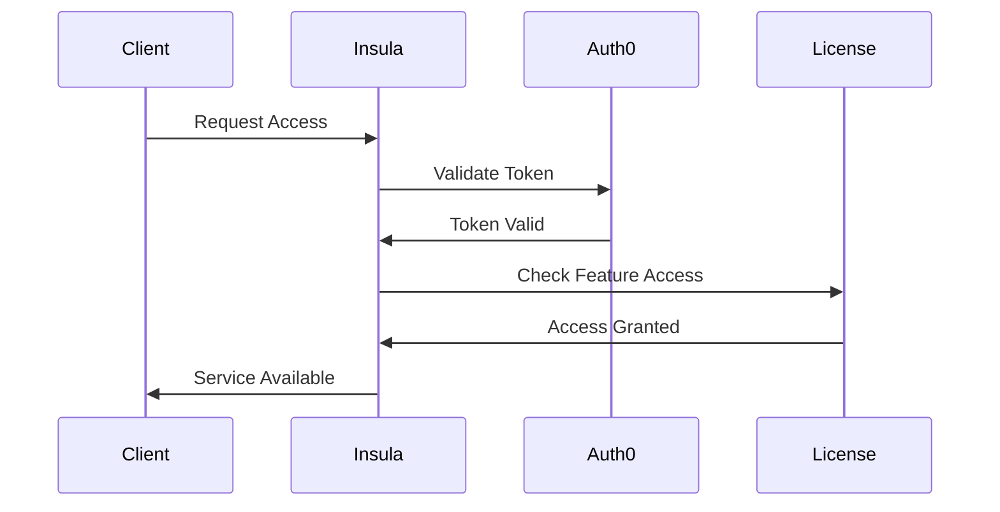
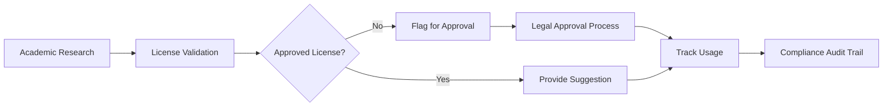

# Design Document

## Overview

Insula MCP is designed as an intelligent, agentic MCP server that extends the existing brAInwav diagnostic infrastructure to serve as a meta-diagnostic and development assistant for the Model Context Protocol ecosystem. The system provides AI-powered assistance for both developers and non-developers to build, debug, and resolve problems with MCP servers and connectors through natural language interactions and automated problem resolution.

The system leverages the current plugin architecture, academic providers, and worker sandbox system while adding local LLM capabilities and enhanced diagnostic tools. This approach ensures code reuse, maintains compatibility with existing infrastructure, and follows established brAInwav patterns while providing conversational, step-by-step guidance for MCP development and troubleshooting.

**Key Design Principles:**

- **Local-First AI**: All LLM processing occurs locally without external dependencies, ensuring privacy and offline functionality
- **Academic License Compliance**: Automated validation of research licenses before implementation suggestions to ensure legal compliance
- **Conversational Interface**: Natural language interactions for both technical and non-technical users
- **Automated Problem Resolution**: AI-powered diagnosis and fix generation for common MCP issues
- **Performance-Focused**: Sub-second response times for most operations with millisecond-precision monitoring

## Architecture

### Core Components

```mermaid
graph TB
    subgraph "Existing brAInwav Infrastructure"
        PLUGIN_HOST[Plugin Host]
        WORKER_SANDBOX[Worker Sandbox]
        ADAPTERS[HTTP/SSE/WS/JSONRPC Adapters]
        EXISTING_PLUGINS[Existing Diagnostic Plugins]
    end
    
    subgraph "MCP Server Layer"
        MCP_SERVER[MCP Server]
        MCP_TOOLS[MCP Tool Definitions]
    end
    
    subgraph "Enhanced LLM Integration"
        LLM_ADAPTER[LLM Adapter Interface]
        OLLAMA_ADAPTER[Ollama Adapter]
        MLX_ADAPTER[MLX Adapter]
        LLAMACPP_ADAPTER[llama.cpp Adapter]
        ORCHESTRATOR[LLM Orchestrator]
        CONVERSATION_MANAGER[Conversation Manager]
        MODEL_MANAGER[Model Manager]
    end
    
    subgraph "Extended Diagnostic Plugins"
        ENHANCED_INSPECTOR[Enhanced MCP Inspector]
        ENHANCED_PROTOCOL[Enhanced Protocol Validator]
        ENHANCED_SECURITY[Enhanced Security Scanner]
        ENHANCED_PERFORMANCE[Enhanced Performance Profiler]
        COMPATIBILITY_CHECKER[Compatibility Checker]
    end
    
    subgraph "Existing Academic Providers"
        CONTEXT7_PROVIDER[Context7 MCP Provider]
        VIBE_CHECK_PROVIDER[Vibe Check MCP Provider]
        SEMANTIC_PROVIDER[Semantic Scholar Provider]
        OPENALEX_PROVIDER[OpenAlex Provider]
        WIKIDATA_PROVIDER[Wikidata Provider]
        ARXIV_PROVIDER[arXiv Provider]
    end
    
    subgraph "New Development Assistance Plugins"
        CODE_GENERATOR[Code Generator Plugin]
        TEMPLATE_GENERATOR[Template Generator Plugin]
        PROBLEM_RESOLVER[Problem Resolver Plugin]
        INTERACTIVE_DEBUGGER[Interactive Debugger Plugin]
        ERROR_INTERPRETER[Error Interpreter Plugin]
        DEVELOPMENT_ASSISTANT[Development Assistant Plugin]
        BEST_PRACTICES_ADVISOR[Best Practices Advisor Plugin]
        INTEGRATION_HELPER[Integration Helper Plugin]
    end
    
    subgraph "Commercial & Licensing Extensions"
        AUTH_PLUGIN[Auth Plugin Extension]
        LICENSE_VALIDATOR[License Validator Plugin]
        COMPLIANCE_MONITOR[Compliance Monitor Plugin]
    end
    
    CLIENT[MCP Client] --> MCP_SERVER
    MCP_SERVER --> MCP_TOOLS
    MCP_TOOLS --> PLUGIN_HOST
    
    PLUGIN_HOST --> WORKER_SANDBOX
    PLUGIN_HOST --> EXISTING_PLUGINS
    PLUGIN_HOST --> ENHANCED_INSPECTOR
    PLUGIN_HOST --> ENHANCED_PROTOCOL
    PLUGIN_HOST --> ENHANCED_SECURITY
    PLUGIN_HOST --> ENHANCED_PERFORMANCE
    PLUGIN_HOST --> COMPATIBILITY_CHECKER
    PLUGIN_HOST --> CODE_GENERATOR
    PLUGIN_HOST --> TEMPLATE_GENERATOR
    PLUGIN_HOST --> PROBLEM_RESOLVER
    PLUGIN_HOST --> INTERACTIVE_DEBUGGER
    PLUGIN_HOST --> ERROR_INTERPRETER
    PLUGIN_HOST --> DEVELOPMENT_ASSISTANT
    PLUGIN_HOST --> BEST_PRACTICES_ADVISOR
    PLUGIN_HOST --> INTEGRATION_HELPER
    PLUGIN_HOST --> LICENSE_VALIDATOR
    PLUGIN_HOST --> COMPLIANCE_MONITOR
    
    WORKER_SANDBOX --> ADAPTERS
    
    ORCHESTRATOR --> LLM_ADAPTER
    ORCHESTRATOR --> CONVERSATION_MANAGER
    ORCHESTRATOR --> MODEL_MANAGER
    LLM_ADAPTER --> OLLAMA_ADAPTER
    LLM_ADAPTER --> MLX_ADAPTER
    LLM_ADAPTER --> LLAMACPP_ADAPTER
    
    PLUGIN_HOST --> CONTEXT7_PROVIDER
    PLUGIN_HOST --> VIBE_CHECK_PROVIDER
    PLUGIN_HOST --> SEMANTIC_PROVIDER
    PLUGIN_HOST --> OPENALEX_PROVIDER
    PLUGIN_HOST --> WIKIDATA_PROVIDER
    PLUGIN_HOST --> ARXIV_PROVIDER
    
    LICENSE_VALIDATOR --> CONTEXT7_PROVIDER
    LICENSE_VALIDATOR --> SEMANTIC_PROVIDER
    LICENSE_VALIDATOR --> ARXIV_PROVIDER
```



### System Architecture Layers

1. **Existing brAInwav Infrastructure**: Leverages current plugin host, worker sandbox, and adapter systems
2. **MCP Server Layer**: Standard MCP server interface built on existing server.ts foundation
3. **Enhanced Plugin Layer**: Extends existing DiagnosticPlugin interface for new capabilities
4. **LLM Integration Layer**: New LLM adapter system following existing adapter patterns
5. **Academic Provider Layer**: Utilizes existing academic MCP providers with license validation
6. **Development Assistance Layer**: New plugins following existing plugin architecture
7. **Commercial Extension Layer**: Authentication and licensing extensions to existing systems

### Existing Infrastructure Reuse

The system builds upon established brAInwav patterns:

- **Plugin Host**: Extends existing plugin-host.ts with new plugin types
- **Worker Sandbox**: Reuses existing sandbox.ts for plugin isolation and budgets
- **Adapters**: Leverages existing HTTP, SSE, WebSocket, and JSON-RPC adapters
- **Academic Providers**: Utilizes existing academic/* providers with license validation
- **Types System**: Extends existing types.ts with new interfaces
- **Observability**: Builds on existing OTEL integration and brAInwav logging

## Plugin Interfaces and Contracts

### Existing DiagnosticPlugin Interface

All diagnostic plugins extend the existing `DiagnosticPlugin` interface:

```typescript
// Existing interface from types.ts
export interface DiagnosticPlugin {
  id: string;
  title: string;
  order?: number;
  run: (ctx: DiagnosticContext) => Promise<Finding[]>;
}

// Existing DiagnosticContext from types.ts
export interface DiagnosticContext {
  endpoint: string;
  headers?: Record<string, string>;
  logger: (...args: unknown[]) => void;
  request: <T>(input: RequestInfo, init?: RequestInit) => Promise<T>;
  jsonrpc: <T>(method: string, params?: unknown) => Promise<T>;
  sseProbe: (url: string, opts?: unknown) => Promise<SseResult>;
  governance?: GovernancePack;
  llm?: LlmAdapter | null;
  evidence: (ev: EvidencePointer) => void;
  deterministic?: boolean;
}
```

### Enhanced LLM Adapter Interface

Extends existing `LlmAdapter` interface from types.ts to support conversational AI and local model management:

```typescript
// Existing interface from types.ts
export interface LlmAdapter {
  complete: (prompt: string, maxTokens?: number) => Promise<string>;
}

// Enhanced interface for multiple backends with conversation support
export interface EnhancedLlmAdapter extends LlmAdapter {
  backend: 'ollama' | 'mlx' | 'llamacpp';
  loadModel: (modelId: string) => Promise<void>;
  unloadModel: (modelId: string) => Promise<void>;
  getSupportedModels: () => Promise<string[]>;
  getModelInfo: (modelId: string) => Promise<ModelInfo>;
  
  // Conversational capabilities for development assistance
  startConversation: (context: ConversationContext) => Promise<ConversationId>;
  continueConversation: (id: ConversationId, message: string) => Promise<string>;
  endConversation: (id: ConversationId) => Promise<void>;
  
  // Specialized completion methods for different tasks
  analyzeCode: (code: string, context: string) => Promise<CodeAnalysis>;
  generateSolution: (problem: Problem, constraints: Constraints) => Promise<Solution>;
  explainError: (error: Error, context: Context) => Promise<Explanation>;
}

export interface ModelInfo {
  id: string;
  name: string;
  size: string;
  capabilities: string[];
  loaded: boolean;
  optimizedFor: ('code' | 'conversation' | 'debugging' | 'documentation')[];
}

export interface ConversationContext {
  userId?: string;
  sessionType: 'development' | 'debugging' | 'learning';
  mcpContext?: MCPContext;
  codeContext?: string;
  problemContext?: Problem;
}
```

### Development Assistance Plugin Extensions

New plugin types that extend `DiagnosticPlugin` to support conversational development assistance:

```typescript
export interface CodeGeneratorPlugin extends DiagnosticPlugin {
  generateCode: (spec: CodeSpec, ctx: DiagnosticContext) => Promise<GeneratedCode>;
  generateFromNaturalLanguage: (description: string, ctx: DiagnosticContext) => Promise<GeneratedCode>;
  generateAPIConnector: (apiSpec: APISpec, ctx: DiagnosticContext) => Promise<MCPConnector>;
  getTemplates: () => Promise<TemplateInfo[]>;
  customizeTemplate: (templateId: string, customizations: TemplateCustomization) => Promise<GeneratedCode>;
}

export interface InteractivePlugin extends DiagnosticPlugin {
  startSession: (problem: string, ctx: DiagnosticContext) => Promise<SessionId>;
  processInput: (sessionId: SessionId, input: string, ctx: DiagnosticContext) => Promise<Response>;
  endSession: (sessionId: SessionId) => Promise<void>;
  
  // Enhanced for step-by-step guidance
  askDiagnosticQuestion: (sessionId: SessionId, context: ProblemContext) => Promise<Question>;
  suggestNextStep: (sessionId: SessionId, currentState: SessionState) => Promise<NextStep>;
  validateSolution: (sessionId: SessionId, solution: Solution) => Promise<ValidationResult>;
}

export interface DevelopmentAssistantPlugin extends DiagnosticPlugin {
  provideGuidance: (userLevel: 'beginner' | 'intermediate' | 'expert', task: DevelopmentTask) => Promise<Guidance>;
  generateTutorial: (topic: string, userContext: UserContext) => Promise<Tutorial>;
  explainConcept: (concept: string, context: ConceptContext) => Promise<Explanation>;
  suggestBestPractices: (implementation: MCPImplementation) => Promise<BestPractice[]>;
}

export interface ProblemResolverPlugin extends DiagnosticPlugin {
  analyzeError: (error: Error, context: ErrorContext) => Promise<ErrorAnalysis>;
  generateFix: (problem: Problem, strategy: FixStrategy) => Promise<Fix>;
  applyFix: (fix: Fix, target: MCPImplementation) => Promise<FixResult>;
  validateFix: (fix: Fix, originalProblem: Problem) => Promise<ValidationResult>;
  suggestMultipleSolutions: (problem: Problem) => Promise<RankedSolution[]>;
}
```

### Academic Provider Integration

Academic providers extend existing patterns in `src/providers/academic/`:

```typescript
// Following existing academic provider patterns
export interface AcademicProvider {
  validateLicense: (content: ResearchContent) => Promise<LicenseValidation>;
  checkCompliance: (implementation: string) => Promise<ComplianceResult>;
  suggestImprovements: (findings: Finding[]) => Promise<Finding[]>;
}

// Integration with existing DiagnosticPlugin
export interface AcademicValidationPlugin extends DiagnosticPlugin {
  provider: AcademicProvider;
  licenseValidator: LicenseValidator;
}
```

### Enhanced Authentication Extensions

Extends existing `src/plugins/auth.ts`:

```typescript
// Enhanced authentication following existing auth plugin patterns
export interface EnhancedAuthPlugin extends DiagnosticPlugin {
  validateAuth0Token: (token: string) => Promise<AuthResult>;
  checkRoleAccess: (role: string, feature: string) => Promise<boolean>;
  trackAuthUsage: (userId: string, action: string) => Promise<void>;
}
```

### Commercial Licensing Extensions

New plugins following existing governance patterns:

```typescript
// Following existing governance.ts plugin patterns
export interface CommercialLicensingPlugin extends DiagnosticPlugin {
  validateCommercialLicense: (key: string) => Promise<LicenseValidation>;
  checkFeatureAccess: (feature: string, license: License) => Promise<boolean>;
  trackUsage: (feature: string, metrics: UsageMetrics) => Promise<void>;
  generateComplianceReport: (period: TimePeriod) => Promise<Finding[]>;
}
```

### License Validation Plugin Interface

```typescript
interface ILicenseValidatorPlugin extends IPlugin {
  validateAcademicLicense(research: ResearchContent): Promise<LicenseValidation>;
  checkImplementationCompliance(code: string, source: ResearchSource): Promise<ComplianceResult>;
  getApprovedLicenses(): Promise<ApprovedLicense[]>;
  flagProprietaryContent(content: AcademicContent): Promise<ProprietaryFlag[]>;
}

interface ComplianceResult {
  compliant: boolean;
  licenseType: string;
  restrictions: string[];
  approvalRequired: boolean;
  implementationAllowed: boolean;
}
```

### Academic MCP Plugin Integrations

**Context7 MCP Plugin**:

- **Purpose**: Provides academic-grade validation of MCP implementations and features
- **Key Features**: Architecture validation, code quality assessment, best practices checking

**Vibe_Check MCP Plugin**:

- **Purpose**: Performs comprehensive error checking and improvement suggestions
- **Key Features**: Anti-pattern detection, refactoring suggestions, code health analysis

**Semantic Scholar MCP Plugin**:

- **Purpose**: Validates implementations against academic research and best practices
- **Key Features**: Research paper validation, citation checking, methodology verification

**OpenAlex MCP Plugin**:

- **Purpose**: Provides access to academic metadata for validation and research
- **Key Features**: Academic concept validation, research trend analysis, citation networks

**Wikidata MCP Plugin**:

- **Purpose**: Validates data structures and relationships using Wikidata knowledge base
- **Key Features**: Entity validation, relationship verification, knowledge graph integration

**arXiv MCP Plugin**:

- **Purpose**: Validates technical implementations against latest research papers
- **Key Features**: Preprint analysis, technical validation, research trend integration

**Exa MCP Plugin**:

- **Purpose**: Provides enhanced search and validation capabilities
- **Key Features**: Advanced search validation, content analysis, relevance scoring

### License Validation and Compliance System

**License Validator Plugin**:

- **Purpose**: Validates academic research licenses before implementation suggestions
- **Key Features**:
  - Real-time license checking with <3s response time
  - Database of approved open-source and permissive licenses
  - Proprietary content flagging and approval workflow
  - Integration with all academic MCP plugins

**Compliance Monitor Plugin**:

- **Purpose**: Tracks and reports license compliance for all academic integrations
- **Key Features**:
  - Continuous compliance monitoring
  - Automated reporting and audit trails
  - Legal framework integration
  - Risk assessment and mitigation recommendations

## Components and Interfaces

### Local LLM Agent

**Purpose**: Provides intelligent, conversational assistance for MCP development and debugging, supporting both developers and non-developers through natural language interactions.

**Key Interfaces**:

- `analyzeCode(code: string, context: string): Promise<Analysis>` - Response time: <2 seconds
- `generateSolution(problem: Problem, constraints: Constraints): Promise<Solution>` - Response time: <5 seconds
- `explainError(error: Error, context: Context): Promise<Explanation>` - Response time: <5 seconds
- `suggestImprovements(implementation: MCPImplementation): Promise<Suggestion[]>` - Response time: <20 seconds
- `interpretNaturalLanguage(description: string, intent: Intent): Promise<ActionPlan>` - Response time: <3 seconds
- `provideStepByStepGuidance(task: DevelopmentTask, userLevel: UserLevel): Promise<GuidanceSession>` - Response time: <2 seconds
- `maintainConversationContext(sessionId: string, interaction: Interaction): Promise<void>` - Persistent across sessions

**Enhanced Capabilities**:

- **Natural Language Processing**: Understands development requests in plain English from non-technical users
- **Conversational Development**: Maintains context across multi-turn conversations for complex development tasks
- **Adaptive Explanations**: Adjusts technical depth based on user expertise level (beginner/intermediate/expert)
- **Interactive Tutorials**: Provides step-by-step guidance with real-time feedback and validation
- **Code Generation from Descriptions**: Creates MCP servers and connectors from natural language specifications
- **Contextual Problem Solving**: Analyzes error logs, configurations, and code together for comprehensive diagnosis
- **Learning and Adaptation**: Improves suggestions based on successful resolution patterns and user feedback

**Model Selection Strategy**:

- **Conversational Tasks**: General-purpose models (Llama 3 Instruct, Mistral 7B Instruct) for natural dialogue
- **Code Analysis**: Code-specialized models (CodeLlama, StarCoder) for technical analysis and generation
- **Debugging**: Reasoning-focused models (Llama 3 Instruct) for complex problem diagnosis
- **Documentation**: Writing-optimized models for clear, user-friendly explanations

### MCP Inspector

**Purpose**: Analyzes MCP servers and connectors for compliance, performance, and security issues.

**Key Interfaces**:

- `inspectServer(endpoint: string): Promise<InspectionReport>` - Response time: <30 seconds
- `validateProtocol(messages: MCPMessage[]): Promise<ValidationResult>` - Accuracy: 99%
- `analyzePerformance(server: MCPServer): Promise<PerformanceReport>` - Precision: millisecond-level
- `scanSecurity(implementation: MCPCode): Promise<SecurityReport>` - Detection accuracy: 95%

**Analysis Types**:

- Protocol compliance validation
- Security vulnerability scanning
- Performance bottleneck identification
- Configuration optimization opportunities
- Compatibility issue detection

### Problem Resolver

**Purpose**: Automatically fixes identified issues and implements suggested improvements.

**Key Interfaces**:

- `resolveProblem(problem: Problem, strategy: ResolutionStrategy): Promise<Resolution>`
- `applyFix(fix: Fix, target: MCPImplementation): Promise<Result>`
- `generatePatch(issue: Issue, solution: Solution): Promise<Patch>`
- `validateFix(fix: Fix, originalProblem: Problem): Promise<ValidationResult>`

**Resolution Strategies**:

- Automated code patching
- Configuration adjustments
- Dependency updates
- Architecture refactoring
- Performance optimizations

### Code Generator

**Purpose**: Creates MCP servers, connectors, and related code from both technical specifications and natural language descriptions, enabling non-developers to create MCP implementations.

**Key Interfaces**:

- `generateServer(spec: ServerSpec): Promise<MCPServerCode>` - Response time: <10 seconds
- `generateFromNaturalLanguage(description: string, userContext: UserContext): Promise<MCPImplementation>` - Response time: <15 seconds
- `generateConnector(apiSpec: APISpec, mcpSpec: MCPSpec): Promise<ConnectorCode>` - Response time: <60 seconds
- `generateTools(toolSpecs: ToolSpec[]): Promise<ToolDefinitions>` - Response time: <5 seconds
- `generateTests(implementation: MCPImplementation): Promise<TestSuite>` - Coverage: 80-90%
- `generateCustomTemplate(requirements: TemplateRequirements, orgStandards: OrgStandards): Promise<CustomTemplate>` - Response time: <8 seconds
- `refineGeneration(code: GeneratedCode, feedback: UserFeedback): Promise<RefinedCode>` - Response time: <12 seconds

**Enhanced Generation Capabilities**:

- **Natural Language to Code**: Converts plain English descriptions into working MCP implementations
- **Conversational Refinement**: Iteratively improves generated code through user feedback and clarification
- **Organization-Specific Templates**: Creates standardized templates following team conventions and coding standards
- **API Integration Automation**: Automatically generates OAuth2 and API key authentication wrappers
- **Comprehensive Documentation**: Creates user guides, API documentation, and deployment instructions
- **Testing Framework Integration**: Generates comprehensive test suites with interoperability testing
- **Configuration Optimization**: Automatically optimizes generated configurations for performance and security

**Design Rationale**: The enhanced code generator addresses the need for non-developers to create MCP implementations through natural language, while maintaining the technical depth required for complex integrations. The conversational refinement capability ensures generated code meets specific requirements through iterative improvement.

### Interactive Debugger

**Purpose**: Provides conversational, step-by-step debugging assistance that can understand context from error messages, logs, and configurations to guide users through complex problem resolution.

**Key Interfaces**:

- `startDebuggingSession(problem: string, context?: ProblemContext): Promise<DebuggingSession>` - Response time: <10 seconds
- `acceptMultipleInputs(session: DebuggingSession, inputs: MultipleInputs): Promise<ContextualAnalysis>` - Supports JSON, text, YAML formats
- `askDiagnosticQuestion(session: DebuggingSession, currentContext: SessionContext): Promise<TargetedQuestion>` - Response time: <5 seconds
- `suggestNextStep(session: DebuggingSession): Promise<DebuggingStep>` - Provides numbered, actionable instructions
- `validateSolution(session: DebuggingSession, solution: Solution): Promise<ValidationResult>` - Includes automated testing
- `provideSolutionAlternatives(session: DebuggingSession, problem: Problem): Promise<RankedSolution[]>` - Multiple approaches ranked by success likelihood
- `maintainSessionContext(session: DebuggingSession, interaction: Interaction): Promise<void>` - Persistent context across interactions

**Enhanced Debugging Flow**:

1. **Multi-Input Analysis**: Accepts error messages, logs, configuration files, and code simultaneously
2. **Contextual Understanding**: Analyzes relationships between different inputs to understand the complete problem
3. **Targeted Questioning**: Asks specific diagnostic questions based on initial analysis rather than generic troubleshooting
4. **Hypothesis Generation**: Creates multiple potential causes ranked by probability
5. **Solution Ranking**: Provides multiple solution approaches with success likelihood and implementation complexity
6. **Automated Verification**: Tests proposed solutions and confirms issue resolution
7. **Learning Integration**: Improves future debugging based on successful resolution patterns

**Design Rationale**: The enhanced interactive debugger addresses the need for intelligent, context-aware troubleshooting that can handle complex MCP issues by understanding the relationships between errors, configurations, and system state. The multi-input capability allows users to provide comprehensive context upfront, leading to more accurate and faster problem resolution.

### Academic Validation Tools with License Compliance

**Context7 Plugin**:

- **Purpose**: Provides academic-grade validation of MCP implementations and features with integrated license compliance checking
- **Key Interfaces**:
  - `validateArchitecture(design: ArchitectureSpec): Promise<AcademicValidation>` - Includes license compliance check
  - `reviewCodeQuality(code: string): Promise<QualityAssessment>` - Validates against academic standards with IP compliance
  - `checkBestPractices(implementation: MCPImplementation): Promise<BestPracticesReport>` - Ensures legal compliance of suggested practices
  - `validateLicenseCompliance(research: ResearchContent): Promise<LicenseValidation>` - <3s response time for license checking

**Vibe Check Plugin**:

- **Purpose**: Performs comprehensive error checking and improvement suggestions with legal compliance validation
- **Key Interfaces**:
  - `performVibeCheck(target: MCPTarget): Promise<VibeCheckResult>` - Includes proprietary content flagging
  - `identifyAntiPatterns(code: string): Promise<AntiPatternReport>` - Flags patterns that may violate licenses
  - `suggestRefactoring(analysis: CodeAnalysis): Promise<RefactoringPlan>` - Only suggests legally compliant refactoring approaches
  - `flagProprietaryContent(content: AcademicContent): Promise<ProprietaryFlag[]>` - Identifies content requiring approval

**Enhanced Academic Integration Features**:

- **Real-time License Validation**: All academic suggestions are validated against approved licenses before presentation
- **Proprietary Content Detection**: Automatically identifies and flags research that requires licensing approval
- **Compliance Tracking**: Maintains audit trail of all academic research usage and license compliance
- **Legal Framework Integration**: Integrates with organizational legal policies and approval workflows

**Design Rationale**: The enhanced academic validation system ensures that all research-based suggestions comply with intellectual property and licensing requirements, addressing legal compliance concerns while maintaining the value of academic research integration. The real-time validation prevents legal issues by checking licenses before implementation suggestions are made.

### Authentication and Licensing System

**Auth0 Integration Plugin**:

- **Purpose**: Provides enterprise-grade authentication for commercial deployment
- **Key Features**:
  - OAuth 2.0 and OpenID Connect support
  - Multi-factor authentication
  - Single sign-on (SSO) integration
  - Role-based access control (RBAC)
  - API key management for programmatic access

**Licensing Manager Plugin**:

- **Purpose**: Manages commercial licensing and feature access control
- **Key Features**:
  - License key validation and activation
  - Feature-based licensing (diagnostic tools, LLM backends, etc.)
  - Usage tracking and reporting
  - Subscription management
  - Offline license validation
  - License compliance monitoring
  - Academic research license validation
  - Intellectual property compliance tracking

## Data Models

### Problem Definition

```typescript
interface Problem {
  id: string;
  type: ProblemType;
  severity: 'low' | 'medium' | 'high' | 'critical';
  description: string;
  userFriendlyDescription: string; // Plain English explanation for non-developers
  context: ProblemContext;
  evidence: Evidence[];
  affectedComponents: string[];
  suggestedSolutions: RankedSolution[];
  conversationHistory?: ConversationEntry[];
  userLevel: 'beginner' | 'intermediate' | 'expert';
}

interface ProblemContext {
  mcpVersion: string;
  serverType: string;
  environment: string;
  configuration: Record<string, any>;
  errorLogs: string[];
  performanceMetrics?: PerformanceMetrics;
  userInputs?: MultipleInputs; // Support for JSON, text, YAML inputs
  sessionContext?: SessionContext;
  previousAttempts?: ResolutionAttempt[];
}

interface MultipleInputs {
  errorMessages?: string[];
  logFiles?: LogFile[];
  configurationFiles?: ConfigFile[];
  codeSnippets?: CodeSnippet[];
  format: 'json' | 'text' | 'yaml' | 'mixed';
}

interface RankedSolution {
  solution: Solution;
  confidence: number;
  successLikelihood: number;
  implementationComplexity: 'low' | 'medium' | 'high';
  estimatedTime: string;
  prerequisites: string[];
}
```

### Solution Framework

```typescript
interface Solution {
  id: string;
  type: SolutionType;
  confidence: number;
  description: string;
  userFriendlyDescription: string; // Plain English explanation
  steps: SolutionStep[];
  codeChanges: CodeChange[];
  configChanges: ConfigChange[];
  testingStrategy: TestingStrategy;
  rollbackPlan: RollbackPlan;
  automatedFix?: AutomatedFix; // For problems that can be fixed automatically
  licenseCompliance?: LicenseCompliance; // For academic research-based solutions
}

interface SolutionStep {
  order: number;
  description: string;
  userFriendlyDescription: string; // Numbered, actionable instructions
  action: Action;
  validation: ValidationCriteria;
  dependencies: string[];
  estimatedDuration: string;
  canAutomate: boolean;
}

interface AutomatedFix {
  canApplyAutomatically: boolean;
  requiresUserConfirmation: boolean;
  riskLevel: 'low' | 'medium' | 'high';
  backupRequired: boolean;
  validationTests: ValidationTest[];
}

interface LicenseCompliance {
  requiresLicenseCheck: boolean;
  approvedLicenses: string[];
  proprietaryContent: boolean;
  approvalRequired: boolean;
  complianceStatus: 'compliant' | 'requires_approval' | 'non_compliant';
}
```

### MCP Analysis Models

```typescript
interface MCPAnalysis {
  serverId: string;
  timestamp: Date;
  protocolCompliance: ComplianceReport;
  securityAssessment: SecurityReport;
  performanceProfile: PerformanceReport;
  compatibilityAssessment: CompatibilityReport;
  recommendations: Recommendation[];
  issues: Issue[];
  conversationalSummary: string; // User-friendly summary of findings
  interactiveActions: InteractiveAction[]; // Actions user can take through conversation
}

interface ComplianceReport {
  version: string;
  compliant: boolean;
  violations: ProtocolViolation[];
  warnings: ProtocolWarning[];
  score: number;
  migrationPath?: MigrationPath; // For version compatibility issues
}

interface CompatibilityReport {
  testedClients: string[];
  compatibilityMatrix: CompatibilityMatrix;
  interoperabilityIssues: InteroperabilityIssue[];
  migrationRecommendations: MigrationRecommendation[];
  testDuration: number; // Should be ≤120 seconds
}

interface InteractiveAction {
  id: string;
  description: string;
  type: 'fix' | 'explain' | 'generate' | 'test' | 'optimize';
  canAutomate: boolean;
  estimatedTime: string;
  conversationPrompt: string; // How to initiate this action through conversation
}
```

## Error Handling

### Error Categories

1. **Protocol Errors**: MCP specification violations
2. **Configuration Errors**: Invalid or suboptimal configurations
3. **Security Errors**: Vulnerabilities and security misconfigurations
4. **Performance Errors**: Bottlenecks and inefficiencies
5. **Integration Errors**: Compatibility and interoperability issues

### Error Resolution Pipeline

```mermaid
graph LR
    ERROR[Error Detected] --> CLASSIFY[Classify Error]
    CLASSIFY --> ANALYZE[Analyze Context]
    ANALYZE --> LLM_PROCESS[LLM Analysis]
    LLM_PROCESS --> GENERATE[Generate Solutions]
    GENERATE --> RANK[Rank Solutions]
    RANK --> PRESENT[Present to User]
    PRESENT --> APPLY[Apply Solution]
    APPLY --> VALIDATE[Validate Fix]
    VALIDATE --> COMPLETE[Resolution Complete]
```



### Intelligent Error Interpretation

The Local LLM Agent provides context-aware error interpretation:

- Translates technical errors into user-friendly explanations
- Suggests probable causes based on context analysis
- Provides step-by-step resolution guidance
- Learns from successful resolutions to improve future recommendations

## Testing Strategy

### Automated Testing Framework

1. **Unit Tests**: Individual component functionality
2. **Integration Tests**: Component interaction validation
3. **MCP Protocol Tests**: Compliance and interoperability testing
4. **Performance Tests**: Load and stress testing
5. **Security Tests**: Vulnerability and penetration testing

### LLM Testing Approach

1. **Response Quality Tests**: Validate LLM output accuracy and helpfulness
2. **Context Understanding Tests**: Verify proper context interpretation
3. **Solution Effectiveness Tests**: Measure success rate of suggested solutions
4. **Conversation Flow Tests**: Validate interactive debugging sessions

### Test Data Generation

- Synthetic MCP server implementations with known issues
- Real-world error scenarios and edge cases
- Performance benchmarks and stress test scenarios
- Security vulnerability test cases

## Local LLM Integration

### Supported Backends

1. **Ollama**: Primary local LLM backend with model management and conversation support
2. **MLX**: Apple Silicon optimized inference with quantization for <2s response times
3. **llama.cpp**: Cross-platform CPU inference with memory optimization
4. **Custom Backends**: Extensible architecture for additional backends

### Enhanced Model Selection Strategy

- **Conversational Development**: General-purpose models (Llama 3 Instruct, Mistral 7B Instruct) for natural dialogue with non-developers
- **Code Analysis and Generation**: Code-specialized models (CodeLlama, StarCoder) for technical analysis and automated code generation
- **Interactive Debugging**: Reasoning-focused models (Llama 3 Instruct) for complex problem diagnosis and step-by-step guidance
- **Documentation and Explanation**: Writing-optimized models for clear, user-friendly explanations adapted to user expertise level
- **Natural Language Processing**: Models optimized for understanding development requests in plain English

### Advanced Context Management

- **Persistent Conversation History**: Maintains context across sessions for ongoing development projects
- **Multi-Modal Context**: Preserves relationships between code, configurations, errors, and user interactions
- **Adaptive Learning**: Improves suggestions based on successful resolution patterns and user feedback
- **Session-Aware Context**: Maintains different context types for development, debugging, and learning sessions
- **Cross-Session Knowledge**: Builds knowledge base from successful interactions to improve future assistance

### Performance Optimization

- **Model Quantization**: Automatic quantization for faster inference targeting <2s response times
- **Context Window Optimization**: Efficient memory usage for long conversations and large codebases
- **Streaming Responses**: Real-time feedback for better user experience during long operations
- **Model Caching**: Warm-up strategies to minimize cold start delays
- **Automatic Model Selection**: Task-based model selection optimized for performance and accuracy

**Design Rationale**: The enhanced LLM integration supports the conversational nature of the system, enabling natural language interactions for both developers and non-developers while maintaining high performance through optimized model selection and caching strategies.

## Security Considerations

### Local-First Security

- All processing occurs locally without external API calls
- No sensitive code or data transmitted to external services
- Local model storage and execution
- Encrypted conversation history storage

### MCP Security Analysis

- Authentication and authorization validation according to MCP specification
- Input sanitization checking based on OWASP guidelines
- Privilege escalation detection and prevention
- Secure communication verification for all transport protocols

### Protocol Compliance

- Full compliance with MCP protocol specification version 2024-11-05
- Support for OAuth2 and API key authentication methods
- JSON-RPC 2.0 message format validation
- WebSocket and HTTP transport protocol support
- Backward compatibility testing for older MCP versions

## Commercial Deployment Architecture

### Licensing Tiers

**Community Edition (Free)**:

- Basic diagnostic tools
- Limited LLM backend support
- Core MCP validation
- Open source plugins only

**Professional Edition**:

- Advanced diagnostic plugins
- All LLM backend support
- Academic validation tools (Context7, Vibe Check)
- Priority support
- Commercial plugin access

**Enterprise Edition**:

- Full feature access
- Auth0 integration
- Custom plugin development
- On-premises deployment
- SLA guarantees
- Advanced usage analytics

### Authentication Flow



### Usage Tracking

- Feature usage metrics collection
- API call tracking and rate limiting
- License compliance monitoring
- Automated billing integration
- Usage analytics and reporting

## Performance Optimization

### LLM Performance

- **Sub-2-Second Response Times**: Model quantization and optimization targeting <2s for most operations
- **Context Window Optimization**: Efficient memory usage for long conversations and large codebases
- **Streaming Responses**: Real-time feedback for better UX during code generation and analysis
- **Model Caching and Warm-up**: Strategies to minimize cold start delays and maintain responsive interactions
- **Automatic Model Selection**: Task-based selection optimized for performance requirements and accuracy
- **Conversation Context Optimization**: Efficient storage and retrieval of multi-turn conversation history

### Enhanced Diagnostic Performance

- **Parallel Analysis Execution**: Multiple diagnostic tools running concurrently for faster results
- **Real-time Monitoring**: Performance metrics collection with 1-second update intervals for live feedback
- **Millisecond-Precision Timing**: Accurate performance profiling for bottleneck identification
- **Incremental Analysis**: Updates with minimal recomputation for iterative development workflows
- **Background Processing**: Non-critical tasks processed asynchronously to maintain responsiveness
- **Caching Strategy**: Intelligent caching of analysis results to avoid redundant processing

### Conversational Performance

- **Natural Language Processing**: <3s response time for interpreting development requests
- **Step-by-Step Guidance**: <2s response time for providing development assistance
- **Interactive Debugging**: <10s response time for starting debugging sessions with context analysis
- **Code Generation**: <15s response time for generating implementations from natural language
- **Multi-Input Analysis**: <5s response time for analyzing multiple inputs (logs, configs, code) simultaneously

### Real-time Monitoring and Adaptation

- **Performance Metrics Collection**: 1-second update intervals with detailed timing breakdowns
- **Automated Performance Alerting**: Degradation detection with adaptive thresholds
- **Resource Usage Optimization**: Dynamic resource allocation for local LLM inference
- **Adaptive Timeout Handling**: System capability-based timeout adjustments
- **User Experience Monitoring**: Response time tracking for different interaction types

**Design Rationale**: The performance optimization strategy ensures that conversational interactions remain responsive and natural, while complex operations like code generation and comprehensive analysis complete within acceptable timeframes. The real-time monitoring enables continuous optimization of the user experience.

## Code Standards and Infrastructure Compliance

### brAInwav CODESTYLE.md Compliance

All implementations must follow established brAInwav standards:

**Naming Conventions**:

- Files and directories: `kebab-case` (e.g., `license-validator.ts`, `mcp-compatibility.ts`)
- Functions and variables: `camelCase` (e.g., `validateLicense`, `checkCompliance`)
- Types and interfaces: `PascalCase` (e.g., `LicenseValidator`, `ComplianceResult`)
- Constants: `UPPER_SNAKE_CASE` (e.g., `MAX_VALIDATION_TIME_MS`)

**Code Structure**:

- Functions ≤ 40 lines; split into helpers when needed
- Named exports only (no `export default`)
- ESM modules with `"type": "module"`
- AbortSignal support for all async operations
- Proper error handling with context propagation

**Infrastructure Reuse**:

- Extend existing `DiagnosticPlugin` interface instead of creating new base classes
- Use existing adapter patterns in `src/adapters/` for new integrations
- Leverage existing worker sandbox system for plugin isolation
- Follow existing observability patterns with brAInwav branding
- Reuse existing `Finding`, `EvidencePointer`, and `FilePlan` types

**Quality Gates**:

- Branch coverage ≥ 65% (configurable via `BRANCH_MIN`)
- Mutation score ≥ 75% (configurable via `MUTATION_MIN`)
- All functions must include proper TypeScript types
- Security scanning with Semgrep and governance rules
- No `Math.random()`, hard-coded mocks, or TODO comments in production paths

## Natural Language Development Interface

### Conversational Development Workflow

The system provides a natural language interface that guides users through MCP development without requiring deep technical knowledge:

**User Interaction Flow**:

1. **Intent Recognition**: Understands development goals from natural language descriptions
2. **Requirement Clarification**: Asks targeted questions to gather necessary details
3. **Solution Planning**: Proposes implementation approach with user-friendly explanations
4. **Iterative Development**: Generates code with conversational refinement based on feedback
5. **Testing and Validation**: Automatically tests generated implementations with user-friendly results

**Key Design Decisions**:

- **Adaptive Communication**: Adjusts technical depth based on detected user expertise level
- **Contextual Memory**: Maintains conversation context across development sessions
- **Progressive Disclosure**: Reveals technical details gradually as users become more comfortable
- **Error Recovery**: Gracefully handles misunderstandings and provides clarification options

### Team Standardization and Templates

**Organization-Specific Customization**:

- **Template Management**: JSON-configurable templates for team-specific patterns and conventions
- **Coding Standards Enforcement**: Automated validation against organizational guidelines
- **Best Practices Integration**: Team-defined rules integrated into AI suggestions and code generation
- **Documentation Standards**: Consistent documentation generation following team preferences

**Standardization Features**:

- **Convention Validation**: Ensures generated code follows naming conventions and architectural patterns
- **Template Customization**: Allows teams to define custom MCP server and connector templates
- **Quality Gates**: Automated checks for code quality, security, and compliance with team standards
- **Knowledge Sharing**: Captures and reuses successful patterns across team members

## Extensibility Framework

### FASTMCP v3 Plugin System

The modular plugin architecture enables:

- **Diagnostic Plugins**: Pluggable analyzers for different MCP aspects (security, performance, compliance)
- **LLM Backend Plugins**: Swappable local LLM implementations (Ollama, MLX, llama.cpp)
- **Code Generator Plugins**: Modular code generation for different languages and frameworks
- **Transport Plugins**: Support for different MCP transport protocols
- **Authentication Plugins**: Pluggable authentication mechanisms
- **Reporting Plugins**: Customizable output formats and destinations

### Plugin Development Kit

- **Plugin SDK**: TypeScript SDK for developing custom plugins
- **Plugin Templates**: Boilerplate code for common plugin types
- **Testing Framework**: Automated testing tools for plugin validation
- **Documentation Generator**: Automatic API documentation for plugins
- **Plugin Registry**: Centralized registry for plugin discovery and distribution

### Version Management

- **Semantic Versioning**: Automatic compatibility checking between plugin versions
- **Dependency Resolution**: Automatic resolution of plugin dependencies
- **Migration Tools**: Automated migration between plugin versions
- **Rollback Support**: Safe rollback to previous plugin versions
- **Update Notifications**: Automatic notifications for available plugin updates

### API Extensions

- **REST API**: External integrations with version-specific endpoints
- **WebSocket API**: Real-time updates with plugin-specific channels
- **CLI Interface**: Command-line automation with plugin-aware commands
- **IDE Plugin Support**: Integration APIs for popular development environments

## License Validation and Compliance Architecture

### Academic Research License Validation

**Real-Time License Checking**:

- **Sub-3-Second Validation**: All academic research suggestions validated against approved licenses within 3 seconds
- **Approved License Database**: Maintains comprehensive database of open-source and permissive licenses
- **Proprietary Content Detection**: Automatically identifies research requiring licensing approval
- **Legal Framework Integration**: Integrates with organizational legal policies and approval workflows

**Compliance Monitoring System**:

- **Continuous Tracking**: Monitors all academic integration usage with audit trail maintenance
- **Automated Reporting**: Generates compliance reports for legal and management review
- **Risk Assessment**: Evaluates intellectual property risks and provides mitigation recommendations
- **Approval Workflow**: Manages approval process for proprietary research content

**Integration with Academic Providers**:

- **Context7 Integration**: License validation integrated into architecture and code quality assessments
- **Semantic Scholar Compliance**: Citation checking includes license compliance verification
- **arXiv Validation**: Preprint analysis includes intellectual property compliance checking
- **OpenAlex Integration**: Research trend analysis includes license compatibility assessment

**Design Rationale**: The license validation system ensures legal compliance while maintaining the value of academic research integration. By validating licenses before suggestions are made, the system prevents legal issues and provides confidence in the compliance of all research-based recommendations.

### Compliance Workflow


