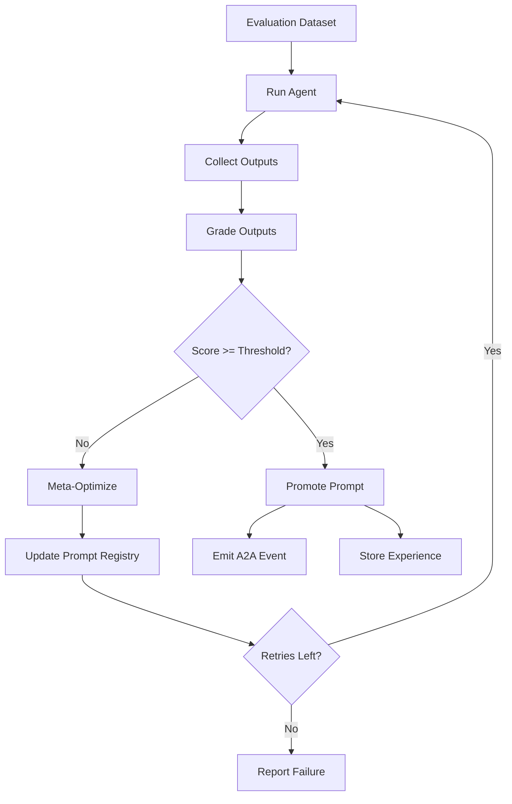
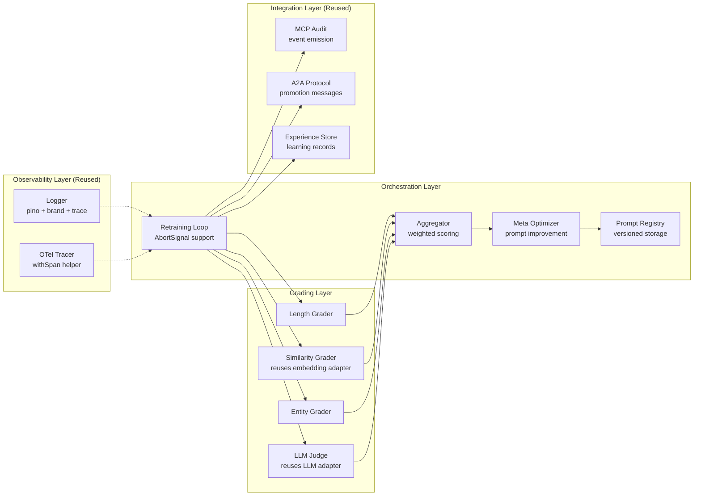

# Design Document

## Overview

The Self-Evolving Agent Retraining System implements a continuous improvement loop for CortexDx agents. The system evaluates agent outputs against multiple quality dimensions, identifies gaps, generates improved prompts through meta-optimization, and automatically promotes successful improvements. The architecture prioritizes code reuse from existing CortexDx infrastructure, observability, determinism, and safe rollout capabilities.

### Core Principles

- **Reuse First**: Leverage existing CortexDx logging, OTel, embeddings, LLM adapters, and MCP infrastructure
- **Deterministic by Default**: All evaluations produce reproducible results for debugging and regression testing
- **Observable**: Every operation emits structured logs with brand and trace context
- **Safe Rollout**: Feature flags, versioned prompts, and rollback mechanisms prevent production issues
- **Evidence-Based**: Experience records capture the recipe for improvements to enable strategy learning

## Architecture

### High-Level Flow



### Component Architecture



## Components and Interfaces

### 1. Observability Infrastructure (Reused)

**Logger** (`packages/cortexdx/src/logging/logger.ts`)
- Reuse existing `createLogger()` with component context
- Add trace_id and traceparent to child logger bindings
- Parameterize brand via environment variable (BRAND=CortexDx)

**OTel Tracer** (`packages/cortexdx/src/observability/otel.ts`)
- Reuse existing `withSpan()` helper
- Add retraining-specific span names: `retraining.evaluate`, `retraining.optimize`, `retraining.promote`
- Attach grader scores and prompt versions as span attributes

### 2. Grading Modules

All graders are pure functions (≤40 lines) that return normalized scores [0, 1].

**Length Grader** (`src/graders/length-score.ts`)
```typescript
export function lengthScore(text: string, target = 100): number {
  const words = text.trim().split(/\s+/).length;
  const deviation = Math.abs(words - target) / target;
  return Math.max(0, 1 - deviation);
}
```

**Similarity Grader** (`src/graders/similarity.ts`)
- Reuses `packages/cortexdx/src/adapters/embedding.ts`
- Calls `cosineSimilarity()` helper from existing adapter
- Accepts expected output and actual output, returns cosine similarity

**Entity Grader** (`src/graders/entities.ts`)
- Simple exact-match checker for required entities
- Returns fraction of required entities found in output

**LLM Judge Grader** (`src/graders/llm-judge.ts`)
- Reuses existing LLM adapter from `packages/cortexdx/src/ml/`
- Uses OpenAI Responses API with rubric-based evaluation
- Returns normalized score from LLM judgment

### 3. Aggregation

**Aggregator** (`src/loop/aggregate.ts`)
```typescript
export interface GraderResult {
  name: string;
  score: number;
}

export interface AggregationResult {
  aggregated: number;
  passed: boolean;
  parts: GraderResult[];
  threshold: number;
}

export function aggregate(
  parts: GraderResult[],
  threshold: number
): AggregationResult {
  const weights: Record<string, number> = {
    length: 0.2,
    similarity: 0.3,
    entities: 0.2,
    judge: 0.3,
  };
  
  const agg = Number(
    parts.reduce((sum, p) => sum + (weights[p.name] ?? 0.25) * p.score, 0)
      .toFixed(3)
  );
  
  return {
    aggregated: agg,
    passed: agg >= threshold,
    parts,
    threshold,
  };
}
```

### 4. Prompt Management

**Prompt Registry** (`src/prompt/prompt-registry.ts`)
```typescript
export interface PromptVersion {
  v: number;
  system: string;
  createdAt: string;
}

const versions: PromptVersion[] = [{
  v: 0,
  system: "Summarize in ~100 words; include entities.",
  createdAt: new Date().toISOString()
}];

export const promptRegistry = {
  current: () => versions.at(-1)!,
  push: (system: string) => versions.push({
    v: versions.length,
    system,
    createdAt: new Date().toISOString()
  }),
  get: (v: number) => versions.find(p => p.v === v),
  history: () => [...versions],
};
```

### 5. Meta-Optimization

**Meta Optimizer** (`src/loop/meta-optimize.ts`)
- Analyzes current prompt, dataset, outputs, and grader feedback
- Generates improved prompt using LLM (reuses existing adapter)
- Keeps function ≤40 lines by delegating prompt construction to helpers

```typescript
export async function metaOptimize(
  currentPrompt: string,
  dataset: string[],
  outputs: string[],
  graderResults: GraderResult[],
  signal?: AbortSignal
): Promise<string> {
  // Build improvement prompt from grader feedback
  // Call LLM adapter with improvement request
  // Return improved system prompt
}
```


### 6. Orchestration Loop

**Self-Evolving Loop** (`src/loop/self-evolving-loop.ts`)

```typescript
export interface LoopOptions {
  dataset: string[];
  runAgent: (input: string, systemPrompt: string, signal?: AbortSignal) => Promise<string>;
  grade: (inputs: string[], outputs: string[], signal?: AbortSignal) => Promise<GraderResult[]>;
  threshold?: number;
  maxRetries?: number;
  trace_id?: string;
  signal?: AbortSignal;
}

export interface LoopResult {
  promoted: boolean;
  score: number;
  version: number;
}

export async function selfEvolvingLoop(opts: LoopOptions): Promise<LoopResult> {
  const { dataset, runAgent, grade, threshold = 0.8, maxRetries = 3 } = opts;
  
  for (let i = 0; i < maxRetries; i++) {
    const sys = promptRegistry.current().system;
    const outs = await Promise.all(dataset.map(d => runAgent(d, sys, opts.signal)));
    const parts = await grade(dataset, outs, opts.signal);
    const res = aggregate(parts, threshold);
    
    if (res.passed) {
      return { promoted: true, score: res.aggregated, version: promptRegistry.current().v };
    }
    
    const improved = await metaOptimize(sys, dataset, outs, parts, opts.signal);
    promptRegistry.push(improved);
  }
  
  return { promoted: false, score: 0, version: promptRegistry.current().v };
}
```

### 7. Integration Points (Reused Infrastructure)

**MCP Audit Events** (`src/integrations/mcp-audit.ts`)
- Reuses existing MCP audit infrastructure from CortexDx
- Emits events: `retraining.evaluation.started`, `retraining.promotion.success`, `retraining.promotion.failed`

**A2A Promotion Messages** (`src/integrations/a2a-events.ts`)
- Reuses existing A2A protocol handlers
- Sends promotion envelope with prompt version, score, timestamp

**Experience Records** (`src/experience/experience.ts`)
```typescript
export interface ExperienceRecord {
  id: string;
  problemSignature: string;
  initialScore: number;
  finalScore: number;
  promptVersions: number[];
  optimizationStrategy: string;
  parameters: Record<string, unknown>;
  elapsedMs: number;
  timestamp: string;
}

export async function storeExperience(record: ExperienceRecord): Promise<void> {
  // Store in queryable format (JSON file or SQLite)
  // Exclude sensitive data
}
```

## Data Models

### Grader Result
```typescript
interface GraderResult {
  name: string;        // "length" | "similarity" | "entities" | "judge"
  score: number;       // [0, 1]
}
```

### Aggregation Result
```typescript
interface AggregationResult {
  aggregated: number;  // Weighted average [0, 1]
  passed: boolean;     // aggregated >= threshold
  parts: GraderResult[];
  threshold: number;
}
```

### Prompt Version
```typescript
interface PromptVersion {
  v: number;           // Monotonic version number
  system: string;      // System prompt text
  createdAt: string;   // ISO 8601 timestamp
}
```

### Experience Record
```typescript
interface ExperienceRecord {
  id: string;
  problemSignature: string;
  initialScore: number;
  finalScore: number;
  promptVersions: number[];
  optimizationStrategy: string;
  parameters: Record<string, unknown>;
  elapsedMs: number;
  timestamp: string;
}
```

## Error Handling

### Cancellation
- All async operations accept `AbortSignal`
- Check signal before expensive operations
- Clean up resources and close spans on cancellation
- Return partial results when cancelled

### Grader Failures
- If a grader fails, log error and use score of 0 for that dimension
- Continue with remaining graders
- Include failure information in aggregation result

### LLM Failures
- Meta-optimizer failures prevent prompt updates
- Loop continues with current prompt for remaining retries
- Emit failure event to MCP audit log

### Timeout Handling
- Set reasonable timeouts for LLM calls (30s for optimization, 10s for judging)
- Use AbortSignal to enforce timeouts
- Degrade gracefully if timeouts occur


## Testing Strategy

### Unit Tests
- **Graders**: Test each grader with boundary inputs (empty, very short, very long, exact target)
- **Aggregator**: Test weight application, threshold boundaries, edge cases
- **Prompt Registry**: Test version management, retrieval, history
- **Meta-Optimizer**: Mock LLM responses, test prompt construction

### Integration Tests
- **North-Star Test**: End-to-end loop reaching threshold within retries
- **Cancellation Test**: Verify graceful shutdown on AbortSignal
- **Failure Scenarios**: Test grader failures, LLM failures, timeout handling
- **Idempotence**: Same dataset produces same results in deterministic mode

### Mutation Testing
- Use Stryker to achieve ≥75% mutation score
- Focus on critical paths: aggregation logic, threshold checks, retry limits
- Ensure mutants in scoring logic are killed by tests

### Coverage Gates
- Package-level coverage ≥90%
- All exported functions covered
- Error paths and edge cases tested

## Deployment Strategy

### Feature Flags
- `CXDX_RETRAIN_ENABLED`: Master switch (default: false)
- `BRAND`: Branding override (default: "CortexDx")
- `LOG_LEVEL`: Logging verbosity (default: "info")

### Rollout Phases
1. **Shadow Mode**: Run evaluations without promotions, collect metrics
2. **Canary**: Enable for subset of agents, monitor for regressions
3. **Full Rollout**: Enable globally after validation

### Rollback Procedure
1. Set `CXDX_RETRAIN_ENABLED=false` to disable immediately
2. Use `promptRegistry.get(v)` to retrieve known-good prompt version
3. Manually set current prompt to rollback version
4. Investigate failure via logs and experience records

### Monitoring
- Track promotion success rate via MCP audit events
- Monitor aggregated scores over time
- Alert on repeated promotion failures
- Track experience record patterns for strategy insights

## Security Considerations

### Data Privacy
- Experience records exclude sensitive data (API keys, user IDs, proprietary content)
- Logs redact authentication headers and tokens
- Dataset inputs sanitized before storage

### Supply Chain
- Generate CycloneDX SBOM during CI builds
- Produce SLSA provenance attestation for releases
- Run Semgrep and gitleaks scans as CI gates
- Fail builds on high-severity vulnerabilities

### Access Control
- Retraining operations require appropriate permissions
- Prompt registry access controlled via feature flags
- Experience records stored with restricted permissions

## Performance Considerations

### Optimization Targets
- Grading latency: <5s per evaluation
- Meta-optimization: <30s per iteration
- Promotion decision: <2s after threshold met
- Total loop time: <3 minutes for 3 retries

### Resource Management
- Limit concurrent grader executions
- Reuse embedding model across similarity checks
- Cache LLM responses where appropriate
- Clean up resources on cancellation

### Scalability
- Graders are stateless and parallelizable
- Prompt registry is in-memory (low overhead)
- Experience records stored asynchronously
- No blocking operations in critical path

## Dependencies

### Existing CortexDx Infrastructure (Reused)
- `packages/cortexdx/src/logging/logger.ts` - Structured logging
- `packages/cortexdx/src/observability/otel.ts` - OpenTelemetry tracing
- `packages/cortexdx/src/adapters/embedding.ts` - Embedding and similarity
- `packages/cortexdx/src/ml/` - LLM adapters for meta-optimization and judging
- MCP audit infrastructure - Event emission
- A2A protocol handlers - Promotion messages

### New Dependencies
- `pino` - Already used by CortexDx for logging
- `@opentelemetry/api` - Already used by CortexDx for tracing

### Optional Dependencies
- `fast-check` - Property-based testing (dev only)
- `stryker` - Mutation testing (dev only)

## Code Organization

```
packages/agent-retraining-cxdx/
├── package.json                    # ESM, named exports only
├── tsconfig.json                   # Strict TypeScript config
├── src/
│   ├── lib/
│   │   ├── logger.ts              # Parametric logger (brand + trace)
│   │   └── otel.ts                # OTel tracer helper
│   ├── graders/
│   │   ├── length-score.ts        # Pure function ≤40 lines
│   │   ├── similarity.ts          # Reuses embedding adapter
│   │   ├── entities.ts            # Exact entity check
│   │   └── llm-judge.ts           # Rubric-based evaluation
│   ├── loop/
│   │   ├── aggregate.ts           # Weighted aggregation
│   │   ├── meta-optimize.ts       # Prompt improvement
│   │   └── self-evolving-loop.ts  # Main orchestrator
│   ├── prompt/
│   │   └── prompt-registry.ts     # Versioned prompt storage
│   ├── integrations/
│   │   ├── mcp-audit.ts           # MCP audit events
│   │   └── a2a-events.ts          # A2A promotion envelopes
│   └── experience/
│       └── experience.ts          # Experience records
├── __tests__/
│   ├── graders.test.ts            # Deterministic unit tests
│   └── loop.northstar.test.ts    # End-to-end North-Star test
└── README.md                       # Package documentation
```

## Alignment with CortexDx Standards

### AGENTS.md Compliance
- ✅ Named exports only (no default exports)
- ✅ Functions ≤40 lines
- ✅ ESM with NodeNext resolution
- ✅ Biome linting (zero warnings)
- ✅ TypeScript strict mode
- ✅ Deterministic by default
- ✅ Evidence-based (experience records)
- ✅ WCAG 2.2 AA (CLI outputs)
- ✅ Security first (no secrets in logs)

### ArcTDD Workflow
- ✅ Tests written before implementation
- ✅ Red → Green → Refactor cycles
- ✅ ≤7 steps per arc
- ✅ Coverage ≥90%, mutation ≥75%

### Observability
- ✅ Structured logs with brand and trace context
- ✅ OpenTelemetry spans for all operations
- ✅ W3C traceparent propagation
- ✅ Deterministic mode for reproducibility


## Ollama Integration (Updated)

### LLM Adapter Strategy

**Meta-Optimizer and LLM Judge** will use Ollama instead of OpenAI API:

- Reuse `packages/cortexdx/src/adapters/ollama.ts` for LLM calls
- Reuse `packages/cortexdx/src/adapters/ollama-embedding.ts` for embeddings
- Reuse `packages/cortexdx/src/ml/ollama-env.ts` for environment detection

### Updated Component Designs

**LLM Judge Grader** (`src/graders/llm-judge.ts`)
```typescript
import { createOllamaAdapter } from '@cortexdx/adapters/ollama';

export async function llmJudge(
  input: string,
  output: string,
  rubric: string,
  signal?: AbortSignal
): Promise<number> {
  const adapter = createOllamaAdapter({
    model: process.env.OLLAMA_MODEL ?? 'llama3.2',
    baseUrl: process.env.OLLAMA_BASE_URL ?? 'http://localhost:11434'
  });
  
  const prompt = `Evaluate this output against the rubric. Return only a score 0-1.\n\nInput: ${input}\n\nOutput: ${output}\n\nRubric: ${rubric}`;
  
  const response = await adapter.generate(prompt, { signal });
  const score = parseFloat(response.trim());
  
  return isNaN(score) ? 0 : Math.max(0, Math.min(1, score));
}
```

**Meta Optimizer** (`src/loop/meta-optimize.ts`)
```typescript
import { createOllamaAdapter } from '@cortexdx/adapters/ollama';

export async function metaOptimize(
  currentPrompt: string,
  dataset: string[],
  outputs: string[],
  graderResults: GraderResult[],
  signal?: AbortSignal
): Promise<string> {
  const adapter = createOllamaAdapter({
    model: process.env.OLLAMA_MODEL ?? 'llama3.2',
    baseUrl: process.env.OLLAMA_BASE_URL ?? 'http://localhost:11434'
  });
  
  const feedback = graderResults
    .map(g => `${g.name}: ${g.score.toFixed(2)}`)
    .join(', ');
  
  const prompt = `Current prompt: "${currentPrompt}"\n\nScores: ${feedback}\n\nImprove the prompt to increase scores. Return only the improved prompt.`;
  
  return await adapter.generate(prompt, { signal });
}
```

**Similarity Grader** (`src/graders/similarity.ts`)
```typescript
import { createOllamaEmbeddingAdapter } from '@cortexdx/adapters/ollama-embedding';
import { cosineSimilarity } from '@cortexdx/adapters/embedding';

export async function similarityScore(
  expected: string,
  actual: string,
  signal?: AbortSignal
): Promise<number> {
  const adapter = createOllamaEmbeddingAdapter({
    model: process.env.OLLAMA_EMBEDDING_MODEL ?? 'nomic-embed-text',
    baseUrl: process.env.OLLAMA_BASE_URL ?? 'http://localhost:11434'
  });
  
  const [expectedVec, actualVec] = await Promise.all([
    adapter.embed({ text: expected }),
    adapter.embed({ text: actual })
  ]);
  
  return cosineSimilarity(expectedVec.values, actualVec.values);
}
```

### Environment Variables

```bash
# Ollama Configuration
OLLAMA_BASE_URL=http://localhost:11434
OLLAMA_MODEL=llama3.2                    # For meta-optimization and judging
OLLAMA_EMBEDDING_MODEL=nomic-embed-text  # For similarity scoring

# Retraining Configuration
CXDX_RETRAIN_ENABLED=false
BRAND=CortexDx
LOG_LEVEL=info
```

### Model Requirements

**LLM Models** (for meta-optimization and judging):
- Recommended: `llama3.2`, `llama3.1`, `mistral`
- Minimum: 7B parameters for reasonable quality
- Must support text generation

**Embedding Models** (for similarity scoring):
- Recommended: `nomic-embed-text`, `mxbai-embed-large`
- Must support embedding generation
- Dimensions: 768+ for good semantic capture

### Local-First Benefits

- ✅ No external API dependencies
- ✅ Works offline
- ✅ Privacy-preserving (data stays local)
- ✅ No API costs
- ✅ Consistent with CortexDx local-first philosophy (Requirement 12)

### Performance Considerations

**Ollama-Specific Optimizations**:
- Keep models loaded between evaluations (avoid reload overhead)
- Use smaller models for faster iteration during development
- Consider model quantization for resource-constrained environments
- Batch embedding requests when possible

**Timeouts**:
- Meta-optimization: 60s (Ollama can be slower than OpenAI)
- LLM judging: 20s per evaluation
- Embedding generation: 5s per text


## Updated Dependencies Section

### Production Dependencies
- `pino` - Already used by CortexDx for structured logging
- `@opentelemetry/api` - Already used by CortexDx for tracing

### Development Dependencies (Required)
- `fast-check` - Property-based testing for graders and aggregation logic
- `@stryker-mutator/core` - Mutation testing framework
- `@stryker-mutator/typescript-checker` - TypeScript support for Stryker
- `@stryker-mutator/vitest-runner` - Vitest integration for Stryker

### Property-Based Testing with fast-check

**Grader Tests**:
```typescript
import fc from 'fast-check';

test('lengthScore is monotonic', () => {
  fc.assert(
    fc.property(
      fc.string({ minLength: 1, maxLength: 1000 }),
      fc.integer({ min: 10, max: 500 }),
      (text, target) => {
        const score = lengthScore(text, target);
        return score >= 0 && score <= 1;
      }
    )
  );
});

test('aggregate respects weights', () => {
  fc.assert(
    fc.property(
      fc.array(fc.record({ name: fc.constantFrom('length', 'similarity', 'entities', 'judge'), score: fc.float({ min: 0, max: 1 }) })),
      fc.float({ min: 0, max: 1 }),
      (parts, threshold) => {
        const result = aggregate(parts, threshold);
        return result.aggregated >= 0 && result.aggregated <= 1;
      }
    )
  );
});
```

### Mutation Testing with Stryker

**Configuration** (`stryker.conf.js`):
```javascript
export default {
  packageManager: 'pnpm',
  testRunner: 'vitest',
  coverageAnalysis: 'perTest',
  mutate: [
    'packages/agent-retraining-cxdx/src/**/*.ts',
    '!packages/agent-retraining-cxdx/src/**/*.test.ts'
  ],
  thresholds: {
    high: 80,
    low: 75,
    break: 75
  },
  checkers: ['typescript'],
  tsconfigFile: 'packages/agent-retraining-cxdx/tsconfig.json'
};
```

**Critical Mutation Targets**:
- Aggregation weight calculations
- Threshold comparison logic
- Retry limit checks
- Score normalization
- Version increment logic

