# CortexDx Architecture

> **Last Updated:** 2025-11-16
> **Status:** Living Document

This document provides a comprehensive overview of the CortexDx architecture, including component diagrams, data flows, and key design decisions.

---

## Table of Contents

1. [Overview](#overview)
2. [High-Level Architecture](#high-level-architecture)
3. [Component Architecture](#component-architecture)
4. [Plugin System](#plugin-system)
5. [Diagnostic Workflow](#diagnostic-workflow)
6. [MCP Session Lifecycle](#mcp-session-lifecycle)
7. [Storage Architecture](#storage-architecture)
8. [Security Architecture](#security-architecture)
9. [Key Design Decisions](#key-design-decisions)

---

## Overview

CortexDx is a **diagnostic meta-inspector** for the Model Context Protocol (MCP). It's designed as a **plugin-first, stateless architecture** that can inspect, validate, and diagnose MCP servers.

### Core Principles

- **Plugin-First**: All diagnostic logic is implemented as plugins
- **Stateless**: Each diagnostic run is independent (with optional persistence)
- **Sandboxed**: Plugins run in isolated worker threads with resource limits
- **Observable**: Full OpenTelemetry integration for distributed tracing
- **Extensible**: Easy to add new diagnostics via plugin API

---

## High-Level Architecture

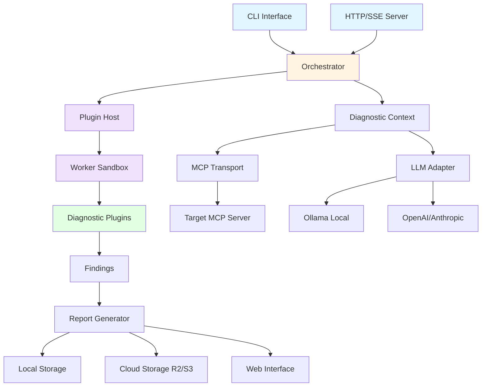

---

## Component Architecture

### 1. Core Components

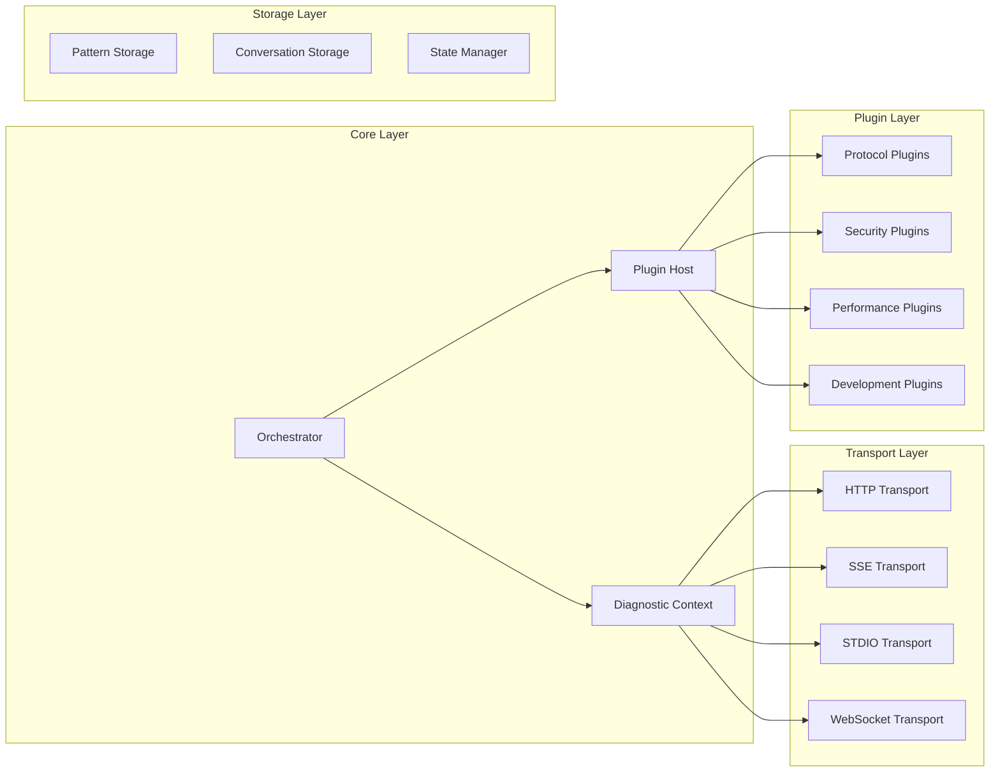

### 2. Directory Structure

```
packages/cortexdx/src/
├── adapters/          # External tool adapters (Clinic.js, PySpy, etc.)
├── auth/              # Authentication & authorization
├── commands/          # CLI command implementations
├── context/           # Diagnostic context management
├── deepcontext/       # DeepContext integration
├── envelope/          # Test envelope for diagnostics
├── graph/             # Dependency graph analysis
├── learning/          # Pattern learning & RAG
├── logging/           # Structured logging (Pino)
├── ml/                # LLM integration (Ollama, OpenAI)
├── observability/     # OpenTelemetry & monitoring
├── orchestration/     # LangGraph workflow orchestration
├── plugins/           # Diagnostic plugins
│   ├── development/   # Development assistance plugins
│   ├── performance/   # Performance profiling
│   └── *.ts           # Core diagnostic plugins
├── probe/             # MCP server probing
├── providers/         # Academic research providers
├── report/            # Report generation
├── security/          # Security scanning & validation
├── self-healing/      # Self-healing diagnostics with LangGraph
├── server.ts          # HTTP/SSE server
├── storage/           # Persistence layer
├── telemetry/         # Shinzo Labs telemetry
├── tools/             # MCP tools implementation
├── types.ts           # Core type definitions
└── workers/           # Sandbox worker threads
```

---

## Plugin System

### Plugin Architecture

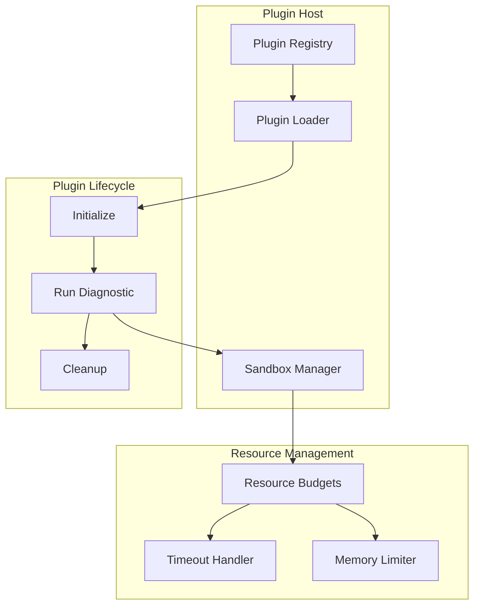

### Plugin Types

1. **Diagnostic Plugins** (`DiagnosticPlugin`)
   - Protocol validation
   - Security scanning
   - Performance profiling
   - Governance checks

2. **Development Plugins** (`DevelopmentPlugin`)
   - Code generation
   - Template scaffolding
   - Testing framework
   - Documentation generation

3. **Conversational Plugins** (`ConversationalPlugin`)
   - Interactive debugging
   - Error interpretation
   - Development assistance

### Built-in Plugin Categories

| Category | Plugins | Purpose |
|----------|---------|---------|
| **Protocol** | `discovery`, `protocol`, `jsonrpc-batch` | MCP spec compliance |
| **Security** | `auth`, `permissioning`, `threat-model`, `security-scanner` | Security validation |
| **Performance** | `performance`, `clinic-profiler`, `pyspy-profiler` | Performance analysis |
| **Governance** | `governance`, `license-validator`, `compliance-monitor` | Policy enforcement |
| **Development** | `code-generation`, `template-generator`, `testing-framework` | Developer assistance |

---

## Diagnostic Workflow

### Standard Diagnostic Flow

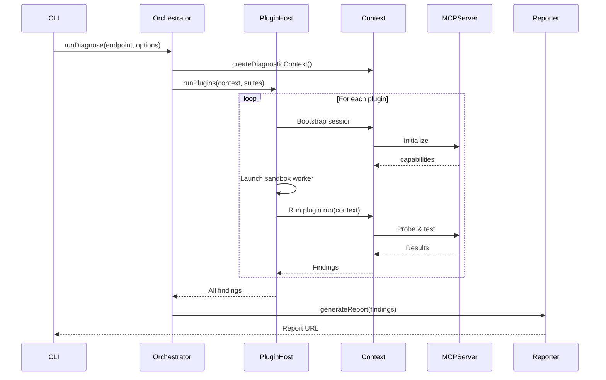

### Self-Healing Diagnostic Flow (LangGraph)

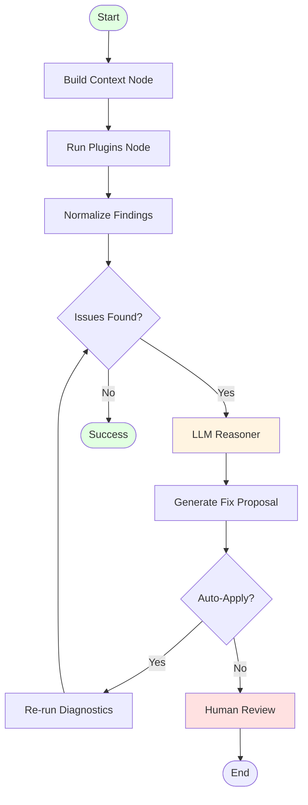

---

## MCP Session Lifecycle

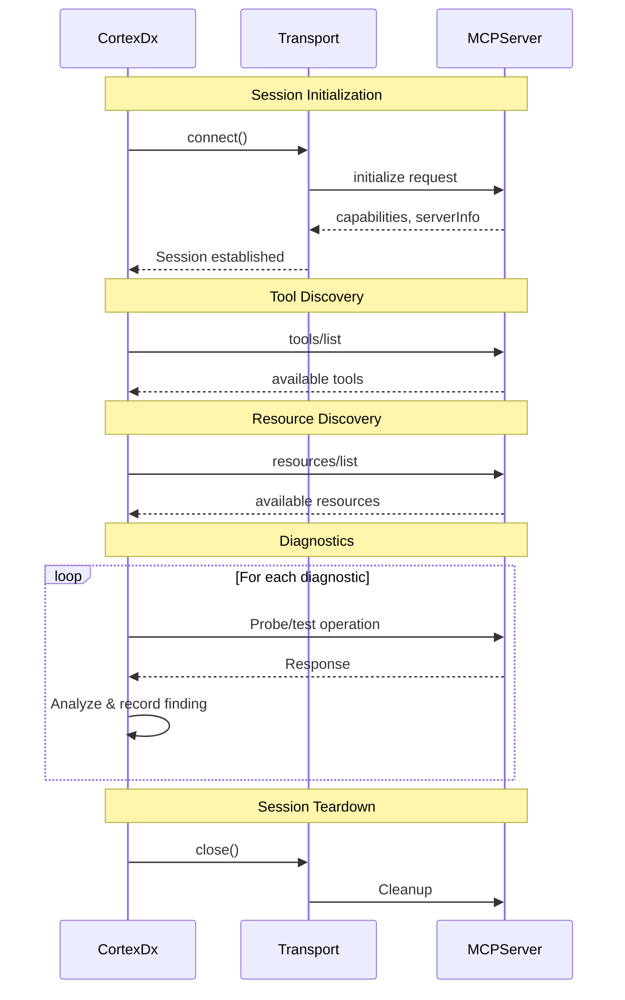

---

## Storage Architecture

### Storage Components

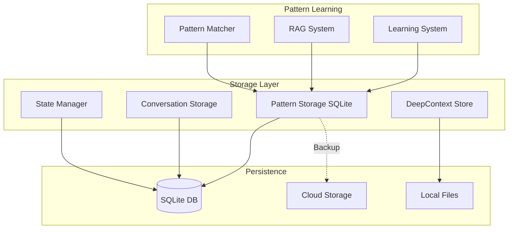

### Pattern Storage Schema

```sql
-- Simplified pattern storage schema
CREATE TABLE patterns (
    id TEXT PRIMARY KEY,
    pattern_data TEXT,  -- JSON (encrypted)
    success_count INTEGER,
    failure_count INTEGER,
    avg_confidence REAL,
    created_at INTEGER,
    updated_at INTEGER
);

CREATE TABLE pattern_feedback (
    id TEXT PRIMARY KEY,
    pattern_id TEXT,
    feedback_type TEXT,  -- 'success' | 'failure'
    context TEXT,
    timestamp INTEGER,
    FOREIGN KEY(pattern_id) REFERENCES patterns(id)
);
```

---

## Security Architecture

### Security Layers

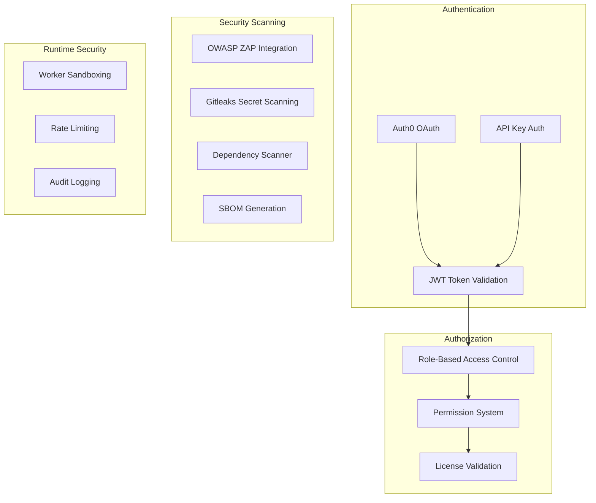

### Sandbox Security Model

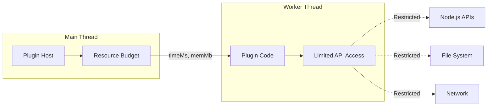

---

## Key Design Decisions

### 1. Plugin-First Architecture

**Decision:** All diagnostic logic is implemented as plugins, not hardcoded.

**Rationale:**
- Extensibility: Easy to add new diagnostics
- Maintainability: Plugins are isolated and testable
- Community: Third-party plugins can extend functionality
- Composition: Users can select which diagnostics to run

### 2. Worker Thread Sandboxing

**Decision:** Run plugins in isolated worker threads with resource budgets.

**Rationale:**
- Security: Untrusted plugins can't access sensitive data
- Stability: Plugin crashes don't crash the host
- Performance: Resource limits prevent runaway plugins
- Isolation: Plugins can't interfere with each other

### 3. Stateless by Default, Optional Persistence

**Decision:** Each diagnostic run is independent, but state can be persisted.

**Rationale:**
- Simplicity: Easier to reason about
- Reliability: No state corruption
- Scalability: Easy to parallelize
- Flexibility: Opt-in persistence for pattern learning

### 4. LangGraph for Self-Healing

**Decision:** Use LangGraph for orchestrating self-healing workflows.

**Rationale:**
- Stateful: Maintains execution context across retries
- Resumable: Can pause and resume workflows
- Observable: Built-in checkpointing and visualization
- Composable: Nodes can be reused across workflows

### 5. Structured Logging (Pino)

**Decision:** Use Pino for all logging with structured JSON output.

**Rationale:**
- Performance: Pino is extremely fast
- Observability: Structured logs are queryable
- Integration: Works with log aggregation tools
- Context: Attach metadata to every log entry

### 6. OpenTelemetry Integration

**Decision:** Full OpenTelemetry tracing for distributed observability.

**Rationale:**
- Standards-based: Industry standard for observability
- Distributed tracing: Track requests across services
- Metrics: Performance metrics automatically collected
- Vendor-neutral: Works with any backend (Jaeger, Honeycomb, etc.)

---

## Data Flow Diagrams

### Report Generation Flow

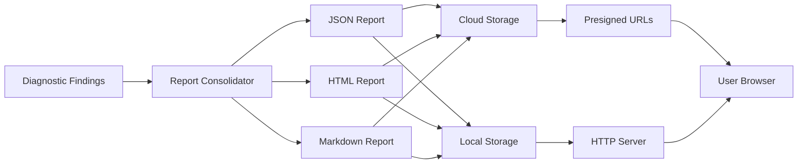

### Pattern Learning Flow

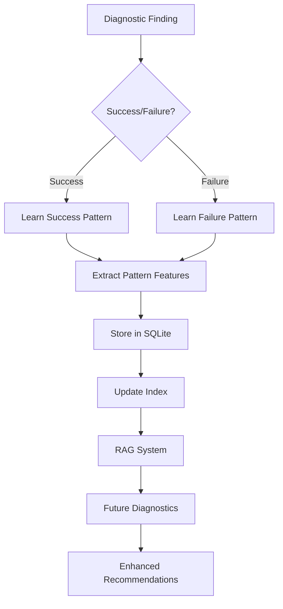

---

## Extension Points

### Adding a New Plugin

1. **Create plugin file** in `src/plugins/`:
```typescript
export const MyPlugin: DiagnosticPlugin = {
  id: "my-plugin",
  title: "My Custom Diagnostic",
  order: 1000,
  async run(ctx: DiagnosticContext): Promise<Finding[]> {
    // Your diagnostic logic
    return findings;
  }
};
```

2. **Register in plugin index** (`src/plugins/index.ts`):
```typescript
import { MyPlugin } from "./my-plugin.js";

export const BUILTIN_PLUGINS = [
  // ... existing plugins
  MyPlugin,
];
```

3. **Test your plugin**:
```bash
pnpm test tests/plugins/my-plugin.spec.ts
```

### Adding a New Transport

Implement the `Transport` interface:

```typescript
export interface Transport {
  send(message: JsonRpcMessage): Promise<void>;
  receive(): AsyncIterableIterator<JsonRpcMessage>;
  close(): Promise<void>;
}
```

### Adding a New Storage Backend

Implement the storage interface and register it:

```typescript
export interface StorageAdapter {
  save(key: string, value: unknown): Promise<void>;
  load(key: string): Promise<unknown>;
  delete(key: string): Promise<void>;
}
```

---

## Performance Characteristics

| Component | Typical Latency | Max Resource Usage |
|-----------|----------------|-------------------|
| Plugin execution | 100ms - 5s | 96MB RAM per plugin |
| MCP handshake | <5s | - |
| Report generation | <2s | - |
| Pattern storage query | <50ms | - |
| Self-healing analysis | <20s | 256MB RAM |
| LLM inference (local) | 1-10s | Depends on model |

---

## Related Documentation

- [API Reference](./API_REFERENCE.md) - Complete API documentation
- [Plugin Development Guide](./PLUGIN_DEVELOPMENT.md) - How to create plugins
- [Troubleshooting](./TROUBLESHOOTING.md) - Common issues and solutions
- [Configuration](../README.md#configuration) - Environment variables and settings
- [Contributing](../CONTRIBUTING.md) - How to contribute to CortexDx

---

## Architecture Evolution

### Version History

- **v1.0.0** (Current)
  - Initial plugin-first architecture
  - Worker thread sandboxing
  - LangGraph self-healing integration
  - OpenTelemetry observability

### Planned Enhancements

- **v1.1.0** - Enhanced pattern learning with vector embeddings
- **v1.2.0** - Multi-server orchestration
- **v1.3.0** - Real-time collaborative diagnostics
- **v2.0.0** - Distributed diagnostic execution

---

**Maintainers:** CortexDx Core Team
**Last Review:** 2025-11-16
**Next Review:** 2025-12-16
