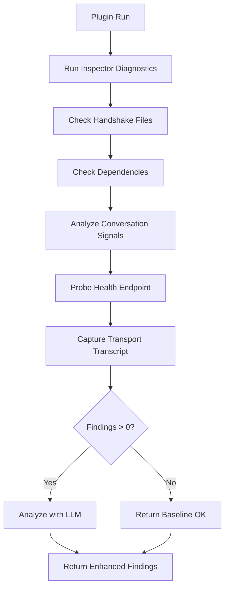

# Self-Improvement Plugin Documentation

## Overview

The Self-Improvement Plugin is an internal diagnostic plugin that analyzes CortexDx itself for handshake gaps, dependency issues, health regressions, and conversation signals. It provides enhanced self-healing insights using LLM analysis to identify and resolve internal issues.

**Plugin ID**: `self-improvement`  
**Category**: `development`  
**Order**: 15  
**Requires LLM**: Yes (for enhanced analysis)

## Purpose

The Self-Improvement Plugin serves as CortexDx's internal diagnostic system, enabling continuous self-monitoring and improvement. It addresses Requirement 15 from the specification:

> As a brAInwav developer, I want CortexDx to continuously self-diagnose and identify internal regressions in handshakes, dependencies, and health, so that I can maintain system reliability and automatically improve the diagnostic tool itself.

## Core Functionality

### 1. Handshake Instrumentation Analysis (Req 15.1)

**Purpose**: Identifies missing critical adapter files required for proper MCP handshake instrumentation.

**Implementation**: `evaluateHandshake(project?: ProjectContext): Finding | null`

**Tracked Files**:

- `packages/cortexdx/src/adapters/jsonrpc.ts` - JSON-RPC adapter for handshake
- `packages/cortexdx/src/adapters/sse.ts` - SSE adapter for streaming handshake

**Detection Logic**:

1. Checks if project source files are available
2. Compares tracked files against actual source files
3. Identifies missing adapter files
4. Returns a `major` severity finding if gaps are detected

**Finding Structure**:

```typescript
{
  id: "self_improvement.handshake_gaps",
  area: "development",
  severity: "major",
  title: "Handshake instrumentation incomplete",
  description: "Missing critical adapter files: [list]",
  evidence: [{ type: "file", ref: "missing-file.ts" }],
  recommendation: "Wire initialize/session tracking through the JSON-RPC and SSE adapters",
  tags: ["self-improvement", "handshake"]
}
```

### 2. Dependency Validation (Req 15.2)

**Purpose**: Validates that required dependencies are installed for proper Inspector functionality.

**Implementation**: `evaluateDependencies(project?: ProjectContext): Finding | null`

**Required Dependencies**:

- `@modelcontextprotocol/sdk` - MCP protocol implementation
- `eventsource-parser` - SSE event parsing

**Detection Logic**:

1. Checks project dependencies from package.json
2. Identifies missing required packages
3. Returns a `minor` severity finding if dependencies are missing

**Finding Structure**:

```typescript
{
  id: "self_improvement.dependency_gaps",
  area: "development",
  severity: "minor",
  title: "Missing inspector dependencies",
  description: "Recommended packages not detected: [list]",
  evidence: [{ type: "log", ref: "[dependency list]" }],
  recommendation: "Install the missing packages to enable protocol replay hooks",
  tags: ["self-improvement", "dependencies"]
}
```

### 3. Conversation Signal Analysis (Req 15.3)

**Purpose**: Analyzes conversation history for repeated failure signals indicating recurring issues.

**Implementation**: `summarizeSignals(history: ChatMessage[]): Finding | null`

**Tracked Signal Keywords**:

- **SSE**: Pattern `/sse/i` - Detects SSE streaming issues
- **Batch**: Pattern `/batch/i` - Detects JSON-RPC batch issues
- **Handshake**: Pattern `/handshake|initialize/i` - Detects handshake gaps

**Detection Logic**:

1. Scans conversation history for signal keywords
2. Counts occurrences of each signal type
3. Generates a digest of repeated signals
4. Returns an `info` severity finding with signal summary

**Finding Structure**:

```typescript
{
  id: "self_improvement.signal_digest",
  area: "development",
  severity: "info",
  title: "Repeated inspector signals detected",
  description: "SSE streaming issues: 3; Batch response issues: 2",
  evidence: [{ type: "log", ref: "user: SSE endpoint not streaming" }],
  tags: ["self-improvement", "signals"]
}
```

### 4. Health Endpoint Probing (Req 15.4)

**Purpose**: Probes internal health endpoints to report connectivity status and system health.

**Implementation**: `probeHealth(ctx: DevelopmentContext): Promise<Finding | null>`

**Detection Logic**:

1. Constructs health endpoint URL from context endpoint
2. Sends GET request to `/health` endpoint
3. Returns `info` severity finding on success with health data
4. Returns `minor` severity finding on failure with error details

**Success Finding Structure**:

```typescript
{
  id: "self_improvement.health",
  area: "development",
  severity: "info",
  title: "Inspector health probe",
  description: '{"status":"healthy","version":"1.0.0"}',
  evidence: [{ type: "url", ref: "http://localhost:5001/health" }],
  tags: ["self-improvement", "health"]
}
```

**Failure Finding Structure**:

```typescript
{
  id: "self_improvement.health_unreachable",
  area: "development",
  severity: "minor",
  title: "Inspector health probe failed",
  description: "Unable to query http://localhost:5001/health: [error]",
  evidence: [{ type: "url", ref: "http://localhost:5001/health" }],
  tags: ["self-improvement", "health"]
}
```

### 5. Transport Transcript Capture

**Purpose**: Captures and summarizes transport-level communication for debugging.

**Implementation**: `summarizeTransport(ctx: DevelopmentContext): Finding | null`

**Detection Logic**:

1. Retrieves transport transcript from context
2. Extracts initialize exchange and follow-up exchanges
3. Summarizes session information
4. Returns `info` severity finding with transcript summary

**Finding Structure**:

```typescript
{
  id: "self_improvement.transport_transcript",
  area: "development",
  severity: "info",
  title: "Inspector transport transcript captured",
  description: "Initialize -> status 200; 3 follow-up exchanges",
  evidence: [{ type: "log", ref: "[transcript JSON]" }],
  tags: ["self-improvement", "transport"]
}
```

### 6. MCP Inspector Integration

**Purpose**: Runs comprehensive MCP Inspector self-diagnosis for deep internal analysis.

**Implementation**: `runInspectorDiagnostics(ctx: DevelopmentContext): Promise<Finding[]>`

**Detection Logic**:

1. Creates InspectorAdapter instance
2. Runs `selfDiagnose()` method
3. Converts Inspector findings to CortexDx format
4. Returns array of findings or error finding on failure

**Integration Benefits**:

- Leverages MCP Inspector's comprehensive diagnostic capabilities
- Provides deep protocol-level analysis
- Identifies issues not caught by basic checks
- Enables meta-diagnostic workflows (CortexDx diagnosing itself)

### 7. LLM-Enhanced Analysis (Req 15.5)

**Purpose**: Provides enhanced root cause analysis with specific code changes and validation steps using local LLM.

**Implementation**: `analyzeWithLLM(findings: Finding[], ctx: DevelopmentContext): Promise<Finding[]>`

**Analysis Process**:

1. Retrieves enhanced LLM adapter from router
2. For each finding, constructs analysis prompt with:
   - Finding details (ID, severity, description, evidence)
   - Current CortexDx context (files, dependencies, language)
   - User expertise level
3. Requests structured JSON analysis from LLM
4. Enhances finding with LLM insights

**LLM System Prompt Features**:

The Meta-Mentor prompt includes enhanced sections for improved determinism and tool awareness:

- **Tool Awareness**: References specific CortexDx capabilities:
  - Diagnostics: `protocol`, `security-scanner`, `mcp-compatibility`, `discovery`
  - Development: `code-generation`, `problem-resolver`, `template-generator`
  - Analysis: `performance-analysis`, `compliance-check`, `threat-model`
  - Research: academic providers (Context7, Exa, OpenAlex)

- **Determinism Rules**:
  - Same finding input produces same analysis structure
  - Tone varies by context but JSON schema remains consistent
  - `suggested_next_moves` ordered by impact (no randomness)
  - Repeated patterns receive consistent categorization

**LLM Analysis Output**:

```typescript
{
  rootCause: "Specific cause in CortexDx's codebase",
  filesToModify: ["file1.ts", "file2.ts"],
  codeChanges: "Actual code changes needed",
  validationSteps: ["step1", "step2"],
  riskLevel: "low|medium|high",
  templateId: "template.identifier",
  canAutoFix: true/false
}
```

**Enhanced Finding Fields**:

- `llmAnalysis`: Raw LLM response text
- `rootCause`: Specific cause identified by LLM
- `filesToModify`: List of files that need changes
- `codeChanges`: Actual code modifications needed
- `validationSteps`: Steps to validate the fix
- `riskLevel`: Risk assessment for applying fix
- `templateId`: Template identifier for automated fixes
- `canAutoFix`: Whether fix can be applied automatically
- `tags`: Includes 'llm-analyzed' tag

**Performance Target**: <15 seconds for LLM analysis (Req 15.5)

**Fallback Behavior**: If LLM is unavailable or analysis fails, returns original findings without enhancement.

## Plugin Execution Flow



## Usage

### Programmatic Usage

```typescript
import { SelfImprovementPlugin } from './plugins/development/self-improvement.js';
import type { DevelopmentContext } from './types.js';

const ctx: DevelopmentContext = {
  endpoint: 'http://localhost:5001',
  logger: console.log,
  request: fetch,
  jsonrpc: async () => ({}),
  sseProbe: async () => ({ ok: true }),
  evidence: () => undefined,
  deterministic: true,
  sessionId: 'session-123',
  userExpertiseLevel: 'intermediate',
  conversationHistory: [],
  projectContext: {
    name: 'cortexdx',
    type: 'mcp-client',
    language: 'typescript',
    dependencies: ['@modelcontextprotocol/sdk'],
    configFiles: ['pnpm-lock.yaml'],
    sourceFiles: ['src/adapters/jsonrpc.ts']
  }
};

const findings = await SelfImprovementPlugin.run(ctx);
```

### CLI Usage

```bash
# Run self-improvement diagnostics
pnpm tsx packages/cortexdx/scripts/internal/self-improvement.ts \
  --endpoint http://localhost:5001 \
  --project packages/cortexdx \
  --type mcp-client \
  --language typescript \
  --out reports/self-improvement.json

# With conversation history
pnpm tsx packages/cortexdx/scripts/internal/self-improvement.ts \
  --endpoint http://localhost:5001 \
  --history .cortexdx/conversation-history.json \
  --out reports/self-improvement.json
```

### CLI Options

- `--endpoint <url>`: Inspector endpoint (default: `http://127.0.0.1:5001`)
- `--project <path>`: Project root path (default: `packages/cortexdx`)
- `--type <type>`: Project type (`mcp-server`, `mcp-client`, `mcp-connector`)
- `--language <lang>`: Project language (default: `typescript`)
- `--history <path>`: Path to conversation history JSON file
- `--out <path>`: Output path for findings JSON

### Environment Variables

- `CORTEXDX_INTERNAL_ENDPOINT`: Default Inspector endpoint
- `CORTEXDX_HISTORY_PATH`: Default conversation history path
- `CORTEXDX_INSPECTOR_MAX_RUNTIME_MS` / `INSPECTOR_MAX_RUNTIME_MS`: Overrides the runtime budget (in ms) before the MCP Inspector CLI is terminated. Partial probe output is still converted into findings when this budget is exceeded.

## Finding Types

### 1. Handshake Gaps

- **ID**: `self_improvement.handshake_gaps`
- **Severity**: `major`
- **Indicates**: Missing critical adapter files for handshake instrumentation

### 2. Dependency Gaps

- **ID**: `self_improvement.dependency_gaps`
- **Severity**: `minor`
- **Indicates**: Missing required npm packages

### 3. Signal Digest

- **ID**: `self_improvement.signal_digest`
- **Severity**: `info`
- **Indicates**: Repeated failure signals in conversation history

### 4. Health Probe Success

- **ID**: `self_improvement.health`
- **Severity**: `info`
- **Indicates**: Successful health check with system status, including quick-subsystem telemetry (state DB availability, provider count, rolling performance metrics, and operations counters) sourced from `/health`.

### 5. Health Probe Failure

- **ID**: `self_improvement.health_unreachable`
- **Severity**: `minor`
- **Indicates**: Failed health check or unreachable endpoint

### 6. Transport Transcript

- **ID**: `self_improvement.transport_transcript`
- **Severity**: `info`
- **Indicates**: Captured transport-level communication summary

### 7. Inspector Diagnostics

- **ID**: Various (from Inspector)
- **Severity**: Various
- **Indicates**: Deep protocol-level issues from MCP Inspector

### 8. Inspector Failed

- **ID**: `self_improvement.inspector_failed`
- **Severity**: `minor`
- **Indicates**: Inspector integration unavailable or failed

### 9. Baseline OK

- **ID**: `self_improvement.ok`
- **Severity**: `info`
- **Indicates**: All checks passed, no issues detected

## Integration Points

### InspectorAdapter

The plugin integrates with `InspectorAdapter` for comprehensive self-diagnosis:

```typescript
const inspector = new InspectorAdapter(ctx);
const report = await inspector.selfDiagnose();
const findings = inspector.convertFindings(report.findings);
```

### LLM Router

The plugin uses the LLM router for enhanced analysis:

```typescript
import { getEnhancedLlmAdapter } from '../../ml/router.js';

const adapter = await getEnhancedLlmAdapter();
if (adapter) {
  const analysis = await adapter.complete(prompt);
  // Enhance findings with LLM insights
}
```

## Testing

### Test Coverage

The plugin has comprehensive test coverage in `tests/self-improvement.spec.ts`:

1. **Handshake Gap Detection**: Validates detection of missing adapter files
2. **Signal Summarization**: Tests conversation history analysis
3. **Health Probe**: Validates health endpoint probing
4. **Transport Transcript**: Tests transport-level capture

### Running Tests

```bash
# Run self-improvement tests
pnpm test self-improvement

# Run with coverage
pnpm test:coverage self-improvement
```

## Performance Characteristics

- **Handshake Check**: <1ms (file list comparison)
- **Dependency Check**: <1ms (dependency list comparison)
- **Signal Analysis**: <10ms (pattern matching on history)
- **Health Probe**: <100ms (HTTP request)
- **Transport Capture**: <1ms (data extraction)
- **Inspector Diagnostics**: <5s (comprehensive analysis)
- **LLM Analysis**: <15s per finding (Req 15.5)
- **Total Execution**: <30s (with LLM analysis)

## Design Rationale

The Self-Improvement Plugin follows the principle of "eating your own dog food" by using CortexDx's diagnostic capabilities to diagnose itself. This approach:

1. **Validates Core Functionality**: Ensures diagnostic tools work correctly
2. **Enables Meta-Diagnostics**: Allows CortexDx to identify its own issues
3. **Provides Continuous Monitoring**: Detects regressions early
4. **Leverages LLM Intelligence**: Uses AI for enhanced root cause analysis
5. **Maintains Consistency**: Uses same plugin architecture as other diagnostics

## Future Enhancements

1. **Automated Fix Application**: Apply LLM-suggested fixes automatically
2. **Pattern Learning Integration**: Learn from successful self-fixes
3. **Continuous Monitoring**: Run self-diagnostics on schedule
4. **Regression Detection**: Track metrics over time to detect degradation
5. **Self-Healing Workflows**: Automatically resolve common internal issues

## Related Documentation

- [Inspector Adapter](./INSPECTOR_ADAPTER.md)
- [LLM Integration](./LLM_INTEGRATION.md)
- [Development Plugins](./DEVELOPMENT_PLUGINS.md)
- [Requirements Document](../.kiro/specs/cortexdx-diagnostic-system/requirements.md)
