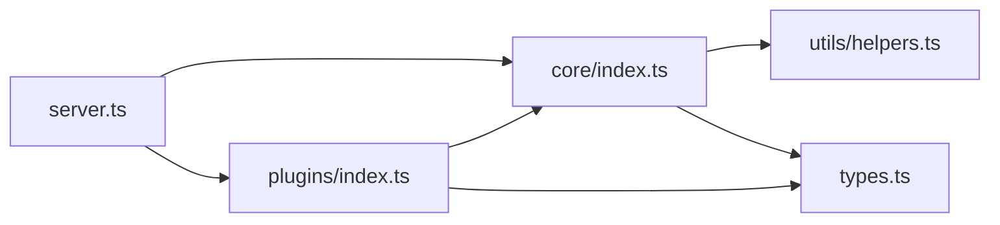
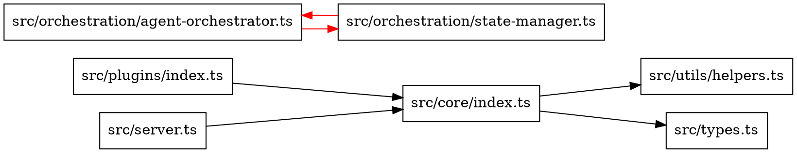

# Dependency Graph

This directory contains dependency graph analysis tools for understanding code relationships and dependencies.

## Overview

The dependency graph module analyzes code dependencies to:
- Map relationships between modules and files
- Detect circular dependencies
- Identify orphaned code
- Calculate coupling metrics
- Generate dependency visualizations

## Components

### `dependency-graph.ts`
Core dependency graph builder and analyzer.

**Features:**
- File dependency parsing
- Module relationship mapping
- Circular dependency detection
- Dependency tree traversal
- Graph visualization generation
- Coupling metrics calculation

## Usage

### Basic Dependency Analysis

```typescript
import { DependencyGraphBuilder } from './dependency-graph.js';

const builder = new DependencyGraphBuilder({
  rootDir: process.cwd(),
  include: ['src/**/*.ts'],
  exclude: ['**/*.spec.ts', '**/node_modules/**']
});

// Build the dependency graph
const graph = await builder.build();

// Analyze dependencies
const analysis = graph.analyze();
console.log(`Total modules: ${analysis.moduleCount}`);
console.log(`Total dependencies: ${analysis.dependencyCount}`);
console.log(`Circular dependencies: ${analysis.circularDependencies.length}`);
```

### Detect Circular Dependencies

```typescript
import { detectCircularDependencies } from './dependency-graph.js';

const circles = await detectCircularDependencies({
  rootDir: './src',
  filePattern: '**/*.ts'
});

if (circles.length > 0) {
  console.error(`Found ${circles.length} circular dependencies:`);
  for (const circle of circles) {
    console.error(`  ${circle.join(' -> ')}`);
  }
}
```

### Dependency Metrics

```typescript
const metrics = graph.calculateMetrics();

console.log('Coupling Metrics:');
console.log(`  Afferent Coupling: ${metrics.afferentCoupling}`);
console.log(`  Efferent Coupling: ${metrics.efferentCoupling}`);
console.log(`  Instability: ${metrics.instability}`);
console.log(`  Abstractness: ${metrics.abstractness}`);
```

### Generate Visualization

```typescript
// Generate Mermaid diagram
const mermaid = graph.toMermaid({
  maxDepth: 3,
  highlight: ['src/core', 'src/plugins']
});

// Generate DOT graph
const dot = graph.toDot({
  rankdir: 'LR',
  showCycles: true
});
```

## Dependency Graph Structure

```typescript
interface DependencyNode {
  id: string;              // File path
  type: 'module' | 'file'; // Node type
  dependencies: string[];  // Outgoing dependencies
  dependents: string[];    // Incoming dependencies
  metadata: {
    exports: string[];     // Exported symbols
    imports: string[];     // Imported symbols
    size: number;          // File size in bytes
    complexity: number;    // Cyclomatic complexity
  };
}

interface DependencyGraph {
  nodes: Map<string, DependencyNode>;
  edges: Map<string, Set<string>>;
  metadata: {
    rootDir: string;
    timestamp: number;
    fileCount: number;
  };
}
```

## Analysis Capabilities

### 1. Circular Dependency Detection

Identifies dependency cycles that can cause:
- Initialization issues
- Memory leaks
- Build problems
- Tight coupling

**Algorithm:** Tarjan's strongly connected components

### 2. Orphaned Code Detection

Finds modules with:
- No incoming dependencies (unused exports)
- No outgoing dependencies (isolated modules)
- Dead code that can be safely removed

### 3. Coupling Metrics

**Afferent Coupling (Ca):** Number of modules that depend on this module
- High Ca = Many dependents (stable, hard to change)

**Efferent Coupling (Ce):** Number of modules this module depends on
- High Ce = Many dependencies (unstable, fragile)

**Instability (I):** `Ce / (Ca + Ce)`
- I = 0: Maximally stable
- I = 1: Maximally unstable

**Abstractness (A):** Ratio of abstract classes/interfaces
- A = 0: Concrete
- A = 1: Abstract

### 4. Dependency Depth

Calculates:
- Maximum dependency chain length
- Average dependency depth
- Module layers/levels

## Visualization Examples

### Mermaid Diagram



### DOT Graph



## Configuration

### Builder Options

```typescript
interface DependencyGraphOptions {
  // Root directory to analyze
  rootDir: string;

  // File patterns to include
  include?: string[];

  // File patterns to exclude
  exclude?: string[];

  // Follow external dependencies
  followExternal?: boolean;

  // Maximum depth to traverse
  maxDepth?: number;

  // Include dev dependencies
  includeDevDependencies?: boolean;

  // Parser options
  parser?: {
    tsconfig?: string;
    jsx?: boolean;
  };
}
```

## Integration

### CI/CD Pipeline

```yaml
# .github/workflows/dependency-check.yml
name: Dependency Analysis

on: [push, pull_request]

jobs:
  analyze:
    runs-on: ubuntu-latest
    steps:
      - uses: actions/checkout@v3
      - name: Check Circular Dependencies
        run: |
          pnpm run graph:check
          # Fails if circular dependencies found
```

### Pre-commit Hook

```bash
#!/bin/sh
# .git/hooks/pre-commit

# Check for new circular dependencies
pnpm run graph:check || {
  echo "❌ Circular dependencies detected!"
  exit 1
}
```

## Performance

| Operation | Time (1000 files) | Memory |
|-----------|-------------------|--------|
| Build graph | ~2-3s | ~50MB |
| Detect cycles | ~500ms | ~10MB |
| Calculate metrics | ~200ms | ~5MB |
| Generate visualization | ~1s | ~20MB |

## Optimization Tips

1. **Use caching** - Graph structure doesn't change often
2. **Incremental analysis** - Only analyze changed files
3. **Exclude unnecessary files** - Skip tests, generated code
4. **Parallelize** - Analyze multiple files concurrently

## Example: Finding Highly Coupled Modules

```typescript
const graph = await builder.build();
const metrics = graph.calculateMetrics();

// Find modules with high coupling
const highlyCoupled = Object.entries(metrics.modules)
  .filter(([_, m]) => m.efferentCoupling > 10)
  .sort((a, b) => b[1].efferentCoupling - a[1].efferentCoupling)
  .slice(0, 10);

console.log('Top 10 most coupled modules:');
highlyCoupled.forEach(([module, m]) => {
  console.log(`  ${module}: ${m.efferentCoupling} dependencies`);
});
```

## Testing

```bash
# Run dependency graph tests
pnpm test tests/graph/

# Check for circular dependencies
pnpm run graph:check

# Generate dependency report
pnpm run graph:report
```

## Related

- [Orchestration](../orchestration/README.md) - Uses dependency graph for workflow optimization
- [Self-Healing](../self-healing/README.md) - Uses graph analysis for impact assessment
- [Architecture](../../../docs/ARCHITECTURE.md) - Overall system architecture

## Further Reading

- [Dependency Inversion Principle](https://en.wikipedia.org/wiki/Dependency_inversion_principle)
- [Circular Dependencies Considered Harmful](https://stackoverflow.com/questions/1897537/what-is-wrong-with-circular-dependencies)
- [Software Coupling Metrics](https://en.wikipedia.org/wiki/Coupling_(computer_programming))
